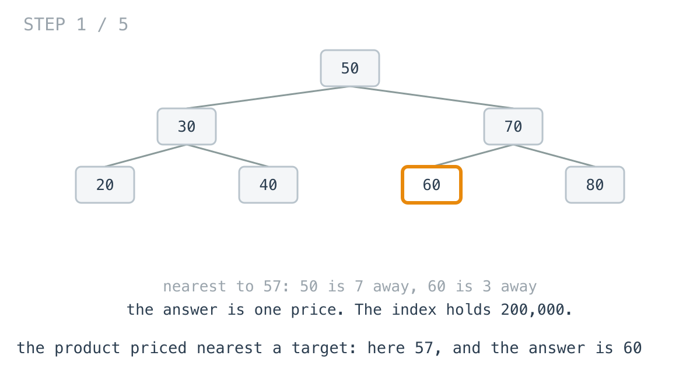
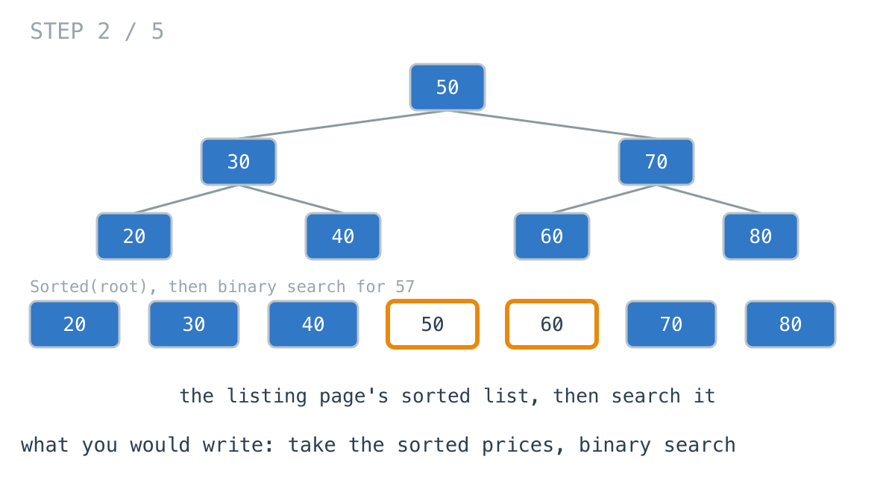
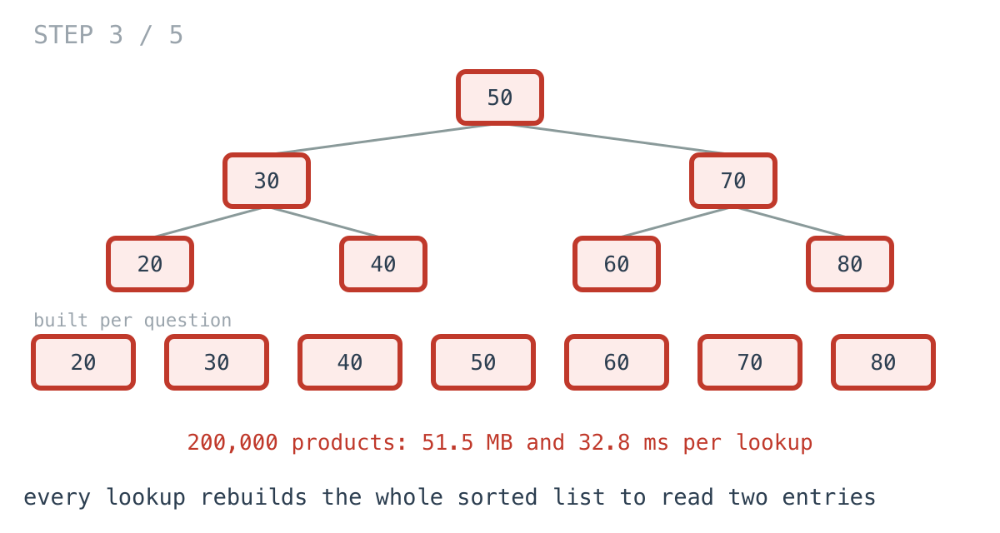
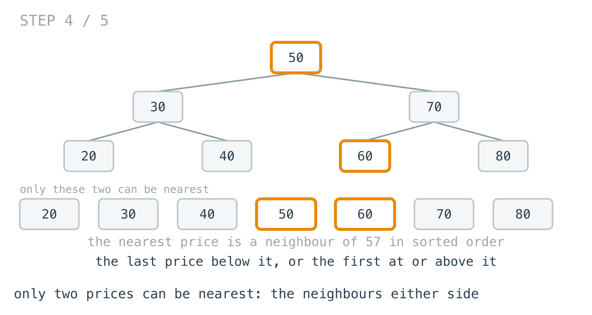
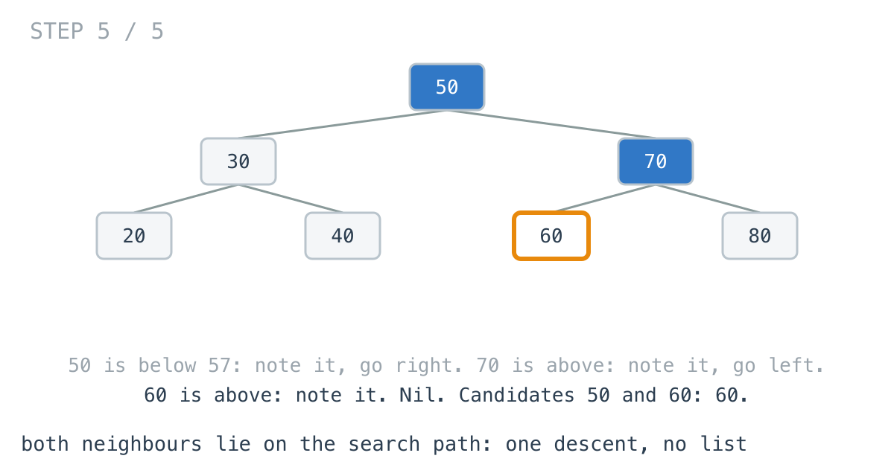

# Nearest price: 51 MB allocated to return one number

**It worked in dev · Episode 25 · technique: the two neighbours are on the search path**

The same price index as [episode 23](../23-range-query-without-scan/), a binary
search tree of 200,000 products. New question: "show me the product priced
nearest to ₹X", for the "similar price" row under every product page.

The version I wrote reused the listing page's sorted list and binary-searched
it. Correct, and **51.5 MB** allocated per lookup, **32.8 ms**, to return one
price. The descent that answers it reads about two dozen nodes and allocates
nothing.

---

## The problem

```go
type Node struct {
	Price       int // paise
	Left, Right *Node
}

// The price in the index nearest to target. Ties go to the cheaper one.
func Closest(root *Node, target int) int
```



---

## What you would write

The listing page already has every price in order:

```go
func Sorted(n *Node) []int {
	if n == nil {
		return []int{}
	}
	return append(Sorted(n.Left), append([]int{n.Price}, Sorted(n.Right)...)...)
}
```

And "nearest to X in a sorted list" is a binary search plus a look either side:

```go
func ClosestBySorting(root *Node, target int) int {
	prices := Sorted(root)
	if len(prices) == 0 {
		return -1
	}
	i := sort.SearchInts(prices, target)
	switch {
	case i == 0:
		return prices[0]
	case i == len(prices):
		return prices[len(prices)-1]
	}
	lo, hi := prices[i-1], prices[i]
	if target-lo <= hi-target {
		return lo
	}
	return hi
}
```

It reuses a function that exists, uses the standard library's binary search,
and handles both ends and the tie. I would approve it.



---

## How bad, on its own

```
Apple M1 Pro · go1.26.4 · go test -bench=Sorting -benchtime=30x
```

| shape | products | sort, then search | allocated |
|---|---:|---:|---:|
| `1k_middle` | 1,000 | 55.2 µs | 134 KB |
| `200k_cheap` | 200,000 | 36,355 µs | 51.5 MB |
| `200k_middle` | 200,000 | 32,785 µs | 51.5 MB |
| `200k_dear` | 200,000 | 32,761 µs | 51.5 MB |

At a thousand products, 55 µs, and nobody would look at it. At 200,000, every
product page's "similar price" row costs 33 ms and half a hundred megabytes of
garbage, to return one number.

---

## From the symptom to the shape

### The issue, said plainly

Every lookup builds the whole sorted list, and then reads two entries of it.

### Quantify it on the concrete example

200,000 prices copied into a list to read the two either side of the target.
Worse, `Sorted` builds it by concatenation - each level of the tree copies
everything below it again - which is why it is 290,046 allocations and not one.

Written flat, appending into a single slice, the same list costs 7.98 MB and
6.92 ms. That is the fair version of "build the list and search it", and it is
still 200,000 prices stored to read two.



### Why is it allowed to happen?

Because the list is the natural shared representation - the listing page needs
it, and `sort.SearchInts` wants it. The binary search is O(log n) and looks
like the fast part. The O(n) was in the line above it.

### The answer was already in the tree

Which prices can possibly be nearest to 57? Only two: the last price below it
and the first price at or above it - its neighbours in sorted order. Nothing
further away in the list can be closer than the neighbour on the same side.



So the list was built for two entries, and those two entries have a
relationship to the tree that does not need the list.

### What is the question actually asking?

Do not assume it. "The last price below 57" in a binary search tree: follow the
path you would take to search for 57. Every time you go right, you are passing
a price below 57 - and each one you pass is closer to 57 than the one before,
because you only go right into bigger prices that are still below it. The last
one you pass going right is the nearest below. The mirror holds going left.

### Write the thing you want as an equation

```
below = the last node the search for target passes going right
above = the last node the search for target passes going left
answer = whichever of below, above is nearer to target
```

Read it out loud. Both candidates are on one root-to-leaf path. Nothing off that
path is read.

### Conclude the walk

Descend as if searching for the target. At each node, note it as `below` or
`above`, and go the way a search would. When you fall off the tree, the two
notes are the answer's only candidates.

```go
if n.Price < target {
	below = n.Price // anything closer is to the right
	n = n.Right
} else {
	above = n.Price // anything closer is to the left
	n = n.Left
}
```



About two dozen nodes for 200,000 products, no allocation, **17.8 ns** with the
path in cache.

### Where it came from in the challenge

[Day 50](https://github.com/architagr/leetcode_solutions/blob/main/easy_problems/701_800/minimum_distance_between_bst_nodes/SOLUTION.md),
Minimum Distance Between BST Nodes, is `Sorted` - the version at the top of
this page is its `inOrder`, line for line - and its write-up states the fact
this episode turns on: "the minimum difference between *any* two BST node values
can only occur between two values that are adjacent once sorted." Nearest to a
target is the same fact with the target standing in for one of the two values.

[Day 47](https://github.com/architagr/leetcode_solutions/blob/main/easy_problems/501_600/minimum_absolute_difference_in_bst/SOLUTION.md),
Minimum Absolute Difference in BST, is the same question answered without the
list: an in-order walk carrying the previous value. Carried here, it becomes the
middle version below - walk in order, stop the moment you pass the target, and
the answer is that price or the one before it. No list, but it still walks
everything cheaper than the target.

### When this does not apply

Go back to the equation and break it.

"Both candidates are on the search path" needs the path to be short. On a tree
built from a sorted import - the chain from episode 23 - the search path is the
whole chain, and the descent is as slow as the walk.

And if the caller wants **the nearest ten**, not the nearest one, the
neighbours are no longer all on one path. The descent finds where to start;
from there you need to walk outward in both directions, which is an iterator
with a stack, not a descent.

### The rule

> **In an ordered structure, the values nearest a target are its neighbours in
> order, and both neighbours are on the path a search for the target takes.
> Search, noting what you pass; do not build the order to read two entries.**

---

## Try it before reading on

No list, no new structure: one loop from the root. What do you note at each
node you pass, and why is the last one you noted on each side the best one?

```bash
git clone https://github.com/architagr/leetcode_solutions
cd leetcode_solutions/series/it-worked-in-dev/episodes/25-closest-price-lookup
go test ./...
```

Reading on costs you the rep.

---

## The version that scales

```go
func ClosestByDescent(root *Node, target int) int {
	below, above := -1, -1
	for n := root; n != nil; {
		if n.Price < target {
			below = n.Price // the best "just under" so far; anything closer is to the right
			n = n.Right
		} else {
			above = n.Price // the best "at or over" so far; anything closer is to the left
			n = n.Left
		}
	}
	switch {
	case below < 0:
		return above
	case above < 0:
		return below
	case target-below <= above-target:
		return below
	}
	return above
}
```

Three things carry it. Each note overwrites the last, because every later note
on the same side is nearer. `n.Price < target` sends an exact match left, so an
exact match lands in `above` and wins with distance zero. And `<=` in the final
comparison sends a tie to the cheaper price.

---

## The measurement

| shape | sort, then search | flat sort | walk until past | descent |
|---|---:|---:|---:|---:|
| `1k_middle` | 55.2 µs | 9.78 µs | 2.78 µs | 12.4 ns |
| `200k_cheap` | 36,355 µs | 5,893 µs | 20.2 µs | 16.2 ns |
| `200k_middle` | 32,785 µs | 6,924 µs | 1,290 µs | 17.8 ns |
| `200k_dear` | 32,761 µs | 6,022 µs | 2,651 µs | 19.6 ns |

Raw ns: 55,179 / 9,781 / 2,781 / 12.44 · 36,354,804 / 5,892,599 / 20,172 / 16.2 ·
32,784,507 / 6,924,496 / 1,290,333 / 17.84 · 32,761,185 / 6,021,900 / 2,650,786 / 19.59

The descent ran at 200,000 iterations and the rest at 30, because at 30 the
descent is noise; asking the same question 200,000 times keeps its path in
cache. Cold, in a 20-iteration run, it was 60 to 148 ns. Either way the gap to
the list versions is five or six orders of magnitude: **1837697x** against
sort-then-search in the middle of the catalogue, **388144x** against the flat
list.

The walk is the interesting middle column. Cheap targets are nearly free for it
(20.2 µs), dear ones cost most of a walk (2.65 ms), because it reads everything
cheaper than the target first. It is day 47's idea taken exactly as far as it
goes.

Allocated: 51.5 MB for sort-then-search, 7.98 MB for the flat list, nothing for
the walk or the descent.

---

## What it costs

**Nothing, on a balanced index.** The descent is shorter than the function it
replaces, allocates nothing and reads no list. The cost is only in knowing
that the two neighbours are on the search path.

**It is only as good as the tree's depth.** A sorted bulk import makes the tree
a chain and the descent a walk. Same warning as episode 23: check the depth of
the index once.

**The listing page still needs `Sorted`.** This does not replace it; it stops
the "similar price" row from calling it. And if `Sorted` stays, write it flat -
at 1,000 products the concatenation alone made it 5.64x slower.

---

## The one line to keep

The nearest value to a target is one of its two neighbours in order, and both
are on the search path - so search and note what you pass, instead of building
the order to read two entries of it.

---

## Built on

Days from the [365-day LeetCode challenge](https://github.com/architagr/leetcode_solutions),
with the solution write-up and the problem itself:

- **Day 47 — [Minimum Absolute Difference in BST](https://github.com/architagr/leetcode_solutions/blob/main/easy_problems/501_600/minimum_absolute_difference_in_bst/SOLUTION.md)** · LeetCode [#530](https://leetcode.com/problems/minimum-absolute-difference-in-bst/) · easy
  <br>an in-order walk of a BST visits values in sorted order, so nothing ever has to be sorted
- **Day 50 — [Minimum Distance Between BST Nodes](https://github.com/architagr/leetcode_solutions/blob/main/easy_problems/701_800/minimum_distance_between_bst_nodes/SOLUTION.md)** · LeetCode [#783](https://leetcode.com/problems/minimum-distance-between-bst-nodes/) · easy
  <br>the closest two values in a BST are always neighbours in sorted order, so only neighbours ever need comparing

---

## Run it yourself

```bash
git clone https://github.com/architagr/leetcode_solutions
cd leetcode_solutions/series/it-worked-in-dev/episodes/25-closest-price-lookup
go test ./...                                                 # all four agree, ties included
go test -bench='Sorting|SortedFlat|Walk' -benchtime=30x       # the list versions and the walk
go test -bench=Descent -benchtime=200000x                     # the descent
```

---

Part of [It worked in dev](../../), the long-form companion to the
[365-day LeetCode challenge](https://github.com/architagr/leetcode_solutions).

---

*Ideation, problem selection, benchmarks and conclusions: Archit Agarwal.
The prose was drafted with AI assistance and edited by me. Every number here
comes from a run you can reproduce with the commands above.*
