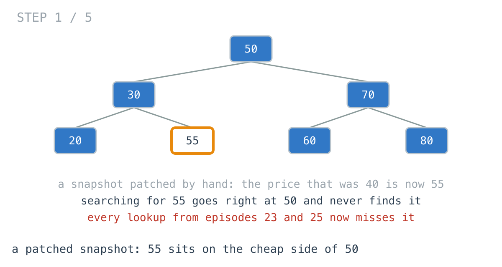
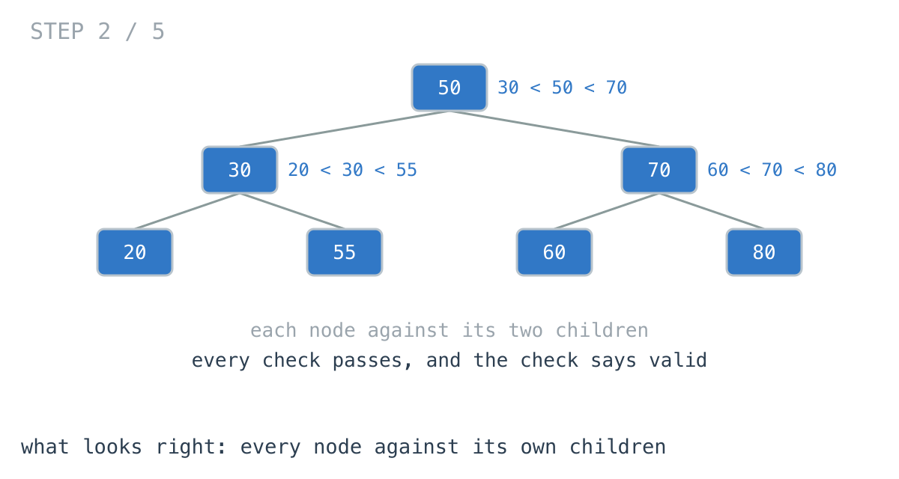
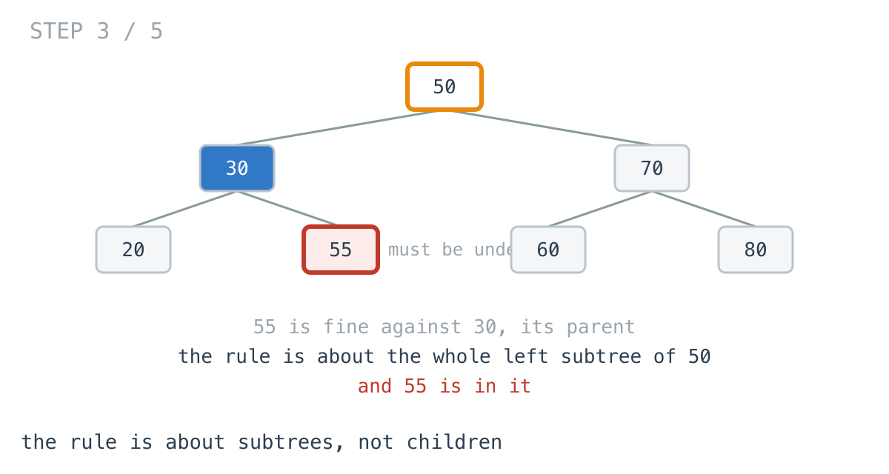
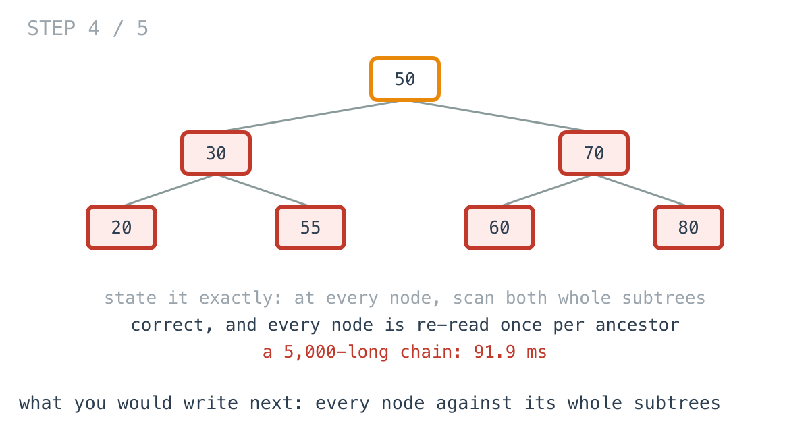
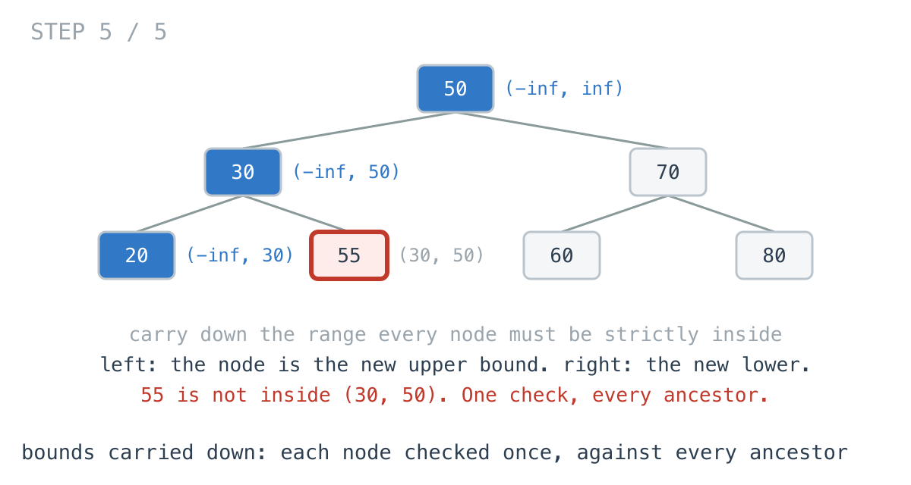

# Each node passed its check. The index was still wrong.

**It worked in dev · Episode 26 · technique: carrying bounds down the tree**

The price index from episodes 23 and 25 is loaded from a snapshot at startup.
Snapshots have been written by older builds, and once patched by hand, so the
loader checks the tree is actually a binary search tree before serving from it.
Every lookup depends on that: a range query, a nearest price, both prune whole
subtrees on the promise that everything to the left is cheaper.

The first check I wrote compared each node with its children. It passed a
snapshot where one price sat on the wrong side of the root. The exact check
that replaced it was right, and on a 5,000-deep index took **91.9 ms**. Carrying
two bounds down the tree is right, takes **57.2 µs** there, and stops at the
first bad price.

---

## The problem

```go
type Node struct {
	Price       int
	Left, Right *Node
}

// True if every node is dearer than everything in its left subtree and
// cheaper than everything in its right subtree. Duplicates are invalid.
func Valid(root *Node) bool
```



---

## The version that looks right and is not

Before the one I would defend: the check almost everyone writes first, because
it reads like the rule. Every node is dearer than its left child and cheaper
than its right child.

```go
func ValidByChildren(n *Node) bool {
	if n == nil {
		return true
	}
	if n.Left != nil && n.Left.Price >= n.Price {
		return false
	}
	if n.Right != nil && n.Right.Price <= n.Price {
		return false
	}
	return ValidByChildren(n.Left) && ValidByChildren(n.Right)
}
```



Patch the snapshot so the dearest price on the root's left is now dearer than
the root. Against its own parent and its own children it still looks fine.
`TestTheChildrenCheckAcceptsACorruptTree`:

```
1024 products, one price on the wrong side of the root: children check says valid
```

It is not benchmarked as a fix, because it is wrong, though it is in the timing
tables so you can see it is no faster than the checks that are right.



---

## What you would write

State the rule exactly. At every node, the largest price on the left must be
cheaper, and the smallest on the right dearer:

```go
func ValidBySubtrees(n *Node) bool {
	if n == nil {
		return true
	}
	if n.Left != nil && maxOf(n.Left) >= n.Price {
		return false
	}
	if n.Right != nil && minOf(n.Right) <= n.Price {
		return false
	}
	return ValidBySubtrees(n.Left) && ValidBySubtrees(n.Right)
}
```

`maxOf` and `minOf` walk a whole subtree. It is the definition in code, it cannot
be fooled by the patched snapshot, and I would approve it.

---

## How bad, on its own

```
Apple M1 Pro · go1.26.4 · go test -bench=BySubtrees -benchtime=20x
```

| shape | products | every subtree |
|---|---:|---:|
| `valid_32k` | 32,767 | 716 µs |
| `valid_262k` | 262,143 | 7.21 ms |
| `corrupt_deep_262k` | 262,143 | 208 µs |
| `chain_5k` | 5,000 | 91.9 ms |

On a balanced snapshot it is 7.21 ms at startup, and I would leave it. On the
chain a sorted import builds, 5,000 products take **91.9 ms** - a seventh of the
products of `valid_32k` and 128x the time.

---

## From the symptom to the shape

### The issue, said plainly

Every product is re-read once for each manager above it in the tree - once by
each ancestor's `maxOf` or `minOf`.

### Quantify it on the concrete example

On the balanced 262,143-product tree, each product has about seventeen
ancestors, so it is read about seventeen times. On the chain, the product at depth `d` is read `d` times:
1 + 2 + ... + 5,000, about 12.5 million reads for 5,000 products.



### Why is it allowed to happen?

Because each node's check is self-contained: it asks its own question of its
own subtrees and remembers nothing. The node above it asked a very similar
question of a larger subtree a moment earlier, and none of that is carried down.

### The answer was already known on the way down

Walk from the root to the patched 55. At 50 the walk went left, so everything
from here down must be under 50. At 30 it went right, so everything from here
down must be over 30. By the time the walk reaches 55, it already knows the
range 55 has to be in: strictly between 30 and 50. It learned that from the
path, without reading any subtree.

### What is the question actually asking?

Do not assume it. "Dearer than everything on the left of every ancestor it is
right of, cheaper than everything on the right of every ancestor it is left
of" collapses: of all the ancestors a node is right of, only the nearest
matters, because it is the dearest of them. Same on the other side. So each
node has exactly two numbers to be between.

### Write the thing you want as an equation

```
range(root)        = (-inf, +inf)
range(left child)  = (lo, n.Price)    where range(n) = (lo, hi)
range(right child) = (n.Price, hi)
valid  ⇔  every node's price is strictly inside its range
```

Read it out loud. Each node's range needs only its parent's range and its
parent's price. It is passed down, never computed from below.

### Conclude the walk

Carry the range down the recursion. Going left, the node's price becomes the
new upper bound; going right, the new lower bound. Check each node once against
its two numbers, and return false the moment one fails.

```go
if n.Price <= lo || n.Price >= hi {
	return false
}
return check(n.Left, lo, n.Price) && check(n.Right, n.Price, hi)
```



Every product read once. **57.2 µs** on the chain, **1608x** the exact check.

### Where it came from in the challenge

[Day 53](https://github.com/architagr/leetcode_solutions/blob/main/medium_problems/1_100/validate_binary_search_tree/SOLUTION.md),
Validate Binary Search Tree, has all three versions in one file. Its kept-for-
contrast `IsValidBstApproch1` is the exact check above, with the note that "it
re-scans those subtrees at every node, so it is O(n^2) on a skewed tree". Its
comments name the wrong one: "comparing a node against its two immediate
children only. That accepts a tree where a deep node violates an ancestor
several levels up." And its real solution is a third way: collect the in-order
sequence and check it is sorted, "validates by the equivalence rather than the
definition". That one is measured below, and it is correct, but it holds every
price in a list and cannot stop early.

[Day 48](https://github.com/architagr/leetcode_solutions/blob/main/medium_problems/201_300/lowest_common_ancestor_of_a_binary_search_tree/SOLUTION.md),
Lowest Common Ancestor of a BST, is the reason the check matters. It descends
by "both targets smaller: in a BST they can only be in the left subtree" -
which is the whole-subtree promise, taken on trust. On the patched snapshot,
that descent, episode 23's range query and episode 25's nearest price all go
the wrong way at 50 and never see 55.

### When this does not apply

Go back to the equation and break it.

"Strictly inside" encodes no duplicates. If the index allows equal prices on
one side, the bound on that side becomes inclusive, and it has to be the same
side the insert code puts them - get that wrong and a valid snapshot fails the
check.

And bounds carried down is a top-down walk, so on the 5,000-deep chain it
recurses 5,000 frames. That is fine at 5,000. A chain of millions needs the
same idea with an explicit stack.

### The rule

> **When every node must agree with all its ancestors, do not look up from
> each node. Carry the tightest constraint down from the root, and check each
> node once against it.**

---

## Try it before reading on

No `maxOf`, no `minOf`, no list of prices. Two extra parameters on the recursive
call. What does the walk already know about a node's allowed range by the time
it arrives there?

```bash
git clone https://github.com/architagr/leetcode_solutions
cd leetcode_solutions/series/it-worked-in-dev/episodes/26-is-this-hierarchy-valid
go test ./...
```

Reading on costs you the rep.

---

## The version that scales

```go
func ValidByBounds(root *Node) bool {
	var check func(n *Node, lo, hi int) bool
	check = func(n *Node, lo, hi int) bool {
		if n == nil {
			return true
		}
		// Strictly inside: lo and hi are the tightest ancestors on each side.
		if n.Price <= lo || n.Price >= hi {
			return false
		}
		return check(n.Left, lo, n.Price) && check(n.Right, n.Price, hi)
	}
	return check(root, math.MinInt, math.MaxInt)
}
```

Three things carry it. The bounds start at `math.MinInt` and `math.MaxInt`, so
the root is only checked against itself. `<=` and `>=` make duplicates invalid.
And `&&` returns false without walking the right side once the left has failed,
which is why a snapshot broken near the top is rejected in nanoseconds.

---

## The measurement

| shape | children only | every subtree | in-order, sorted | bounds |
|---|---:|---:|---:|---:|
| `valid_32k` | 126 µs | 716 µs | 414 µs | 112 µs |
| `valid_262k` | 1.01 ms | 7.21 ms | 3.14 ms | 0.90 ms |
| `corrupt_deep_262k` | 1.02 ms, says valid | 208 µs | 2.74 ms | 465 µs |
| `corrupt_early_262k` | 2.24 ns | 211 µs | 3.23 ms | 4.22 ns |
| `chain_5k` | 57.5 µs | 91.9 ms | 79.6 µs | 57.2 µs |

Raw ns: 125,860 / 715,519 / 414,252 / 111,669 · 1,008,773 / 7,210,410 / 3,142,694 / 896,912 ·
1,018,196 / 208,342 / 2,735,052 / 465,421 · 2.238 / 210,796 / 3,231,531 / 4.221 ·
57,510 / 91,927,300 / 79,606 / 57,183

Every subtree against bounds: **8.04x** on the valid balanced snapshot, **1608x**
on the chain.

One row goes the other way, and it is worth saying why. On `corrupt_deep` the
exact check is faster, **0.448x**: its very first act is to scan the root's
whole left side for the maximum, which is exactly where the patched price is.
Bounds walks that side in order and meets the patched price last. Which check
finds a corruption first depends on where the corruption is.

The in-order check always reads everything before it can say no: 3.23 ms on a
snapshot that bounds rejects in 4.22 ns. It also holds 10.1 MB of prices on the
big trees; nothing else here allocates.

And the children check is no faster than bounds - **1.12x** on the valid
snapshot. It was never buying speed. It was only ever wrong.

---

## What it costs

**Nothing you would notice.** Bounds is the same length as the children check,
reads every node once, allocates nothing and is correct. Of the four, it is the
one to write first.

**The strictness is a decision.** `<=` and `>=` reject duplicates. If the index
allows them, one side has to be inclusive, and it has to match the insert code.

**On a balanced snapshot, the exact check is fine.** 7.21 ms once at startup. If
your snapshots can never be a chain, `ValidBySubtrees` reads like the rule and
that has value. The chain is what a sorted import produces, which is exactly the
kind of snapshot that ends up being patched by hand.

---

## The one line to keep

A node in a search tree answers to every ancestor, but only the nearest one on
each side can bind it - so carry those two bounds down and check each node once.

---

## Built on

Days from the [365-day LeetCode challenge](https://github.com/architagr/leetcode_solutions),
with the solution write-up and the problem itself:

- **Day 48 — [Lowest Common Ancestor of a Binary Search Tree](https://github.com/architagr/leetcode_solutions/blob/main/medium_problems/201_300/lowest_common_ancestor_of_a_binary_search_tree/SOLUTION.md)** · LeetCode [#235](https://leetcode.com/problems/lowest-common-ancestor-of-a-binary-search-tree/) · medium
  <br>descending by comparison alone, because an ordering says which side every target is on without searching
- **Day 53 — [Validate Binary Search Tree](https://github.com/architagr/leetcode_solutions/blob/main/medium_problems/1_100/validate_binary_search_tree/SOLUTION.md)** · LeetCode [#98](https://leetcode.com/problems/validate-binary-search-tree/) · medium
  <br>the children-only check that accepts a broken tree, the subtree check that is quadratic on a chain, and the in-order equivalence

---

## Run it yourself

```bash
git clone https://github.com/architagr/leetcode_solutions
cd leetcode_solutions/series/it-worked-in-dev/episodes/26-is-this-hierarchy-valid
go test ./...                                              # the three correct checks agree
go test -run TestTheChildrenCheckAcceptsACorruptTree -v    # the one that is wrong
go test -bench=. -benchtime=20x                            # the timings above
```

---

Part of [It worked in dev](../../), the long-form companion to the
[365-day LeetCode challenge](https://github.com/architagr/leetcode_solutions).

---

*Ideation, problem selection, benchmarks and conclusions: Archit Agarwal.
The prose was drafted with AI assistance and edited by me. Every number here
comes from a run you can reproduce with the commands above.*
