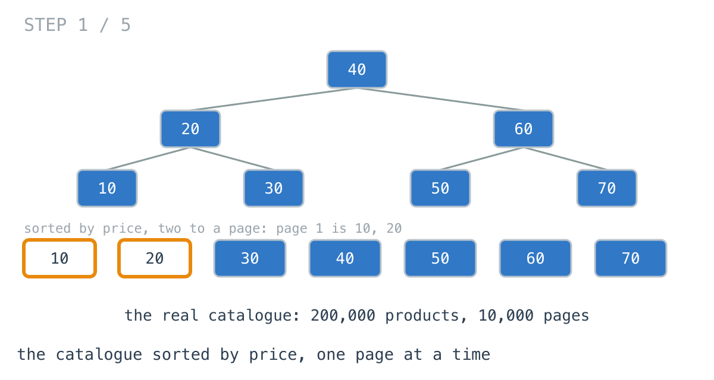
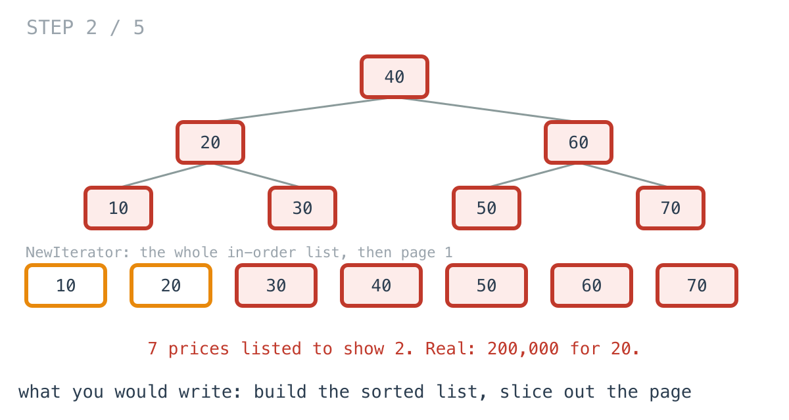
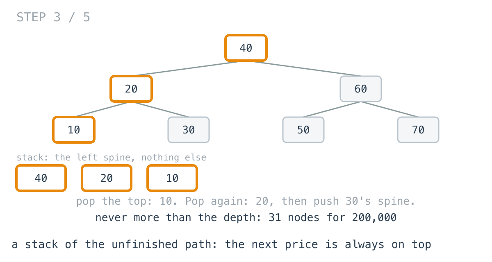
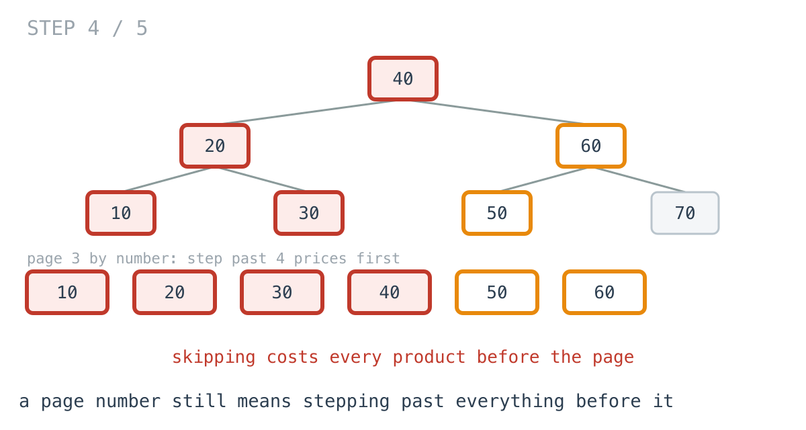
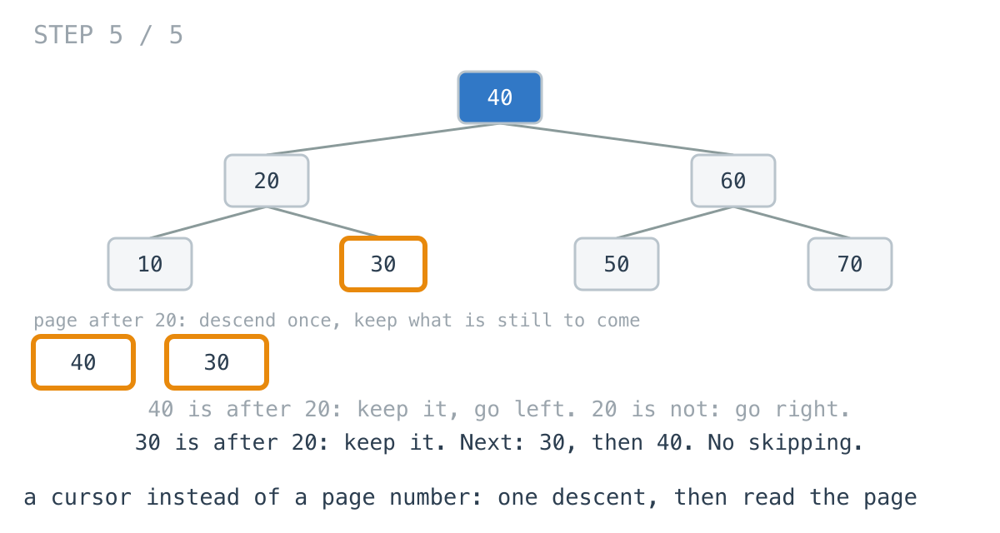

# Page 1 of the catalogue built all 10,000 pages

**It worked in dev · Episode 27 · technique: an iterator that keeps only the unfinished path**

The catalogue page lists products sorted by price, twenty to a page, straight
from the in-memory price index of the last few episodes. The index is a binary
search tree, and an in-order walk of it comes out sorted, so paging should be
cheap.

Page 1 took **6.52 ms** and allocated **7.98 MB**: it built the sorted list of
all 200,000 products, 10,000 pages of them, and showed the first twenty. So did
page 2. An iterator that holds only the path it has not finished serves any
page in under a microsecond, and the export of all 200,000 products gets
**2.41x** faster too.

---

## The problem

```go
type Node struct {
	Price       int
	Left, Right *Node
}

// Twenty products at a time, in price order.
func Page(root *Node, page, size int) []int
```



---

## What you would write

The index already had an iterator, written the way day 56 writes it: build the
in-order sequence once, then hand it out.

```go
func NewIterator(root *Node) *Iterator {
	it := &Iterator{}
	var walk func(n *Node)
	walk = func(n *Node) {
		if n == nil {
			return
		}
		walk(n.Left)
		it.all = append(it.all, n.Price)
		walk(n.Right)
	}
	walk(root)
	return it
}
```

So a page is: make an iterator, skip `page * size`, take `size`.

```go
func PageByList(root *Node, page, size int) []int {
	it := NewIterator(root)
	for skip := page * size; skip > 0 && it.HasNext(); skip-- {
		it.Next()
	}
	out := make([]int, 0, size)
	for len(out) < size && it.HasNext() {
		out = append(out, it.Next())
	}
	return out
}
```

`Next` and `HasNext` are trivial, the iterator is tested, and paging is five
lines on top of it. I would approve it.



---

## How bad, on its own

```
Apple M1 Pro · go1.26.4 · go test -bench=ByList -benchtime=30x
```

| shape | products | page | build the list, slice it | allocated |
|---|---:|---:|---:|---:|
| `page_1` | 200,000 | 1 | 6.52 ms | 7.98 MB |
| `page_100` | 200,000 | 100 | 5.98 ms | 7.98 MB |
| `page_5000` | 200,000 | 5,000 | 6.12 ms | 7.98 MB |
| `last_page` | 200,000 | 10,000 | 6.12 ms | 7.98 MB |

Every page costs the same, because every page builds the whole catalogue. Page
1, which almost every visitor sees and most see only, pays for the other 9,999.

---

## From the symptom to the shape

### The issue, said plainly

To show twenty products, the page lists all 200,000 first.

### Quantify it on the concrete example

In the diagram, seven prices are listed to show two. In the catalogue, 200,000
to show 20: a list of 7.98 MB built and thrown away on every page view.

### Why is it allowed to happen?

Because the iterator's contract is just `Next` and `HasNext`, and building the
whole sequence up front makes those two trivial. Day 56's own comment says it
is "the right trade when the caller will consume most of the tree". A page is a
caller that consumes 0.01% of it.

### The answer was already in the tree

What does an iterator actually need to know to hand out the next price? Not
the whole sequence. In a search tree, the next price after where you are is
fixed by the part of the walk you have not finished: the nodes you went left
from and have not come back to.



Those are the left spine below the current position. The smallest unshown
price is always the top one. When you take it, the next few come from its
right subtree, whose own left spine goes on top.

### What is the question actually asking?

Do not assume it. "The next price" is one price, and "the next twenty" is
twenty. The in-order walk was already the right order - day 53's whole point is
that a search tree's in-order sequence *is* its sorted order. What was wrong was
running all of it in advance.

### Write the thing you want as an equation

```
stack  = the left spine from the root
next() = pop n; push the left spine of n.Right; return n.Price
```

Read it out loud. The stack never holds more than the tree's depth: 31 nodes
for 200,000 products. Each `next()` does a little work, and nothing is done for
prices nobody asks for.

### Conclude the iterator

Keep a stack instead of a list. Page 1 is now 377 ns: push the left spine, pop
twenty. But page 5,000 is 1.29 ms, because a page number still means stepping
past the 99,980 products before it.



### Closing the last gap: ask for "after", not "page"

The previous page ended on a price. Ask for the twenty prices after it. Now
start the stack there instead of at the smallest: descend once as if searching
for the cursor, and keep every node that is after it - you went left from those,
so they and their right sides are still to come.

```go
if n.Price > after {
	it.stack = append(it.stack, n) // n and its right side are still to come
	n = n.Left
} else {
	n = n.Right // n and everything on its left are already shown
}
```



Every page, first or last, is one descent and twenty pops: **254 to 723 ns**.

### Where it came from in the challenge

[Day 56](https://github.com/architagr/leetcode_solutions/blob/main/medium_problems/101_200/binary_search_tree_iterator/SOLUTION.md),
Binary Search Tree Iterator, is the iterator at the top of this page, and it
says which trade it is making: it holds "O(n) memory held for the iterator's
lifetime and a full walk before the caller asks for anything", and the
problem's "follow-up wants O(h) memory instead, using a stack holding the
leftmost spine." This episode is the follow-up, measured, with a cursor added.

[Day 53](https://github.com/architagr/leetcode_solutions/blob/main/medium_problems/1_100/validate_binary_search_tree/SOLUTION.md),
Validate Binary Search Tree, is why the in-order walk is the sorted order at
all: "in-order traversal of a BST yields ascending values, and that runs both
ways". The seek is the same comparison against a bound that its validation
uses, made once on the way down.

### When this does not apply

Go back to the equation and break it.

The stack is a snapshot of a path through a tree that might change. Insert or
delete a product between two page requests and a stack kept across requests
points at a tree that has moved. That is why the cursor version rebuilds the
stack from a price on every request rather than keeping it - the price is
stable when the tree is not.

And if the product at the cursor is deleted, "after this price" still works,
because the seek never needs the cursor to be in the tree. A page number does
not have that property either way: delete one product on page 3 and every page
after it shifts by one.

Only a cursor can jump straight to a page. If the product needs "go to page
5,000" from a number box, that is an offset, and an offset costs the products
before it unless each node also records its subtree size.

### The rule

> **An in-order iterator only needs the unfinished path, not the finished
> sequence. Keep a stack of it, and start it from a cursor, and a page costs
> the depth plus the page.**

---

## Try it before reading on

A stack of nodes, no list. What is on the stack at the start, what does `Next`
do to it, and how would you start it somewhere other than the smallest price?

```bash
git clone https://github.com/architagr/leetcode_solutions
cd leetcode_solutions/series/it-worked-in-dev/episodes/27-paginate-without-loading
go test ./...
```

Reading on costs you the rep.

---

## The version that scales

```go
type StackIterator struct {
	stack []*Node
}

func (it *StackIterator) pushLeft(n *Node) {
	for ; n != nil; n = n.Left {
		it.stack = append(it.stack, n)
	}
}

func (it *StackIterator) Next() int {
	n := it.stack[len(it.stack)-1]
	it.stack = it.stack[:len(it.stack)-1]
	it.pushLeft(n.Right) // everything in n's right subtree comes next, smallest first
	return n.Price
}

func SeekAfter(root *Node, after int) *StackIterator {
	it := &StackIterator{}
	for n := root; n != nil; {
		if n.Price > after {
			it.stack = append(it.stack, n) // n and its right side are still to come
			n = n.Left
		} else {
			n = n.Right // n and everything on its left are already shown
		}
	}
	return it
}
```

Three things carry it. `pushLeft(n.Right)` after every pop is what makes the
next pop the next price. `SeekAfter` builds exactly the stack an iterator would
have after handing out every price up to the cursor, without handing any of them
out. And `>` rather than `>=` in the seek, so the cursor's own price is not
shown twice.

---

## The measurement

| shape | build the list | stack, skip to page | stack from a cursor | list vs cursor |
|---|---:|---:|---:|---:|
| `page_1` | 6.52 ms | 377 ns | 397 ns | 16444x |
| `page_100` | 5.98 ms | 12.1 µs | 419 ns | 14260x |
| `page_5000` | 6.12 ms | 1.29 ms | 723 ns | 8463x |
| `last_page` | 6.12 ms | 2.94 ms | 254 ns | 24069x |

Raw ns: 6,523,229 / 376.9 / 396.7 · 5,980,599 / 12,088 / 419.4 ·
6,120,528 / 1,293,378 / 723.2 · 6,123,276 / 2,937,347 / 254.4

On page 1 the two stack versions do the same work, **0.95x**, within noise. From
there the page number costs more with every page, and on the last page skipping
is only **2.08x** faster than building the whole list. The cursor stays flat.

And the case the list version was written for - reading everything:

| | build the list, then read it | stack iterator |
|---|---:|---:|
| export all 200,000 | 6.26 ms | 2.60 ms |

**2.41x** in the stack's favour even there, because building the list means
growing a 200,000-entry slice.

Allocated: 7.98 MB per page for the list, 216 to 664 bytes for either stack
version.

---

## What it costs

**The stack is a snapshot.** Kept across requests, it goes wrong as soon as the
index changes. Rebuilt from a cursor on each request, it does not - which is
why the cursor, not the stack, is what the page URL should carry.

**The API changes.** "Page 5,000" becomes "after ₹9,998". That is the right
change for next and previous buttons and an awkward one for a page-number box,
which needs subtree sizes on every node to be fast.

**If every caller reads everything, the list is not wrong.** It is 2.41x slower
here, but simpler to reason about. It stops being fine the moment the common
caller is a page, which on a catalogue is always.

---

## The one line to keep

An iterator over a search tree needs only the path it has not finished; keep
that as a stack, seed it from a cursor, and a page costs the depth plus the page
instead of the catalogue.

---

## Built on

Days from the [365-day LeetCode challenge](https://github.com/architagr/leetcode_solutions),
with the solution write-up and the problem itself:

- **Day 53 — [Validate Binary Search Tree](https://github.com/architagr/leetcode_solutions/blob/main/medium_problems/1_100/validate_binary_search_tree/SOLUTION.md)** · LeetCode [#98](https://leetcode.com/problems/validate-binary-search-tree/) · medium
  <br>the children-only check that accepts a broken tree, the subtree check that is quadratic on a chain, and the in-order equivalence
- **Day 56 — [Binary Search Tree Iterator](https://github.com/architagr/leetcode_solutions/blob/main/medium_problems/101_200/binary_search_tree_iterator/SOLUTION.md)** · LeetCode [#173](https://leetcode.com/problems/binary-search-tree-iterator/) · medium
  <br>an iterator that builds the whole in-order list up front, and the follow-up it names: a stack of the leftmost spine in O(h)

---

## Run it yourself

```bash
git clone https://github.com/architagr/leetcode_solutions
cd leetcode_solutions/series/it-worked-in-dev/episodes/27-paginate-without-loading
go test ./...                                                   # all three serve the same pages
go test -run TestStackStaysShallow -v                           # 31 nodes for 200,000
go test -bench='ByList|ExportAll|ByStack/(page_5000|last_page)' -benchtime=30x
go test -bench='PageAfter|ByStack/(page_1$|page_100$)' -benchtime=20000x
```

---

Part of [It worked in dev](../../), the long-form companion to the
[365-day LeetCode challenge](https://github.com/architagr/leetcode_solutions).

---

*Ideation, problem selection, benchmarks and conclusions: Archit Agarwal.
The prose was drafted with AI assistance and edited by me. Every number here
comes from a run you can reproduce with the commands above.*
