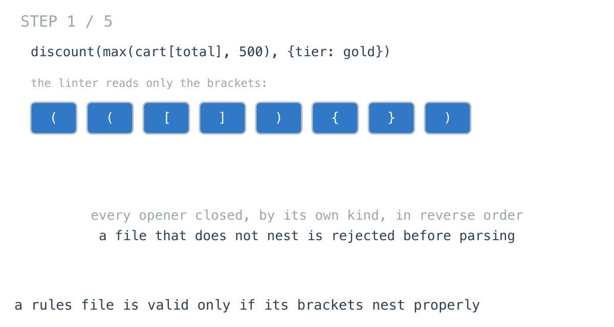
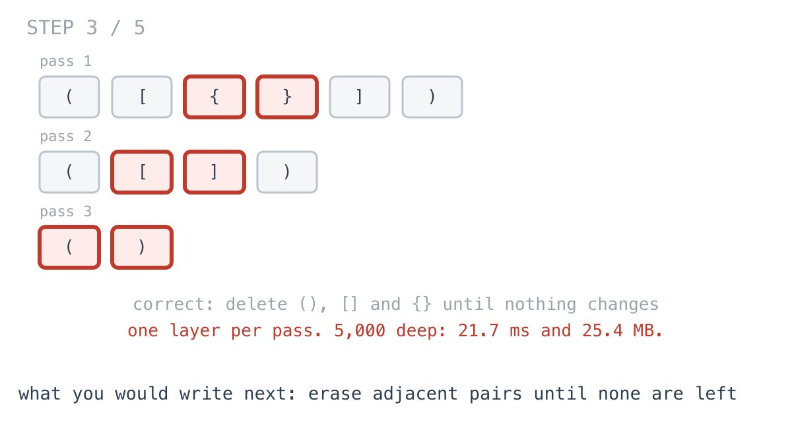
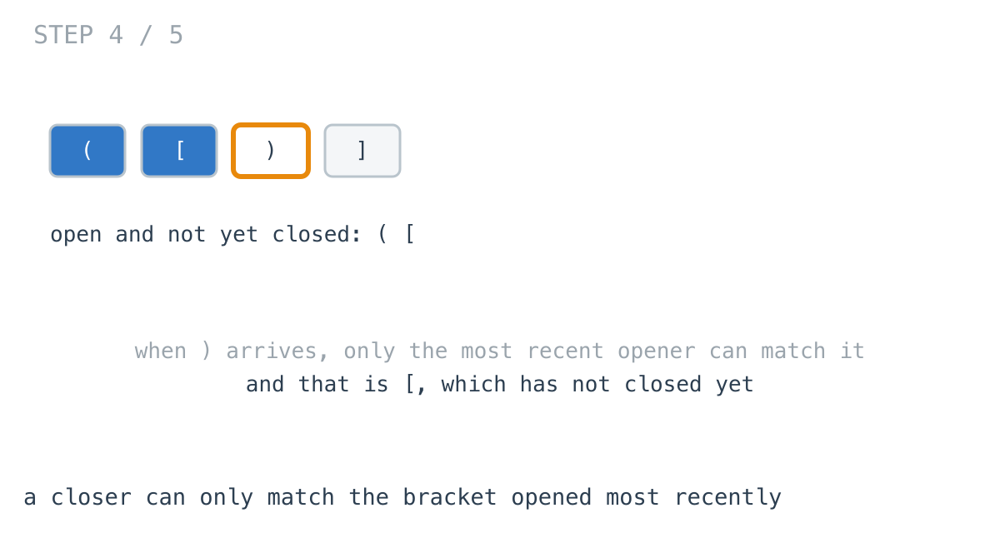
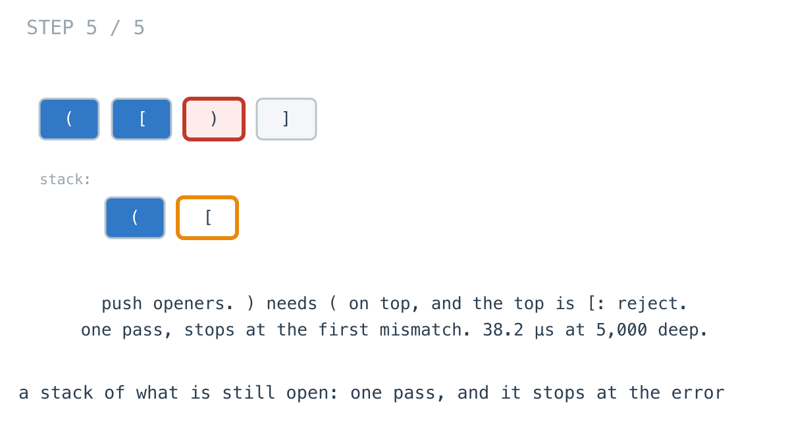

# The linter passed ([)], and its fix choked on depth

**It worked in dev · Episode 28 · technique: a stack of what is still open**

The pricing engine reads rules like `discount(max(cart[total], 500), {tier:
gold})`. A linter checks the brackets nest before the parser runs, because a
parse error on line 4,000 about something on line 12 costs an afternoon.

The first linter counted each kind of bracket, and passed `([)]`. The fix
I wrote next was correct, and on a rule the builder had wrapped 5,000 groups
deep it took **21.7 ms** and allocated **25.4 MB**. A stack of the brackets that
are still open is correct, takes **38.2 µs** there, and stops at the first
mistake.

---

## The problem

```go
// True if every (, [ and { is closed by its own kind, innermost first.
// Everything that is not a bracket is ignored.
func Balanced(s string) bool
```



---

## The version that looks right and is not

What shipped first: count each kind. Every kind must end at zero and never go
below it.

```go
func BalancedByCounting(s string) bool {
	var round, square, curly int
	for i := 0; i < len(s); i++ {
		switch s[i] {
		case '(':
			round++
		case ')':
			round--
		// ... the same for [ ] and { }
		}
		if round < 0 || square < 0 || curly < 0 {
			return false
		}
	}
	return round == 0 && square == 0 && curly == 0
}
```

It catches every missing and every extra bracket, and `TestCountingPassesCrossedBrackets` shows what it misses:

```
"([)]": counting says balanced, the stack says not
```

Every count is fine. The `]` closes a `(` that is still open inside it. It is in
the tables below so you can see it is not buying any speed; it is not a
candidate.

![What ships first: count each kind, and ([)] passes](images/walkthrough-2.png)

---

## What you would write

A file that nests properly always has an adjacent pair somewhere - `()`, `[]` or
`{}` with nothing between them - because the innermost group is one. Delete
those, and the next layer's pairs become adjacent. Keep going; if nothing is
left, it nested.

```go
func BalancedByErasing(s string) bool {
	var b strings.Builder
	for i := 0; i < len(s); i++ {
		if strings.IndexByte("()[]{}", s[i]) >= 0 {
			b.WriteByte(s[i])
		}
	}
	t := b.String()
	for {
		u := strings.ReplaceAll(t, "()", "")
		u = strings.ReplaceAll(u, "[]", "")
		u = strings.ReplaceAll(u, "{}", "")
		if u == t {
			return t == ""
		}
		t = u
	}
}
```

It is short, it is correct - it rejects `([)]`, because `)` and `]` never become
adjacent to their own openers - and the argument for it fits in one sentence. I
would approve it.

---

## How bad, on its own

```
Apple M1 Pro · go1.26.4 · go test -bench=ByErasing -benchtime=200x
```

| shape | bytes | deepest | erasing pairs |
|---|---:|---:|---:|
| `rules_100` | 4,690 | 5 | 24.4 µs |
| `rules_10k` | 561,730 | 5 | 3.42 ms |
| `nested_500` | 2,000 | 500 | 333 µs |
| `nested_5000` | 20,000 | 5,000 | 21.7 ms |

On hand-written rules, five brackets deep at most, 3.42 ms for the whole
engine's rules. Fine. The rule builder, though, wraps every condition a user
adds in another group, and one rule with 5,000 conditions is 20 KB of text that
takes **21.7 ms** and **25.4 MB** to lint. Ten times the depth of `nested_500`,
**65.1x** the time.



---

## From the symptom to the shape

### The issue, said plainly

Each pass over the file removes one layer of nesting, so the number of passes
is the depth.

### Quantify it on the concrete example

`([{}])` takes three passes: `{}`, then `[]`, then `()`. Each pass copies the
whole remaining string, three times over, one `ReplaceAll` per kind. At 5,000
deep that is thousands of copies of a shrinking string: 5,016 allocations and
25.4 MB for a 20 KB input.

### Why is it allowed to happen?

Because every pass only knows how to see pairs that are already adjacent. The
information that `{` goes with `}` in `([{}])` was visible the moment `}` was
read - it came straight after `{`. The information that `[` goes with `]` was
visible the moment `]` was read too, if you remembered what was still open.
Each pass throws that away and re-reads the string to rediscover it.

### The answer was already there when the closer arrived

Read `([)]` left to right. When `)` arrives, `(` and `[` are open. Which of them
can `)` close? Only the most recent one - anything else would leave `[` open
inside a closed `(`. The most recent is `[`. So the file is broken, and that is
known at the third character.



### What is the question actually asking?

Do not assume it. It is not "do the counts balance" and not "can pairs be
erased". It is: at every closer, is the most recently opened bracket that is
still open the same kind? That needs exactly one thing remembered - the
brackets opened and not yet closed, in order, with quick access to the last.

### Write the thing you want as an equation

```
open  = the brackets opened and not yet closed, most recent last
valid ⇔ every closer matches the last of open, which it then removes,
        and open is empty at the end
```

Read it out loud. "Most recent last", "matches the last", "removes it". That is
a stack, named by its own definition.

### Conclude the check

Push openers. For a closer, compare with the top and pop, or reject on the spot.
At the end, anything left was never closed.

```go
if len(stack) == 0 || stack[len(stack)-1] != open {
	return false // nothing open, or the wrong thing open
}
stack = stack[:len(stack)-1]
```



One pass, every byte read once. **38.2 µs** at 5,000 deep, **568x** the erasing
loop, 17.4 KB allocated.

### Where it came from in the challenge

[Day 60](https://github.com/architagr/leetcode_solutions/blob/main/easy_problems/1_100/valid_parentheses/SOLUTION.md),
Valid Parentheses, is the check, and its write-up starts where this episode
started: "Counting openers against closers accepts `)(`. Tracking a depth that
rises and falls accepts `([)]`, because depth records *how many* brackets are
open and never *which*." And then, exactly: "Most recent in, first out. That is
a stack." Its map is keyed by the closer - "One lookup answers both questions" -
which the `switch` above does in its own way.

[Day 56](https://github.com/architagr/leetcode_solutions/blob/main/medium_problems/101_200/binary_search_tree_iterator/SOLUTION.md),
Binary Search Tree Iterator, is the same stack in different clothes. Its
follow-up is "a stack holding the leftmost spine" - the nodes a walk has gone
into and not yet come back out of. Open brackets are the groups a read has gone
into and not come out of. Episode 27 built that iterator; this is the same
structure holding characters instead of nodes.

### When this does not apply

Go back to the equation and break it.

"Everything that is not a bracket is ignored" is false in any real config
language. A `)` inside a string literal - `note: "sale (ends friday"` - is not a
bracket, and all three checks here will fail on it. The stack is still the
answer, but the linter has to know where strings and comments start and end,
which is a small lexer, and at that point the stack lives inside the parser
rather than in front of it.

And if the file will be parsed anyway, the parser already has a stack and will
find the same mismatch. The linter only earns its place by pointing at the
opening bracket - the stack has it on top at the moment of failure, which none
of the other checks could report.

### The rule

> **When each closing thing must match the most recent open one, remember
> what is still open, in order. That is a stack, and it finds a mismatch at
> the character where it happens.**

---

## Try it before reading on

One pass over the string, one slice of bytes. What do you keep, what does an
opener do to it, and what must be true when a closer arrives?

```bash
git clone https://github.com/architagr/leetcode_solutions
cd leetcode_solutions/series/it-worked-in-dev/episodes/28-matching-brackets-config
go test ./...
```

Reading on costs you the rep.

---

## The version that scales

```go
func BalancedByStack(s string) bool {
	stack := make([]byte, 0, 64)
	for i := 0; i < len(s); i++ {
		var open byte
		switch c := s[i]; c {
		case '(', '[', '{':
			stack = append(stack, c)
			continue
		case ')':
			open = '('
		case ']':
			open = '['
		case '}':
			open = '{'
		default:
			continue
		}
		// Nothing open, or the wrong thing open: no later character can fix it.
		if len(stack) == 0 || stack[len(stack)-1] != open {
			return false
		}
		stack = stack[:len(stack)-1]
	}
	return len(stack) == 0 // anything still open was never closed
}
```

Three things carry it. The `switch` maps a closer to the opener it needs, so one
comparison with the top decides. `return false` inside the loop, because nothing
later in the file can fix a wrong closer. And `len(stack) == 0` at the end, for
the brackets that were opened and never closed.

---

## The measurement

| shape | counting | erasing pairs | stack | erasing vs stack |
|---|---:|---:|---:|---:|
| `rules_100` | 15.8 µs | 24.4 µs | 9.46 µs | 2.57x |
| `rules_10k` | 1.32 ms | 3.42 ms | 1.25 ms | 2.75x |
| `nested_500` | 3.83 µs | 333 µs | 3.62 µs | 92x |
| `nested_5000` | 37.7 µs | 21.7 ms | 38.2 µs | 568x |
| `crossed_10k` | 1.29 ms, says valid | 3.46 ms | 622 µs | 5.57x |

Raw ns: 15,825 / 24,352 / 9,461 · 1,323,785 / 3,420,445 / 1,245,787 ·
3,835 / 333,150 / 3,620 · 37,732 / 21,693,196 / 38,182 · 1,294,181 / 3,464,133 / 621,862

On hand-written rules the erasing loop is **2.75x** the stack - real, but not a
reason to rewrite anything. Depth is what hurts it: **92x** at 500, **568x** at
5,000.

Counting is never meaningfully faster than the stack: between **0.988x** and
**2.08x** of its time.
And on `crossed_10k` it reads the whole file and passes it, where the stack
stops at the crossing halfway through in 622 µs.

Allocated: 25.4 MB for erasing at 5,000 deep, 17.4 KB for the stack, nothing for
the stack on the rules files, whose five levels fit in its first 64 bytes.

---

## What it costs

**Nothing.** The stack version is as long as the counting version, faster than
the erasing one everywhere, and the only one of the three that can say where
the mistake is. That is rare in this series and worth saying plainly.

**None of the three understand strings or comments.** A bracket inside quotes
breaks all of them. The stack is still the structure, inside a lexer.

**On five-deep hand-written rules, the erasing loop is fine.** 3.42 ms for the
whole engine, and the logic is one sentence. It stops being fine when a tool
starts generating the rules, which is exactly when nobody reads them.

---

## The one line to keep

A closer can only match the most recent thing still open, so keep what is open
on a stack - and the check becomes one pass that stops at the mistake.

---

## Built on

Days from the [365-day LeetCode challenge](https://github.com/architagr/leetcode_solutions),
with the solution write-up and the problem itself:

- **Day 56 — [Binary Search Tree Iterator](https://github.com/architagr/leetcode_solutions/blob/main/medium_problems/101_200/binary_search_tree_iterator/SOLUTION.md)** · LeetCode [#173](https://leetcode.com/problems/binary-search-tree-iterator/) · medium
  <br>an iterator that builds the whole in-order list up front, and the follow-up it names: a stack of the leftmost spine in O(h)
- **Day 60 — [Valid Parentheses](https://github.com/architagr/leetcode_solutions/blob/main/easy_problems/1_100/valid_parentheses/SOLUTION.md)** · LeetCode [#20](https://leetcode.com/problems/valid-parentheses/) · easy
  <br>why a count or a depth cannot check nesting, and the stack of unclosed openers that can

---

## Run it yourself

```bash
git clone https://github.com/architagr/leetcode_solutions
cd leetcode_solutions/series/it-worked-in-dev/episodes/28-matching-brackets-config
go test ./...                                          # erasing and the stack agree
go test -run TestCountingPassesCrossedBrackets -v      # the check that is wrong
go test -bench=. -benchtime=200x                       # the timings above
```

---

Part of [It worked in dev](../../), the long-form companion to the
[365-day LeetCode challenge](https://github.com/architagr/leetcode_solutions).

---

*Ideation, problem selection, benchmarks and conclusions: Archit Agarwal.
The prose was drafted with AI assistance and edited by me. Every number here
comes from a run you can reproduce with the commands above.*
