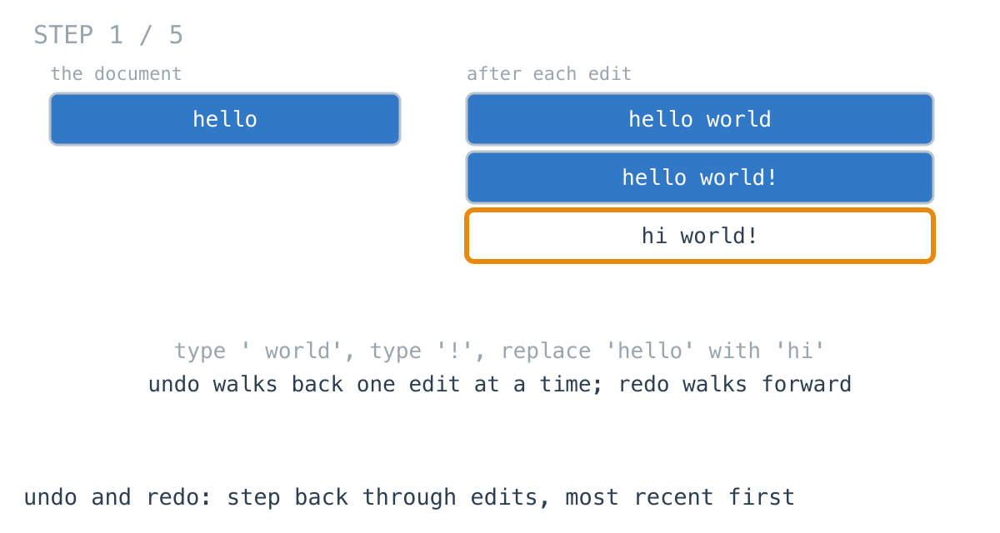
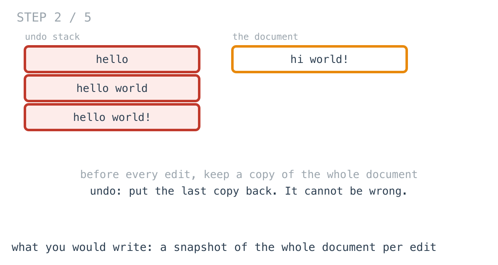
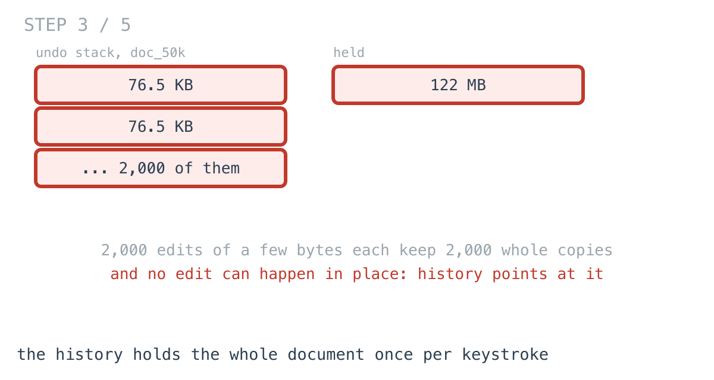
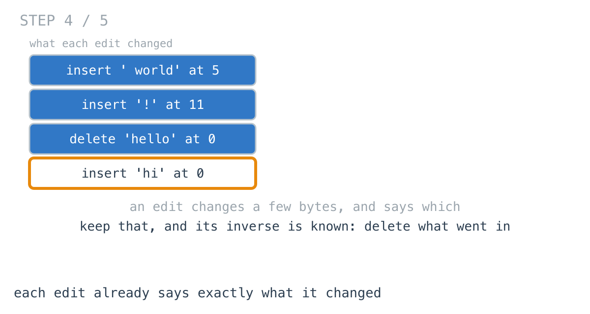
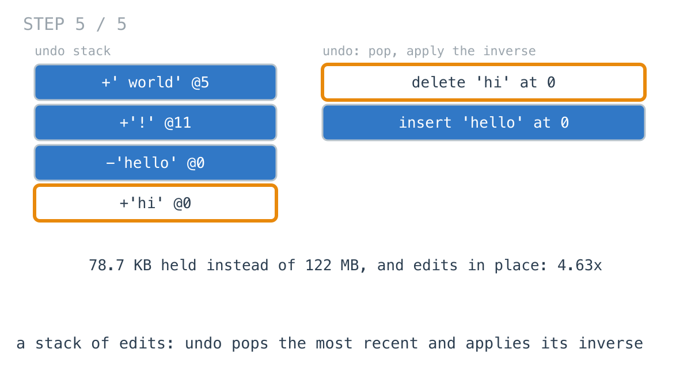

# Undo held 122 MB for a 76 KB document

**It worked in dev · Episode 29 · technique: a stack of edits, each with its inverse**

The docs editor has undo and redo. The first version kept a copy of the whole
document before every edit, which is the one kind of undo that cannot get an
edit wrong, because it never works out what an edit did.

After a two-thousand-edit session on a long document, 76.5 KB of text, the undo
history held **122 MB**. A stack of the edits themselves holds **78.7 KB** for
the same session and is **4.63x** faster - but only once the editor edits in
place, and working that out was the interesting part.

---

## The problem

```go
Insert(pos int, text string)
Delete(pos, n int)
Undo() bool // step back one edit; false if there is nothing to undo
Redo() bool // step forward again; any new edit clears the redo history
```



---

## What you would write

Before every edit, keep the document as it was. Undo puts the last one back.

```go
type SnapshotEditor struct {
	Doc        []byte
	undo, redo [][]byte
}

func (e *SnapshotEditor) Insert(pos int, text string) {
	e.undo = append(e.undo, e.Doc)
	e.redo = e.redo[:0] // a new edit forks history: the old future is gone
	e.Doc = splice(e.Doc, pos, 0, []byte(text))
}

func (e *SnapshotEditor) Undo() bool {
	if len(e.undo) == 0 {
		return false
	}
	e.redo = append(e.redo, e.Doc)
	e.Doc = e.undo[len(e.undo)-1]
	e.undo = e.undo[:len(e.undo)-1]
	return true
}
```

`Delete` and `Redo` are the same shape. Undo is a pointer swap. There is no
inverse to get wrong, no position to recalculate, and redo falls out for free.
I would approve it.



---

## How bad, on its own

```
Apple M1 Pro · go1.26.4 · go test -run TestHeld -v
```

| shape | document at the end | edits | snapshots held |
|---|---:|---:|---:|
| `note_2k` | 8.37 KB | 500 | 2.54 MB |
| `doc_50k` | 76.5 KB | 2,000 | 122 MB |
| `spec_200k` | 209 KB | 1,000 | 197 MB |

A note is fine. A long document is 122 MB of history, and that is one document
in one tab, for as long as the tab stays open.

It is also 9.51 ms of copying for the session, because an edit cannot change
the document in place: the undo stack is holding references to it.

---

## From the symptom to the shape

### The issue, said plainly

Every edit keeps the whole document, to remember a change of a few bytes.

### Quantify it on the concrete example

Two thousand edits, most of them one word typed, against a document that grows
to 76.5 KB: 2,000 copies of the document, one per keystroke-sized change. The
history is **1584x** the size of the edits it records.



### Why is it allowed to happen?

Because a snapshot is the one representation of the past that needs no
thought. It records the result of an edit instead of the edit, and results are
big.

### The answer was already there

Look at what an edit is when it happens. "Insert ' world' at 5." "Delete
'hello' at 0." Each one says exactly what changed, in a few bytes, at the
moment it is made. And each one already implies its own undo: the inverse of
inserting text is deleting that text at that position, and the inverse of a
delete is putting the deleted text back.



The editor was holding the one thing it did not need - the whole document - and
throwing away the one thing it did - the edit.

### What is the question actually asking?

Do not assume it. Undo is only ever asked to reverse **the most recent** edit.
Reversing an older edit first would mean applying its inverse to a document it
was never applied to. So history is last in, first out: a stack. The only open
question is what each entry holds.

### Write the thing you want as an equation

```
undo stack = the edits, oldest at the bottom, each with the text it inserted or removed
undo()     = pop e; apply inverse(e); push e on redo
redo()     = pop e from redo; apply e; push e on undo
```

Read it out loud. Nothing in it refers to the whole document. An entry is as big
as the edit it records.

### Conclude the structure

Push each edit - with the deleted text, for a delete, because it is the only way
to put it back. Undo pops and applies the inverse.

```go
func (e *OpEditor) Undo() bool {
	if len(e.undo) == 0 {
		return false
	}
	o := e.undo[len(e.undo)-1]
	e.undo = e.undo[:len(e.undo)-1]
	e.apply(o.inverse()) // the most recent edit is the only one safe to reverse
	e.redo = append(e.redo, o)
	return true
}
```



78.7 KB of history for the session that took 122 MB.

### And then it was slower

I wrote that, kept building a new document on every edit the way the snapshot
editor did, and measured: **4.06x slower** than snapshots on `doc_50k`. Undo
now had to edit the document back, where the snapshot editor only swapped a
pointer - two copies of the document per edit instead of one.

The copies were never needed. The snapshot editor has to build a new document
for every edit, because its history is holding the old one. An edit stack holds
nothing but edits, so nothing else points at the document, and it can be edited
in place. That change is where the speed comes from: **4.63x faster** than
snapshots, and 739 KB allocated over the session instead of 130 MB.

### Where it came from in the challenge

[Day 60](https://github.com/architagr/leetcode_solutions/blob/main/easy_problems/1_100/valid_parentheses/SOLUTION.md),
Valid Parentheses, is where the stack comes from and why: "only the most
recently opened one can match it ... Most recent in, first out. That is a
stack." Undo is the same constraint about edits instead of brackets - only the
most recent edit can be reversed.

[Day 62](https://github.com/architagr/leetcode_solutions/blob/main/medium_problems/101_200/min_stack/SOLUTION.md),
Min Stack, is what each entry should hold. Its write-up is about exactly this
mistake the other way round: a minimum is "a property of **the stack at a given
height**", so each entry carries it - not the whole stack below it, just the
one number needed to answer at that height. A snapshot editor carries the whole
state per entry. An edit stack carries what is needed to step back one entry.

### When this does not apply

Go back to the equation and break it.

"Undo is only asked to reverse the most recent edit" is true for one person in
one document. With two people editing the same document, your most recent edit
may not be the document's most recent edit, and applying its inverse at its
recorded position deletes the wrong text. That is operational transform or a
CRDT, and a plain stack is not enough.

And if the document is small and edits are few - a form field, a short note -
snapshots are 2.54 MB for a whole session and cannot be wrong. The trade only
matters when the history lives as long as the document does.

### The rule

> **When you can only ever reverse the most recent change, keep a stack of
> changes, not of states. Each entry needs what it takes to step back one
> change, which is usually tiny.**

---

## Try it before reading on

A stack of small structs instead of a stack of documents. What does an entry
need to hold so that undo can reverse it with nothing else? And once history
holds no documents, what does that let every edit stop doing?

```bash
git clone https://github.com/architagr/leetcode_solutions
cd leetcode_solutions/series/it-worked-in-dev/episodes/29-undo-history
go test ./...
```

Reading on costs you the rep.

---

## The version that scales

```go
type op struct {
	pos    int
	text   []byte
	insert bool
}

func (o op) inverse() op { return op{pos: o.pos, text: o.text, insert: !o.insert} }

func (e *OpEditor) Delete(pos, n int) {
	// Keep the deleted text: it is the only way to put it back.
	o := op{pos: pos, text: append([]byte(nil), e.Doc[pos:pos+n]...), insert: false}
	e.apply(o)
	e.undo = append(e.undo, o)
	e.redo = e.redo[:0]
}

// apply edits the document in place. Nothing else holds a reference to the
// document - history is edits, not copies - so there is no reason to copy it.
func (e *OpEditor) apply(o op) {
	if o.insert {
		n, at := len(o.text), o.pos
		e.Doc = append(e.Doc, o.text...) // grow by len(text); contents fixed below
		copy(e.Doc[at+n:], e.Doc[at:len(e.Doc)-n])
		copy(e.Doc[at:], o.text)
	} else {
		n, at := len(o.text), o.pos
		copy(e.Doc[at:], e.Doc[at+n:])
		e.Doc = e.Doc[:len(e.Doc)-n]
	}
}
```

Three things carry it. A delete copies the text it removes, because nothing
else will remember it. The inverse of an edit is the same edit with `insert`
flipped. And `apply` changes the document in place, which is only safe because
no history entry points into it.

---

## The measurement

| shape | snapshots | edits, copying the document | edits, in place | snapshots vs in place |
|---|---:|---:|---:|---:|
| `note_2k` | 680 µs | 1.04 ms | 89.6 µs | 7.59x |
| `doc_50k` | 9.51 ms | 38.6 ms | 2.05 ms | 4.63x |
| `spec_200k` | 12.7 ms | 56.2 ms | 3.63 ms | 3.5x |

Raw ns: 680,400 / 1,041,915 / 89,588 · 9,505,319 / 38,550,019 / 2,053,015 ·
12,729,919 / 56,247,425 / 3,633,115

Each figure is a whole session and every edit undone.

History held at the end of the session: 2.54 MB against 19.3 KB, 122 MB against
78.7 KB, 197 MB against 39.7 KB - **135x**, **1584x**, **5088x**.

The middle column is the honest one. An edit stack that still copies the
document is **1.53x** to **4.42x** slower than snapshots. The memory win is the
stack's; the speed win is editing in place, which the stack allows and
snapshots forbid.

---

## What it costs

**Every edit must know its inverse.** For inserts and deletes that is easy. For
"replace all", "reformat", "sort lines", the inverse has to be recorded too, and
a missed case is an undo that silently does the wrong thing - the failure the
snapshot editor cannot have.

**Positions have to stay true.** An entry records "at 5". That is only right if
every edit after it is undone first, which the stack guarantees for one editor
and nothing guarantees for two.

**For small documents, snapshots are fine.** 2.54 MB for a whole note-editing
session, and no inverse to get wrong. The stack is for the document that stays
open all day.

---

## The one line to keep

Undo only ever reverses the most recent change, so keep a stack of changes with
their inverses - not of whole states - and the document can be edited in place.

---

## Built on

Days from the [365-day LeetCode challenge](https://github.com/architagr/leetcode_solutions),
with the solution write-up and the problem itself:

- **Day 60 — [Valid Parentheses](https://github.com/architagr/leetcode_solutions/blob/main/easy_problems/1_100/valid_parentheses/SOLUTION.md)** · LeetCode [#20](https://leetcode.com/problems/valid-parentheses/) · easy
  <br>why a count or a depth cannot check nesting, and the stack of unclosed openers that can
- **Day 62 — [Min Stack](https://github.com/architagr/leetcode_solutions/blob/main/medium_problems/101_200/min_stack/SOLUTION.md)** · LeetCode [#155](https://leetcode.com/problems/min-stack/) · medium
  <br>carrying in each stack entry exactly what is needed to answer at that height, so a pop never has to recompute anything

---

## Run it yourself

```bash
git clone https://github.com/architagr/leetcode_solutions
cd leetcode_solutions/series/it-worked-in-dev/episodes/29-undo-history
go test ./...                      # all three editors agree through every undo, redo and fork
go test -run TestHeld -v           # the history each one holds
go test -bench=. -benchtime=20x    # the timings above
```

---

Part of [It worked in dev](../../), the long-form companion to the
[365-day LeetCode challenge](https://github.com/architagr/leetcode_solutions).

---

*Ideation, problem selection, benchmarks and conclusions: Archit Agarwal.
The prose was drafted with AI assistance and edited by me. Every number here
comes from a run you can reproduce with the commands above.*
