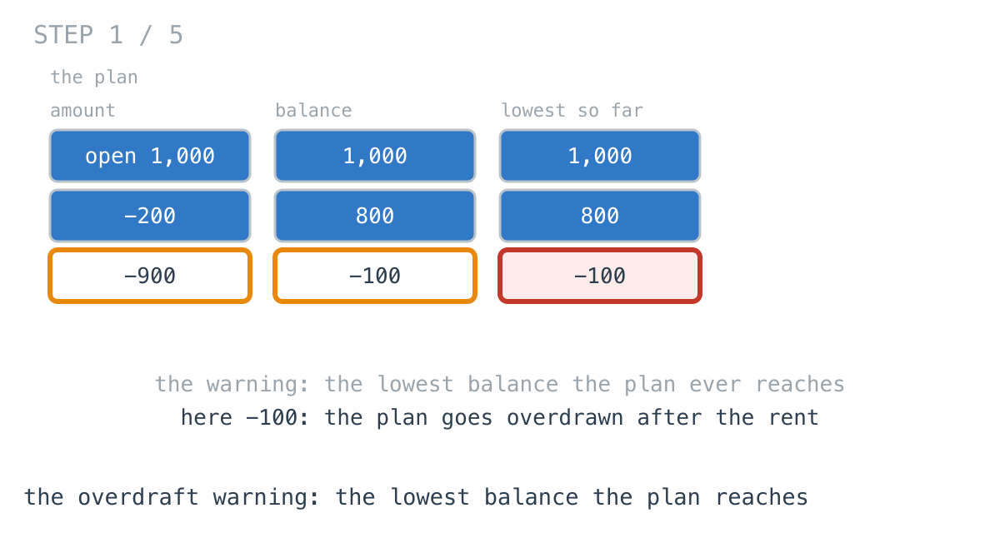
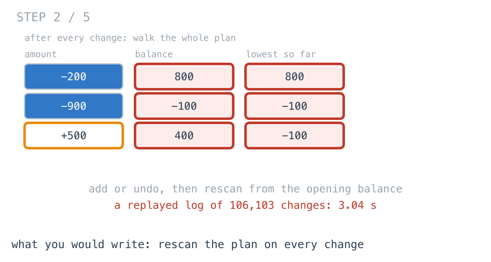
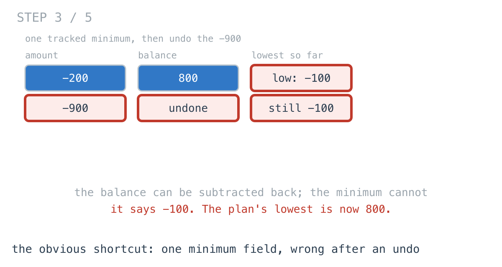
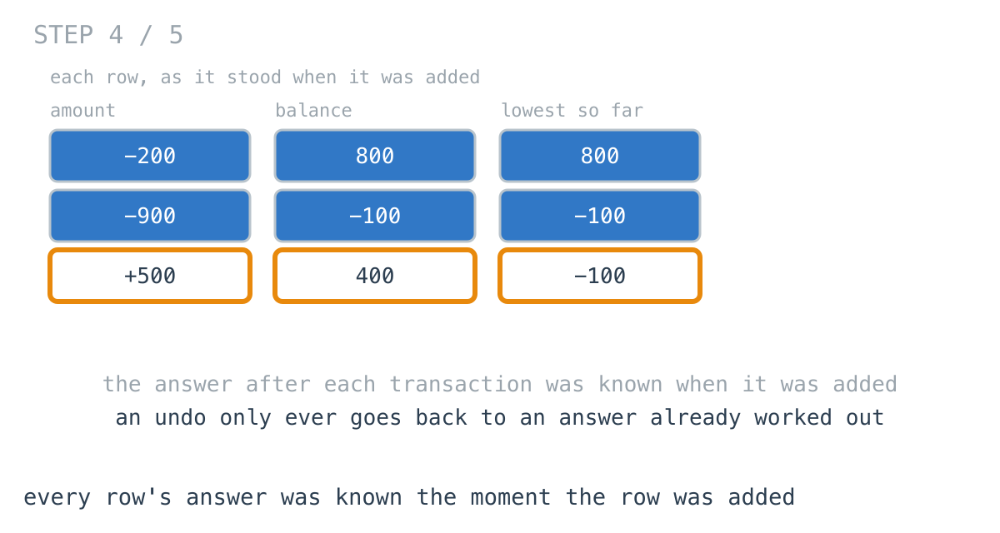
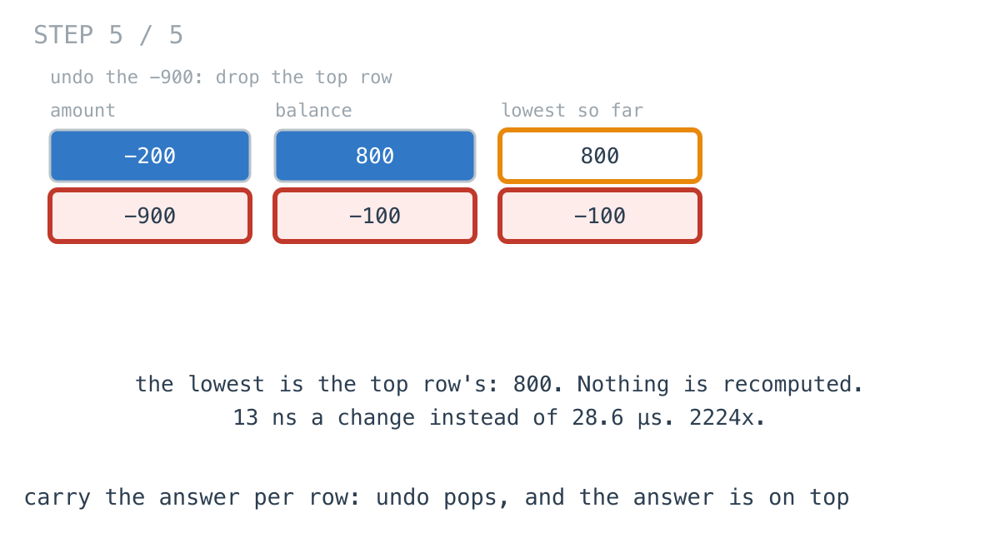

# Replaying the budget's change log took 3 seconds

**It worked in dev · Episode 30 · technique: each stack entry carries the answer at its height**

The budget planner shows one warning above everything else: the lowest balance
the plan ever reaches, so you can see the month you go overdrawn. You add
planned transactions and undo them, and the warning updates after every change.

For a household it was instant. For a small business whose plan's change log -
106,103 adds and undos - is replayed when the planner loads, to draw the
warning's history, it took **3.04 seconds**. Carrying the answer in each
transaction as it is added makes the same replay **1.37 ms**.

---

## The problem

```go
Add(amount int) // a planned transaction at the end of the plan
Undo()          // remove the most recent one
Lowest() int    // the lowest balance the plan reaches, from the opening balance
```



---

## What you would write

Keep the transactions. To answer, walk them from the opening balance and track
the lowest point:

```go
func (p *PlanByRescan) Lowest() int {
	bal, low := p.Opening, p.Opening
	for _, a := range p.tx {
		bal += a
		if bal < low {
			low = bal
		}
	}
	return low
}
```

`Add` appends and `Undo` truncates. There is no state to keep in sync, so there
is nothing to get wrong after an undo. I would approve it.



---

## How bad, on its own

```
Apple M1 Pro · go1.26.4 · go test -bench=PlanByRescan
```

| shape | changes | plan peaks at | rescan on every change |
|---|---:|---:|---:|
| `month_100` | 109 | 71 | 3.85 µs |
| `year_2k` | 2,108 | 1,706 | 1.26 ms |
| `decade_20k` | 21,143 | 16,989 | 134 ms |
| `log_100k` | 106,103 | 83,797 | 3.04 s |

Each figure is a whole session, with the warning computed after every change.
One change on a household plan is a few microseconds, and a person clicking
will never feel it. Replaying a long log is every change at once: 28.6 µs each,
106,103 times.

---

## The version that looks right and is not

The obvious speed-up: keep the balance and the lowest point as fields, and
update them on `Add`. `Undo` subtracts the amount back out of the balance.

```go
func (p *PlanByOneMin) Undo() {
	if len(p.tx) > 0 {
		p.bal -= p.tx[len(p.tx)-1]
		p.tx = p.tx[:len(p.tx)-1]
		// p.low stays where it was: the plan may no longer go that low.
	}
}
```

`TestOneMinIsWrongAfterUndo`:

```
undo the -900: one tracked minimum says -100, the plan's lowest is now 800
```

A balance can be subtracted back out. A minimum cannot: when the transaction
that set it is undone, the field has nothing to go back to except a rescan.



---

## From the symptom to the shape

### The issue, said plainly

Every change walks the whole plan from the start to recompute one number.

### Quantify it on the concrete example

On `log_100k` the plan averages tens of thousands of transactions, and every
one of the 106,103 changes walks all of them. The answer after each walk
differs from the answer before it by at most the one transaction just added or
removed.

### Why is it allowed to happen?

Because `Lowest` is written as a function of the whole plan, which is what the
question sounds like. And the shortcut that makes it incremental breaks on
undo, so the rescan looks like the price of correctness.

### The answer was already known when each row was added

Look at the plan as a table. When the -900 was added, the balance became -100
and the lowest so far became -100. When the +500 was added, the balance became
400 and the lowest stayed -100. Each row's answer - the lowest balance up to and
including it - was worked out at the moment that row was added, from the row
above.



And undo only ever removes the most recent row. So after an undo, the answer is
the one that was right when the row before it was added - which had been
computed already, and thrown away.

### What is the question actually asking?

Do not assume it. It sounds like a question about the whole plan. But since the
plan only changes at the end, it is a question about **the plan at a given
length**, and every length the plan can go back to is one it has already been.

### Write the thing you want as an equation

```
low(k) = min(low(k-1), balance(k))
Lowest() = low(current length)
```

Read it out loud. `low(k)` needs only row `k-1` - which is right below it on a
stack - and nothing about rows after it. So store it in row `k`.

### Conclude the structure

Each entry carries the amount, the balance after it and the lowest so far.
`Add` computes one entry from the one below. `Undo` drops the top entry. `Lowest`
reads the top.

```go
bal += amount
low = min(low, bal) // the lowest so far is the lowest before, or now
p.e = append(p.e, entry{amount, bal, low})
```



13 ns a change. The replayed log: **1.37 ms**, **2224x**.

### Where it came from in the challenge

[Day 62](https://github.com/architagr/leetcode_solutions/blob/main/medium_problems/101_200/min_stack/SOLUTION.md),
Min Stack, is this episode, with a stack of numbers instead of a plan. Its
write-up starts at the broken shortcut: "Keeping one minimum and updating it on
push works right up until the first pop. Pop the element that *is* the current
minimum, and the field is stale." And it says why, in the sentence this episode
is built on: the minimum "is a property of **the stack at a given height**, and
popping returns you to a height whose minimum you have already discarded."

[Day 60](https://github.com/architagr/leetcode_solutions/blob/main/easy_problems/1_100/valid_parentheses/SOLUTION.md),
Valid Parentheses, is why the plan is a stack at all: changes only happen at the
end, and an undo can only take back the most recent one - "Most recent in, first
out."

### When this does not apply

Go back to the equation and break it.

`low(k)` only depends on the rows below it because the plan only changes at the
end. Let someone edit a transaction in the middle - move the rent a month
earlier - and every row above it has a stale balance and a stale minimum. The
per-entry answers are no better than the one field was. That needs a segment
tree over the plan, or, at household sizes, the rescan, which is always right.

### The rule

> **If a structure only changes at one end, every answer it can go back to is
> one it has already computed. Store each answer in the entry it belongs to,
> and an undo is a pop.**

---

## Try it before reading on

Two more numbers per transaction, and no rescan. What does each entry need to
carry so that after an undo the answer is already sitting on top?

```bash
git clone https://github.com/architagr/leetcode_solutions
cd leetcode_solutions/series/it-worked-in-dev/episodes/30-running-min-without-rescan
go test ./...
```

Reading on costs you the rep.

---

## The version that scales

```go
type entry struct {
	amount, bal, low int
}

func (p *PlanByEntry) Add(amount int) {
	bal, low := p.Opening, p.Opening
	if n := len(p.e); n > 0 {
		bal, low = p.e[n-1].bal, p.e[n-1].low
	}
	bal += amount
	low = min(low, bal) // the lowest so far is the lowest before, or now
	p.e = append(p.e, entry{amount, bal, low})
}

func (p *PlanByEntry) Undo() {
	if len(p.e) > 0 {
		p.e = p.e[:len(p.e)-1]
	}
}

func (p *PlanByEntry) Lowest() int {
	if n := len(p.e); n > 0 {
		return p.e[n-1].low
	}
	return p.Opening
}
```

Two things carry it. `Add` reads only the entry below, never the plan. And an
empty plan answers with the opening balance, so undoing everything leaves the
warning right.

---

## The measurement

| shape | changes | rescan on every change | lowest carried per entry | ratio |
|---|---:|---:|---:|---:|
| `month_100` | 109 | 3.85 µs | 1.45 µs | 2.65x |
| `year_2k` | 2,108 | 1.26 ms | 25.7 µs | 49x |
| `decade_20k` | 21,143 | 134 ms | 261 µs | 512x |
| `log_100k` | 106,103 | 3.04 s | 1.37 ms | 2224x |

Raw ns: 3,848 / 1,451 · 1,257,552 / 25,684 · 133,745,058 / 261,233 ·
3,035,645,133 / 1,365,242

The ratio grows with the plan, because the rescan's cost per change does and the
entry's does not. At a month of transactions it is **2.65x** of nothing.

Allocated: the per-entry plan holds three numbers per transaction instead of
one - 10.6 MB against 3.07 MB on `log_100k`.

---

## What it costs

**Three times the memory per transaction.** 24 bytes instead of 8. For a plan
that is tens of thousands of transactions long that is a few megabytes, and it
is the whole price.

**It only works while changes happen at the end.** The moment the planner lets
you edit a transaction in the middle, every stored answer above it is stale and
has to be recomputed from that point - which, done naively, is the rescan again.

**At household sizes, the rescan is fine.** A few microseconds per change and
nothing to keep consistent. It is the replay on load, the thing nobody clicks,
that runs it a hundred thousand times.

---

## The one line to keep

When changes only happen at one end, store each answer in the entry it belongs
to - then an undo is a pop and the answer is already on top.

---

## Built on

Days from the [365-day LeetCode challenge](https://github.com/architagr/leetcode_solutions),
with the solution write-up and the problem itself:

- **Day 60 — [Valid Parentheses](https://github.com/architagr/leetcode_solutions/blob/main/easy_problems/1_100/valid_parentheses/SOLUTION.md)** · LeetCode [#20](https://leetcode.com/problems/valid-parentheses/) · easy
  <br>why a count or a depth cannot check nesting, and the stack of unclosed openers that can
- **Day 62 — [Min Stack](https://github.com/architagr/leetcode_solutions/blob/main/medium_problems/101_200/min_stack/SOLUTION.md)** · LeetCode [#155](https://leetcode.com/problems/min-stack/) · medium
  <br>carrying in each stack entry exactly what is needed to answer at that height, so a pop never has to recompute anything

---

## Run it yourself

```bash
git clone https://github.com/architagr/leetcode_solutions
cd leetcode_solutions/series/it-worked-in-dev/episodes/30-running-min-without-rescan
go test ./...                                           # rescan and per-entry agree at every step
go test -run TestOneMinIsWrongAfterUndo -v              # the shortcut that breaks on undo
go test -bench='/(month_100|year_2k)' -benchtime=500x
go test -bench='/(decade_20k|log_100k)' -benchtime=5x   # about a minute
```

---

Part of [It worked in dev](../../), the long-form companion to the
[365-day LeetCode challenge](https://github.com/architagr/leetcode_solutions).

---

*Ideation, problem selection, benchmarks and conclusions: Archit Agarwal.
The prose was drafted with AI assistance and edited by me. Every number here
comes from a run you can reproduce with the commands above.*
