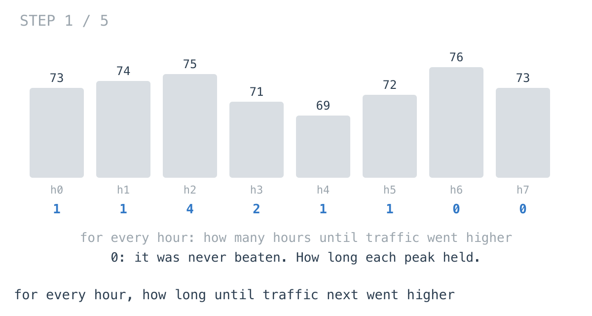
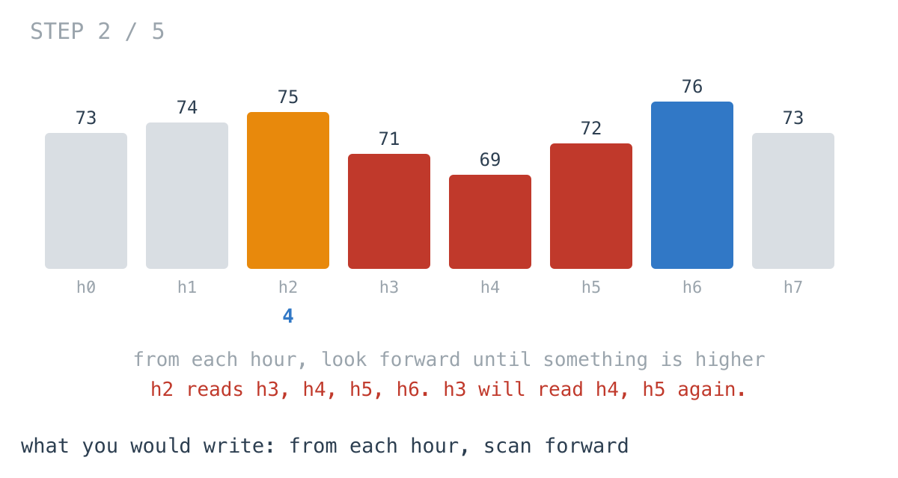
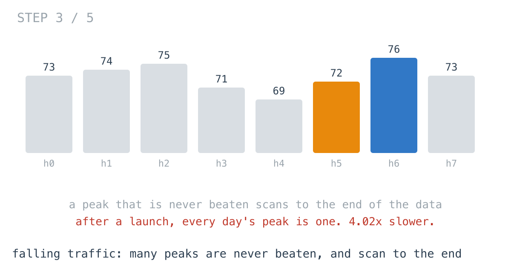
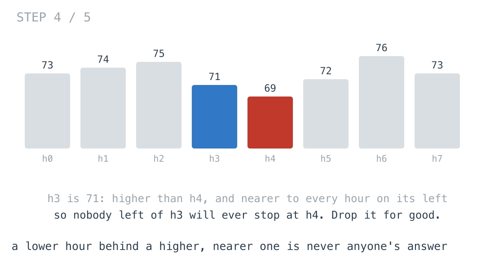
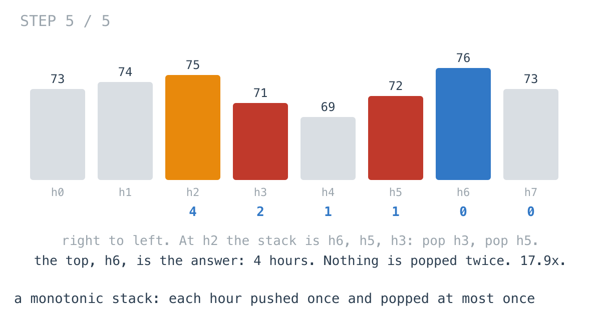

# Falling traffic made the peak report 4.02x slower

**It worked in dev · Episode 31 · technique: monotonic stack**

The capacity dashboard has a panel that shows, for every hour, how long until
traffic next went higher - how long each peak held. A peak that held for a
week is worth planning for; one beaten the next hour is noise.

For a year of hourly traffic the report took **95.9 µs**, and nobody will ever
optimise that. Then the same report ran over the year after a launch, when
traffic starts high and settles down. Same 8,760 hours, and it took **386 µs**,
**4.02x** as long, for data that was *quieter*. A monotonic stack does both years
in about the same time, and is **17.9x** faster on a month of minute-level
launch traffic.

This is one of the episodes where the honest answer at dashboard scale is: the
simple version is fine. The interesting part is why its cost depends on the
shape of the data rather than the size of it.

---

## The problem

```go
// For every period, how many periods until load is strictly higher.
// 0 if it never is.
func Wait(load []int) []int
```



---

## What you would write

From each hour, look forward until something is higher:

```go
func WaitByScan(load []int) []int {
	out := make([]int, len(load))
	for i := range load {
		for j := i + 1; j < len(load); j++ {
			if load[j] > load[i] {
				out[i] = j - i
				break
			}
		}
	}
	return out
}
```

It is the definition, it has a `break`, and on real traffic the inner loop is
usually short: most hours are beaten within the day. I would approve it.



---

## How bad, on its own

```
Apple M1 Pro · go1.26.4 · go test -bench=WaitByScan -benchtime=20x
```

| shape | periods | scan forward |
|---|---:|---:|
| `week_hours` | 168 | 1.18 µs |
| `year_hours` | 8,760 | 95.9 µs |
| `year_minutes` | 525,600 | 18.0 ms |
| `launch_hours` | 8,760 | 386 µs |
| `launch_minutes` | 43,200 | 5.87 ms |

Look at `year_hours` and `launch_hours`. Same number of hours. The launch year
is 4.02x slower. And `launch_minutes`, a twelfth of the length of
`year_minutes`, takes a third of the time.

At hourly resolution, all of this is fine. It stops being fine at minute
resolution over a long window, or when the panel is computed for every service
in the fleet at once.

---

## From the symptom to the shape

### The issue, said plainly

Every hour re-reads the hours after it, and a peak that is never beaten reads
all of them.

### Quantify it on the concrete example

`TestSteps` counts how far the scans look in total:

```
year_hours        8760 periods,     12 never beaten  |  forward steps the scan takes:        93709
launch_hours      8760 periods,    143 never beaten  |  forward steps the scan takes:      1103549
```

On a growing year, most hours are beaten within hours: 11 steps each on
average. After a launch, traffic settles lower, so the early peaks are beaten
late or never, and every hour near one of them has to read past it.



### Why is it allowed to happen?

Because each hour's scan starts from nothing. In the diagram, h2 reads h3, h4,
h5 and h6. Then h3 reads h4 and h5 again. What h2's scan learned about the hours
after it is thrown away, and h3 relearns part of it.

### The answer was already known: some hours can never be an answer

Look at h3 and h4. h3 is 71; h4 is 69. For any hour to the left of h3, the scan
reaches h3 before h4, and h3 is at least as high. So if h4 would stop that scan,
h3 already did. h4 can never be the answer for anything to the left of h3.



That was known the moment h3 was compared with h4 - and the scan compares them
again for every hour further left.

### What is the question actually asking?

Do not assume it. Walking from the right, the hours worth keeping as possible
answers are the ones not hidden behind a nearer, higher hour. Those form a
sequence that rises as you go further right: each kept hour is higher than every
kept hour nearer to you.

### Write the thing you want as an equation

```
candidates(i) = hours after i, not hidden behind a nearer hour that is at least as high
answer(i)     = the nearest candidate higher than load[i]
candidates(i-1) = the ones in candidates(i) higher than load[i], then i itself
```

Read the last line out loud. Moving one hour left, every candidate not higher
than the new hour is hidden by it for good, and the new hour joins, nearest of
all. Removals are from the near end, additions to the near end. That is a stack.

### Conclude the walk

Walk right to left. Pop every candidate not higher than this hour. Whatever is
on top now is the nearest higher hour. Push this hour.

```go
for len(stack) > 0 && load[stack[len(stack)-1]] <= load[i] {
	stack = stack[:len(stack)-1]
}
if len(stack) > 0 {
	out[i] = stack[len(stack)-1] - i
}
stack = append(stack, i)
```



Every hour is pushed once and popped at most once, whatever the shape of the
traffic. 3 to 8 ns per period on every series here.

### Where it came from in the challenge

[Day 63](https://github.com/architagr/leetcode_solutions/blob/main/medium_problems/701_800/daily_temperatures/SOLUTION.md),
Daily Temperatures, is this panel with temperatures for traffic, and it walks
right to left for the same reason: "The answer for index `i` is known while
standing on `i`." It also explains the `<=`: "Equal temperatures are not
*warmer*. A day holding the same temperature can never be anyone's answer, so it
must be popped." Equal traffic has not gone *higher* either.

[Day 61](https://github.com/architagr/leetcode_solutions/blob/main/easy_problems/401_500/next_greater_element_i/SOLUTION.md),
Next Greater Element I, is the same stack walked the other way, and it names the
turn this episode takes: "The natural reading is 'for each element, look right
until something is bigger'. That is O(n²) ... This asks the opposite question."
It is also where the name is explained - the stack "is always **decreasing from
bottom to top** ... A stack that maintains an ordering invariant like this is a
monotonic stack."

### When this does not apply

Go back to the equation and break it.

The candidates only work as a stack because every question is "the nearest
higher one after me". Ask instead "the nearest hour after me that is at least 20%
higher", and a candidate hidden behind a nearer, slightly higher hour may still
be the answer for someone - the hiding argument fails, and so does the stack.

And on normal traffic at hourly resolution, the scan is a tenth of a
millisecond for a year. The stack is the right structure; it is not a fix
anybody needs until the window is long, the resolution is fine, or the data
stops rising.

### The rule

> **When each item needs the nearest later item that beats it, anything
> beaten by a nearer item can never be the answer for anyone earlier. Keep the
> rest on a stack, and each item is pushed and popped once.**

---

## Try it before reading on

One slice of indices and one pass, in either direction. Which hours are worth
remembering as possible answers, and when can you forget one for good?

```bash
git clone https://github.com/architagr/leetcode_solutions
cd leetcode_solutions/series/it-worked-in-dev/episodes/31-next-bigger-spike
go test ./...
```

Reading on costs you the rep.

---

## The version that scales

```go
func WaitByStack(load []int) []int {
	out := make([]int, len(load))
	stack := make([]int, 0, 64) // indices; their loads rise from top to bottom
	for i := len(load) - 1; i >= 0; i-- {
		// Not higher than load[i] means nobody left of i will ever pick it:
		// i is nearer and at least as high.
		for len(stack) > 0 && load[stack[len(stack)-1]] <= load[i] {
			stack = stack[:len(stack)-1]
		}
		if len(stack) > 0 {
			out[i] = stack[len(stack)-1] - i
		}
		stack = append(stack, i)
	}
	return out
}
```

Three things carry it. The stack holds indices, because the answer is a
distance. `<=`, so an equal hour is dropped - it is not higher. And an empty
stack after the pops means nothing later is higher, which leaves the answer at 0.

---

## The measurement

| shape | periods | scan forward | monotonic stack | ratio |
|---|---:|---:|---:|---:|
| `week_hours` | 168 | 1.18 µs | 441 ns | 2.68x |
| `year_hours` | 8,760 | 95.9 µs | 26.2 µs | 3.66x |
| `year_minutes` | 525,600 | 18.0 ms | 3.98 ms | 4.53x |
| `launch_hours` | 8,760 | 386 µs | 34.9 µs | 11.1x |
| `launch_minutes` | 43,200 | 5.87 ms | 327 µs | 17.9x |

Raw ns: 1,180 / 440.7 · 95,933 / 26,242 · 18,049,004 / 3,982,619 ·
386,127 / 34,927 · 5,865,477 / 326,971

The ratio is not a function of size. It is a function of how far the scan has to
look, which is a function of the data. Growing traffic: **3.66x** on a year of
hours. Traffic after a launch: **11.1x** on a year of hours, **17.9x** on a month
of minutes. The stack's cost moved by **1.33x** between the two hourly years; the
scan's by **4.02x**.

Allocated: the same in both - the result, one int per period. The stack's own
slice only grows past 64 entries on the minute-level series.

---

## What it costs

**Almost nothing: a few more lines.** Same result, same memory,
and a cost that does not depend on what the traffic did.

**It reads backwards.** Walking right to left and popping is harder to check by
eye than a forward scan with a `break`. The comment on the pop condition is the
one that matters.

**At the dashboard's scale, the scan is fine.** 95.9 µs for a year of hours. I
would write the stack because it is no harder and its cost does not move with
the data, not because the scan was a problem - until the panel moved to
per-minute data after a launch.

---

## The one line to keep

Anything beaten by a nearer item can never be anyone's "next bigger" further
back - so keep only the unbeaten on a stack, and every item is touched twice.

---

## Built on

Days from the [365-day LeetCode challenge](https://github.com/architagr/leetcode_solutions),
with the solution write-up and the problem itself:

- **Day 61 — [Next Greater Element I](https://github.com/architagr/leetcode_solutions/blob/main/easy_problems/401_500/next_greater_element_i/SOLUTION.md)** · LeetCode [#496](https://leetcode.com/problems/next-greater-element-i/) · easy
  <br>asking which earlier values each new value answers, instead of scanning forward from each, and the monotonic stack that invariant builds
- **Day 63 — [Daily Temperatures](https://github.com/architagr/leetcode_solutions/blob/main/medium_problems/701_800/daily_temperatures/SOLUTION.md)** · LeetCode [#739](https://leetcode.com/problems/daily-temperatures/) · medium
  <br>the same stack holding indices so the answer can be a distance, walked right to left, with <= because equal is not higher

---

## Run it yourself

```bash
git clone https://github.com/architagr/leetcode_solutions
cd leetcode_solutions/series/it-worked-in-dev/episodes/31-next-bigger-spike
go test ./...                         # scan and stack agree on every series
go test -run TestSteps -v             # how far the scan looks
go test -bench=. -benchtime=20x       # the timings above
```

---

Part of [It worked in dev](../../), the long-form companion to the
[365-day LeetCode challenge](https://github.com/architagr/leetcode_solutions).

---

*Ideation, problem selection, benchmarks and conclusions: Archit Agarwal.
The prose was drafted with AI assistance and edited by me. Every number here
comes from a run you can reproduce with the commands above.*
