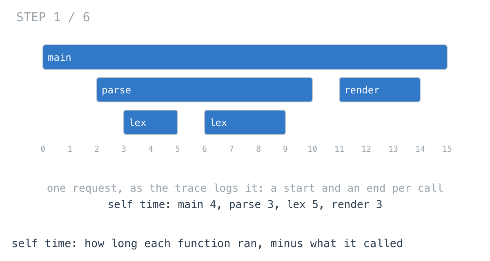
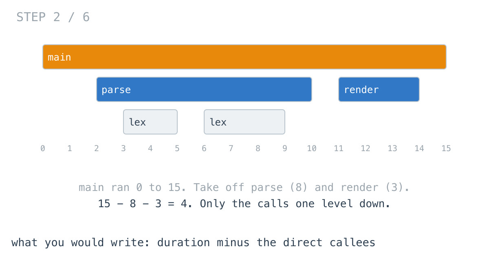
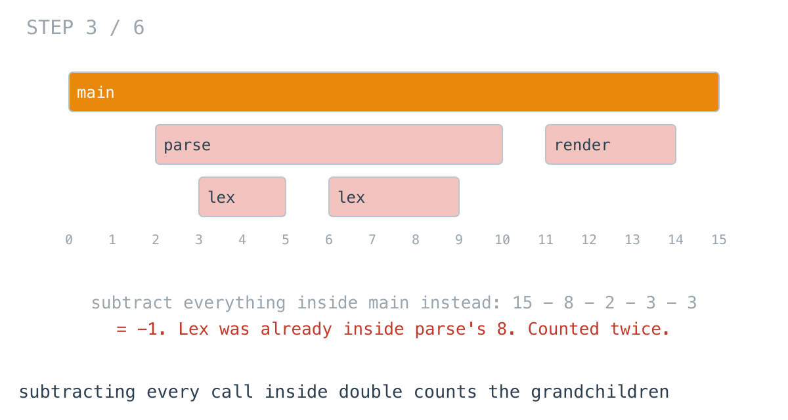
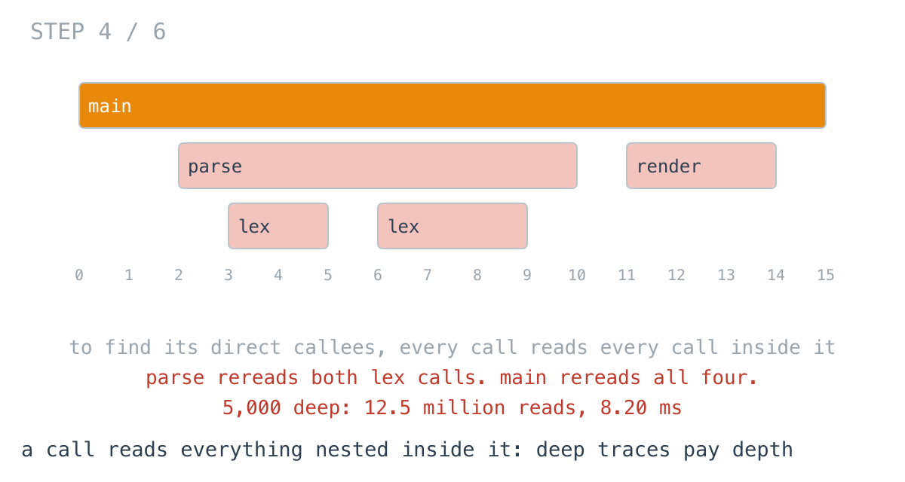
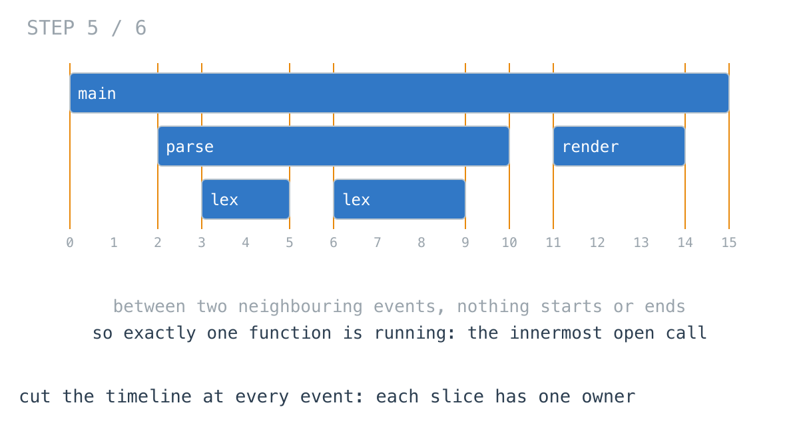
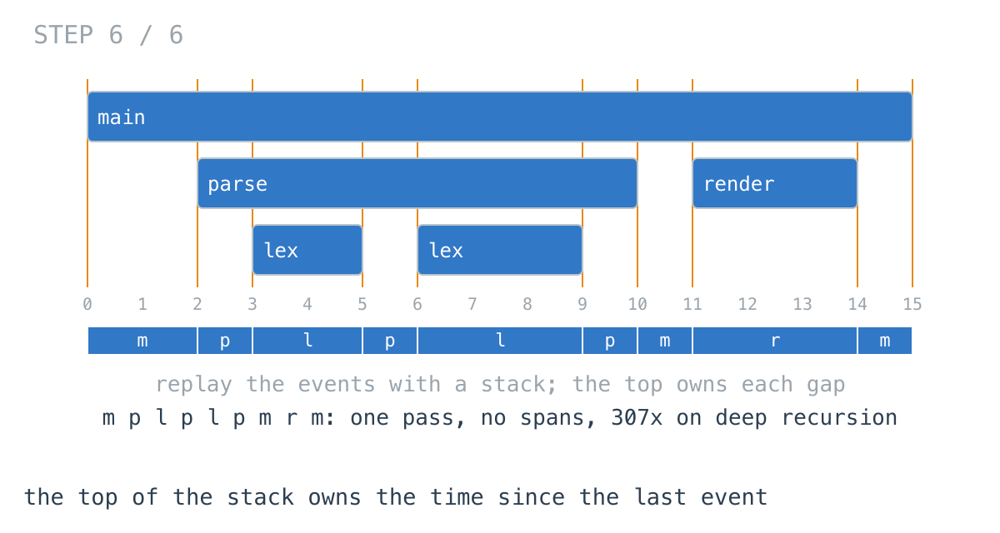

# 20,000 calls took the profiler longer than 200,000

**It worked in dev · Episode 32 · technique: the top of the call stack owns the time**

Our services write a trace: every function call logs a start and an end with a
nanosecond timestamp. The flame-graph panel needs each function's self time -
how long it was actually running, not counting the functions it called. That is
the number that tells you where the time went.

On a 200,000-call batch job the panel's code took **4.27 ms**. On a trace from
the config parser, with a tenth of the calls, it took **12.5 ms** - **2.92x** as
long. The parser recurses, and the code that computes self time pays for depth,
not for calls. Replaying the trace on a stack does the parser in **151 µs**, and
a 5,000-deep recursion **307x** faster.

---

## The problem

```go
type Event struct {
	Fn    int   // function id
	Start bool  // true for a call, false for its return
	At    int64 // ns since the trace began
}

// Self time per function: how long it ran, minus the time spent in
// the functions it called.
func Self(n int, events []Event) []int64
```

Timestamps are half-open: a call that ends at `t` stopped running at `t`, and
its caller is running again from `t`.



---

## What you would write

Self time is a call's duration minus its callees' durations. So: turn the trace
into calls with a start, an end and a depth, then take each one's duration and
subtract the calls made directly from it.

```go
func SelfBySpans(n int, events []Event) []int64 {
	spans := make([]span, 0, len(events)/2)
	open := make([]int, 0, 64) // indices into spans of calls not yet returned
	for _, e := range events {
		if e.Start {
			open = append(open, len(spans))
			spans = append(spans, span{fn: e.Fn, start: e.At, depth: len(open) - 1})
			continue
		}
		spans[open[len(open)-1]].end = e.At
		open = open[:len(open)-1]
	}

	out := make([]int64, n)
	for i, s := range spans {
		self := s.end - s.start
		for j := i + 1; j < len(spans) && spans[j].start < s.end; j++ {
			if spans[j].depth == s.depth+1 { // only direct callees
				self -= spans[j].end - spans[j].start
			}
		}
		out[s.fn] += self
	}
	return out
}
```



The `depth == s.depth+1` is there because the first version I wrote did not
have it. It subtracted every call inside `main`, and `main` came out at -1:
`lex` was already inside `parse`'s 8 units and got taken off twice.



With that fixed, this is correct, it reads like the definition, and the inner
loop stops at the first span starting after the call ends. Spans are a natural
thing to want anyway - a flame graph draws them. I would approve it.

---

## How bad, on its own

```
Apple M1 Pro · go1.26.4 · go test -bench=SelfBySpans -benchtime=100x
```

| shape | calls | max depth | spans, then direct callees |
|---|---:|---:|---:|
| `request` | 2,000 | 12 | 24.3 µs |
| `batch` | 200,000 | 16 | 4.27 ms |
| `parser` | 20,000 | 1,638 | 12.5 ms |
| `recursion` | 5,000 | 5,000 | 8.20 ms |

`request` is one HTTP request: 24.3 µs, which nobody will ever look at. `batch`
is a hundred times the calls and costs about what a hundred requests would. Then
`parser`, a tenth of `batch`, is 2.92x slower. And `recursion`, 5,000 calls,
costs nearly twice as much as 200,000.

On the traces most services write, twelve or sixteen layers deep, this is fine.
It stops being fine on anything that recurses: parsers, tree walks, template
renderers, a retry wrapper that calls itself.

---

## From the symptom to the shape

### The issue, said plainly

Every call reads every call nested inside it, to find the few that are its
direct callees.

### Quantify it on the concrete example

In the diagram, `parse` reads both `lex` calls. `main` reads all four calls -
including both `lex` calls again, to check their depth and skip them. A call at
depth `d` is read once by each of the `d` calls above it.

`TestSteps` counts it:

```
batch       200000 calls, max depth    16  |  spans the inner loop reads:     1511720
parser       20000 calls, max depth  1638  |  spans the inner loop reads:    15077280
recursion     5000 calls, max depth  5000  |  spans the inner loop reads:    12497500
```

Shallow traces cost calls times depth, and depth is small. A 5,000-deep
recursion is 5,000 times 4,999 over two.



### Why is it allowed to happen?

Because each call's answer is worked out separately, after the fact, from the
spans. `main` has no way to know that `parse` already looked at the two `lex`
calls. The trace gave us the nesting in order, and the first loop threw the
order away to build spans.

### The answer was already there: in the order of the events

Look at the trace as it arrives instead of as spans. Between two consecutive
events nothing starts and nothing ends. So for that whole stretch, exactly one
function is running: the innermost one that has started and not returned.



We knew who that was when the event arrived. The first loop already had it -
it is the top of `open`. Every stretch of time had its owner sitting on the
stack, and the spans version waited until the end to work it out again by
subtraction.

### What is the question actually asking?

Do not assume it. "Duration minus the durations of direct callees" is one way to
say self time, and it is the one that needs the spans. Another way to say the
same thing: the sum of the stretches where this function was the one running.

### Write the thing you want as an equation

```
self(f) = sum over consecutive events (a, b) where top-of-stack during (a, b) is f
          of  b.At - a.At
```

Read the right-hand side out loud. Each term needs two timestamps that are next
to each other in the trace, and the top of the stack between them. Nothing about
a call's end, its depth, or its callees. Everything is known at event `b`, the
moment it arrives.

### Conclude the walk

Replay the trace. On every event, charge the gap since the last event to
whoever is on top, then push or pop.

```go
if len(stack) > 0 {
	out[stack[len(stack)-1]] += e.At - last // the top was running since last
}
last = e.At
```



Each event is looked at once and the trace is never turned into spans. The
subtraction never happens, so it cannot be done twice.

### Where it came from in the challenge

[Day 66](https://github.com/architagr/leetcode_solutions/blob/main/medium_problems/601_700/exclusive_time_of_functions/SOLUTION.md),
Exclusive Time of Functions, is this panel. Its write-up starts where this
episode ends up: "The log is a recording of a call stack, and this function
replays it." Its timestamps are inclusive, so an end at `t` owns instant `t`,
and each stack entry carries the time its function resumed - which is why it
needs `time + 1` and two different rules for start and end. With half-open
timestamps a trace format usually has, the resume time of whatever is now on
top is always the timestamp that just arrived. One variable, `last`, holds it
for every entry.

[Day 62](https://github.com/architagr/leetcode_solutions/blob/main/medium_problems/101_200/min_stack/SOLUTION.md),
Min Stack, is where the habit comes from: put in the stack whatever a pop will
need, so nothing gets recomputed afterwards. Day 66 put a resume time in each
entry. Here the entries need only the function id, because the timestamp they
would carry is shared.

### When this does not apply

Go back to the equation and break it.

It needs the events in time order, with every call's end after everything it
called. A sampled profile, or a trace merged from several threads without a
thread id on each event, does not have that - two calls on different threads
overlap without nesting, and the top of one stack does not own the time. Keep a
stack per thread, or go back to spans.

And if what you need is the spans - to draw the flame graph, not to total it -
you are building them anyway. Build them, and compute self time during the same
replay instead of from them afterwards.

### The rule

> **When events nest and arrive in order, the innermost open one owns
> everything until the next event. Charge it as you go, and the subtraction
> you were going to do later never has to happen.**

---

## Try it before reading on

One pass over the events, a stack of function ids, and one extra variable. No
spans, no subtraction.

```bash
git clone https://github.com/architagr/leetcode_solutions
cd leetcode_solutions/series/it-worked-in-dev/episodes/32-who-holds-the-time
go test ./...
```

Reading on costs you the rep.

---

## The version that scales

```go
func SelfByStack(n int, events []Event) []int64 {
	out := make([]int64, n)
	stack := make([]int, 0, 64) // function ids, innermost on top
	var last int64
	for _, e := range events {
		if len(stack) > 0 {
			out[stack[len(stack)-1]] += e.At - last // the top was running since last
		}
		last = e.At
		if e.Start {
			stack = append(stack, e.Fn)
		} else {
			stack = stack[:len(stack)-1]
		}
	}
	return out
}
```

Two things carry it. The charge happens before the push or pop, because the gap
belongs to whoever was on top *before* this event. And the check for an empty
stack is not defensive: between two top-level calls nothing is running, and that
idle time belongs to nobody.

`TestBothAgree` also checks that the self times add up to exactly the time
something was on the stack. Every nanosecond charged once.

---

## The measurement

| shape | calls | max depth | spans, then direct callees | stack replay | ratio |
|---|---:|---:|---:|---:|---:|
| `request` | 2,000 | 12 | 24.3 µs | 5.86 µs | 4.15x |
| `batch` | 200,000 | 16 | 4.27 ms | 1.56 ms | 2.73x |
| `parser` | 20,000 | 1,638 | 12.5 ms | 151 µs | 82.3x |
| `recursion` | 5,000 | 5,000 | 8.20 ms | 26.7 µs | 307x |

Raw ns: 24,302 / 5,860 · 4,270,666 / 1,564,211 · 12,457,010 / 151,339 ·
8,198,515 / 26,736

On shallow traces the replay is **2.73x to 4.15x** faster, mostly because it
never builds the spans. On the parser it is **82.3x**, and on the 5,000-deep
recursion **307x**. The replay costs 3 to 8 ns per call on every trace; the spans
version goes from 12 ns per call to 1,640 as the trace gets deeper.

Allocated: the spans version builds a 32-byte span per call before it starts,
**6.41 MB** on the batch job. The replay allocates the eight-entry result and
nothing else on shallow traces, and a stack that grows with depth on deep ones.

---

## What it costs

**You no longer have the spans.** If the panel draws a flame graph, it needs
them, and the replay does not produce them. Build them in the same pass if you
need both.

**It trusts the trace.** An end with nothing open, or an end for a different
function than the one on top, is silently charged to the wrong place. The spans
version has the same assumption hidden in `open[len(open)-1]`; neither checks.
A real trace parser should.

**On shallow traces it barely matters.** 24.3 µs for a request. I would write
the replay because it is shorter and its cost does not depend on how deep the
code recursed - which is not something whoever reads the panel gets to choose.

---

## The one line to keep

Between two nested events, the innermost open call owns the time. Charge it as
the events arrive, and there is nothing left to subtract.

---

## Built on

Days from the [365-day LeetCode challenge](https://github.com/architagr/leetcode_solutions),
with the solution write-up and the problem itself:

- **Day 62 — [Min Stack](https://github.com/architagr/leetcode_solutions/blob/main/medium_problems/101_200/min_stack/SOLUTION.md)** · LeetCode [#155](https://leetcode.com/problems/min-stack/) · medium
  <br>carrying in each stack entry exactly what is needed to answer at that height, so a pop never has to recompute anything
- **Day 66 — [Exclusive Time of Functions](https://github.com/architagr/leetcode_solutions/blob/main/medium_problems/601_700/exclusive_time_of_functions/SOLUTION.md)** · LeetCode [#636](https://leetcode.com/problems/exclusive-time-of-functions/) · medium
  <br>replaying a call log on a stack whose top is the function running now, so every stretch of time is charged to exactly one function

---

## Run it yourself

```bash
git clone https://github.com/architagr/leetcode_solutions
cd leetcode_solutions/series/it-worked-in-dev/episodes/32-who-holds-the-time
go test ./...                         # spans and replay agree on every trace
go test -run TestSteps -v             # how much the inner loop reads
go test -bench=. -benchtime=100x      # the timings above
```

---

Part of [It worked in dev](../../), the long-form companion to the
[365-day LeetCode challenge](https://github.com/architagr/leetcode_solutions).

---

*Ideation, problem selection, benchmarks and conclusions: Archit Agarwal.
The prose was drafted with AI assistance and edited by me. Every number here
comes from a run you can reproduce with the commands above.*
