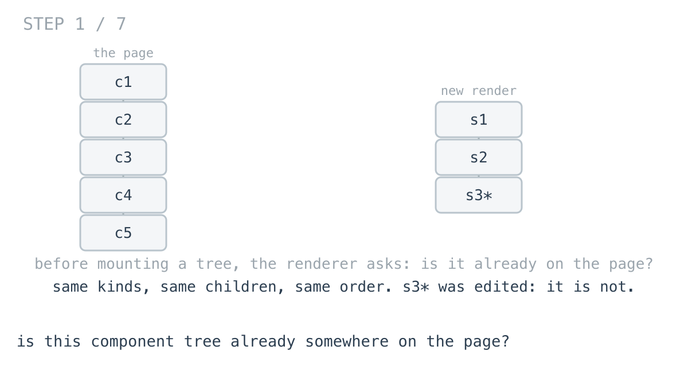
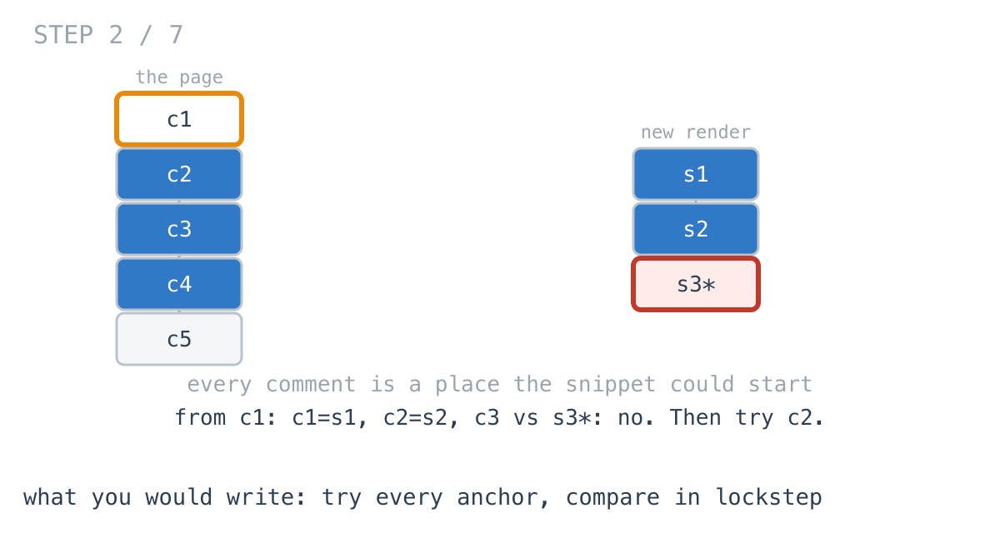
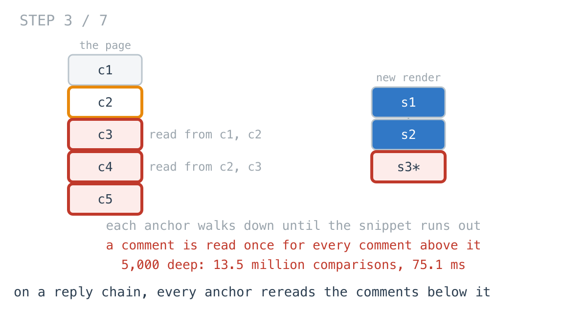
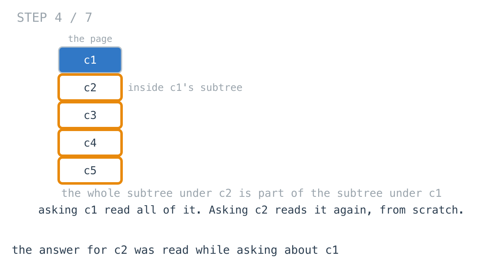
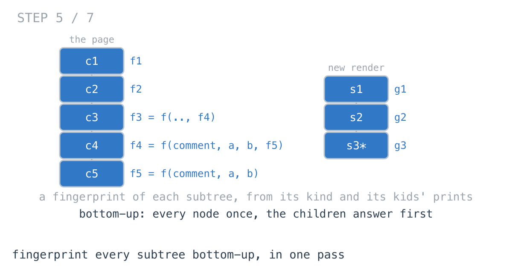
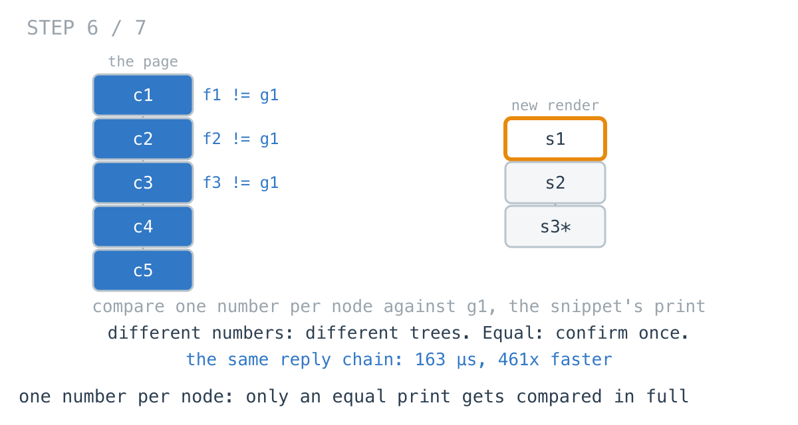
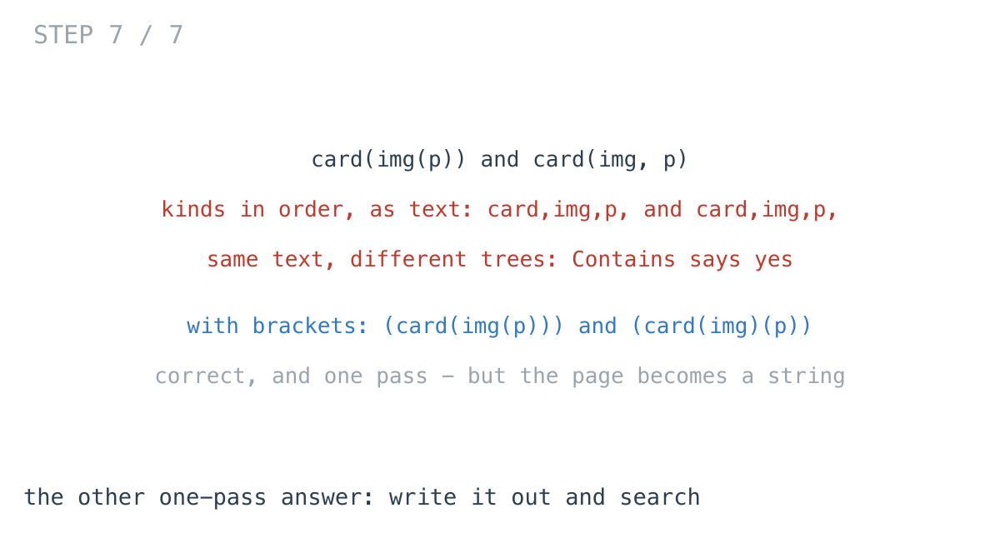

# The reuse check took 75 ms on one reply thread

**It worked in dev · Episode 33 · technique: fingerprint every subtree bottom-up**

Before our renderer mounts a component tree, it asks whether an identical tree
is already on the page, so it can reuse it instead of building it again. Same
kinds, same children, same order.

On a 400,000-component catalogue page the check takes **5.55 ms**. On a page
holding one reply thread 5,000 comments deep - 15,001 components - it takes
**75.1 ms**, **13.5x** as long for a page 26 times smaller. Fingerprinting every
subtree once, bottom-up, does the thread in **163 µs**, **461x** faster.

On a normal page, though, the simple check wins. That is part of the episode.

---

## The problem

```go
type Node struct {
	Kind string
	Kids []*Node
}

// Is there a component in page whose whole subtree is identical to snip?
func Contains(page, snip *Node) bool
```



---

## What you would write

Every component of the right kind is a place the snippet could start. Try each
one and compare from there, both trees in lockstep:

```go
func ContainsByWalk(page, snip *Node) bool {
	if page == nil {
		return snip == nil
	}
	if page.Kind == snip.Kind && same(page, snip) {
		return true
	}
	for _, k := range page.Kids {
		if ContainsByWalk(k, snip) {
			return true
		}
	}
	return false
}

func same(a, b *Node) bool {
	if a.Kind != b.Kind || len(a.Kids) != len(b.Kids) {
		return false
	}
	for i := range a.Kids {
		if !same(a.Kids[i], b.Kids[i]) {
			return false
		}
	}
	return true
}
```



It allocates nothing, it stops at the first match, and the kind check in front
of `same` throws away most anchors without a comparison. `same` stops at the
first difference. I would approve this without a second look, and on most pages
I would still ship it.

---

## How bad, on its own

```
Apple M1 Pro · go1.26.4 · go test -bench=ContainsByWalk -benchtime=100x
```

| shape | components | walk every anchor |
|---|---:|---:|
| `page` | 5,000 | 37.6 µs |
| `grid` | 120,001 | 817 µs |
| `sections` | 400,001 | 5.55 ms |
| `thread` | 15,001 | 75.1 ms |

`page` is a normal page, and the snippet is on it. `grid` is 2,000 product cards
from one template and `sections` is 200 big sections from another; the snippet
is a new variant with one component changed, so the walk compares every card
nearly to the end and finds nothing. That is still linear: 817 µs for 120,001
components.

Then `thread`: one reply chain, 5,000 comments deep, and the new render of its
last 1,000 comments with the bottom one edited. 15,001 components. 75.1 ms.

---

## From the symptom to the shape

### The issue, said plainly

On the thread, the same comments get compared over and over - once for every
comment above them.

### Quantify it on the concrete example

`TestSteps` counts the pairs `same` compares:

```
grid     page  120001, snippet    60, anchors   2000  |  nodes the walk compares:     120000
sections page  400001, snippet  2000, anchors    200  |  nodes the walk compares:     400000
thread   page   15001, snippet  3001, anchors   5000  |  nodes the walk compares:   13503500
```

On the grid, every component is compared exactly once: no card is inside another
card. On the thread every comment is inside every comment above it, and each
anchor walks down until the snippet runs out - 900 comparisons per component.



### Why is it allowed to happen?

Because each anchor's comparison starts from nothing. `same(c1, s1)` reads `c2`
and `c3`. Then `same(c2, s1)` reads `c3` and `c4`. Nothing `c1`'s comparison
learned is kept, and on a page where anchors are not nested inside each other
there would be nothing worth keeping. Day 70's write-up says what that costs at
worst: "for each of the `m` candidate anchor nodes, the full-equality check can
touch up to `n` nodes".

### The answer was already read: while asking about the parent

Look at what each comparison is really asking: is the whole subtree under this
node equal to the snippet? The subtree under `c2` is part of the subtree under
`c1`. Answering for `c1` already read all of it - and then the walk asks about
`c2` and reads it again from the top.



The information was not missing. It was produced in the wrong order: top-down,
once per ancestor, when every subtree only needed reading once.

### What shape is the question?

Do not assume it. A component tree is a **tree**: one parent each, no cycles.
And the question is the same one at every node - is `subtree(x)` equal to
`snip`? - so the answer we need is a fact about each subtree, for every
subtree.

### Write the thing you want as an equation

```
subtree(x) = x.Kind, then subtree(k) for each k in x.Kids, in order
```

Read the right-hand side out loud. Everything in it is about `x` itself or
strictly below it. So any summary of a subtree that is built from the node's
kind and its children's summaries - and nothing else - can be computed for every
node, bottom-up, reading each node once.

The summary that answers "might these be equal" is a fingerprint: a number
mixed from the kind, each child's fingerprint in order, and the child count.
Equal subtrees always get equal numbers. Different numbers mean different trees.

### Conclude the order

If `print(x)` needs `print(k)` for every child, the children finish first.
Postorder - the same walk the whole series keeps arriving at. Compare each
node's print with the snippet's, and only when they are equal run `same` once
to rule out a collision.



### Where it came from in the challenge

[Day 70](https://github.com/architagr/leetcode_solutions/blob/main/easy_problems/501_600/subtree_of_another_tree/SOLUTION.md),
Subtree of Another Tree, is the walk above, and its intuition names both halves:
"Are two trees identical?" and "that's just problem 1, tried at every possible
anchor point". It also has the kind check, as "a cheap pruning trick": compare
values before running the full comparison. On a thread every anchor passes it.

[Day 68](https://github.com/architagr/leetcode_solutions/blob/main/easy_problems/601_700/merge_two_binary_trees/SOLUTION.md),
Merge Two Binary Trees, is the lockstep walk `same` is made of: two trees walked
together, pairing the nodes at each position, and the recursion "only descends
as far as both trees still have nodes".

### When this does not apply

Go back to the equation and break it.

It works because equality is decided by the subtree alone. Ask "is the snippet
here, ignoring the order of children", and the fingerprint has to combine the
children in a way that ignores order too - doable, but a different function.
Ask "is something *similar* here", and no number made from the subtree tells you
how close two subtrees are. Back to comparing.

And when the snippet is on the page, the walk stops the moment it finds it. The
fingerprints always read the whole page. On a normal page that makes them
slower, as the numbers below show.

### The rule

> **When you check every node's subtree against the same thing, and the
> subtrees nest, build a fingerprint of each subtree from its children's
> fingerprints, bottom-up - and each node is read once instead of once per
> ancestor.**

---

## Try it before reading on

One recursive pass that returns a number per subtree, built only from the node
and what its children returned. Compare it with the snippet's number.

```bash
git clone https://github.com/architagr/leetcode_solutions
cd leetcode_solutions/series/it-worked-in-dev/episodes/33-is-this-tree-a-subtree
go test ./...
```

Reading on costs you the rep.

---

## The version that scales

```go
func ContainsByHash(page, snip *Node) bool {
	want := fingerprint(snip)
	found := false
	var walk func(n *Node) uint64
	walk = func(n *Node) uint64 {
		h := kindHash(n.Kind)
		for _, k := range n.Kids {
			h = mix(h, walk(k)) // the children answer first
		}
		h = mix(h, uint64(len(n.Kids)))
		if !found && h == want && same(n, snip) { // equal fingerprints, then make sure
			found = true
		}
		return h
	}
	walk(page)
	return found
}
```



Three things carry it. The children's prints are mixed in order, so
`card(img, p)` and `card(p, img)` differ. The child count goes in last, as one
more guard against two shapes mixing to the same number. And the
`same` call stays: two different subtrees can share a 64-bit print, and a
renderer that reuses the wrong component is worse than a slow one.

### The other one-pass answer: write it out and search

There is a second way to stop rereading: write both trees out as text and let
`strings.Contains` find one in the other. The first version of that I wrote put
the kinds in preorder with commas, and it was wrong. `card(img(p))` and
`card(img, p)` are both `card,img,p,`.



Writing every component as `(` kind, children, `)` fixes it - a match has to
start at a `(` and close where that component closes. `TestFlatTextFalsePositive`
keeps the comma version honest. The bracketed version is correct and one pass,
and it builds the whole page as a string first.

---

## The measurement

| shape | components | walk | text search | fingerprints | walk ÷ prints |
|---|---:|---:|---:|---:|---:|
| `page` | 5,000 | 37.6 µs | 155 µs | 71.3 µs | 0.53x |
| `grid` | 120,001 | 817 µs | 2.31 ms | 868 µs | 0.94x |
| `sections` | 400,001 | 5.55 ms | 8.28 ms | 3.72 ms | 1.49x |
| `thread` | 15,001 | 75.1 ms | 468 µs | 163 µs | 461x |

Raw ns, walk / text / prints: 37,622 / 154,517 / 71,297 ·
817,045 / 2,314,260 / 867,988 · 5,547,538 / 8,280,726 / 3,719,740 ·
75,113,604 / 468,268 / 162,946

On a normal page the walk wins: the fingerprints are **1.90x** slower, because
the walk stops when it finds the card and the prints read everything. On the
template grid it is a tie, **1.06x** to the walk. On the thread, the prints are
**461x** faster than the walk and **2.87x** faster than writing the page out.

Allocated: the walk and the prints allocate nothing. Writing out builds the page
as a string: 3.24 MB on the grid, 10.6 MB on the sections.

---

## What it costs

**It always reads the whole page.** The walk can stop at the first match; the
fingerprint of a node is only known once its children are done, and a match deep
in the page is found after everything before it. If the snippet is usually there
and near the top, the walk is faster.

**A fingerprint can collide.** Two different subtrees can share a 64-bit number.
`same` on every equal print keeps the answer right, and makes a page with many
collisions as slow as the walk. With a decent mix that does not happen by
accident.

**At page scale, keep the walk.** 37.6 µs on a normal page. I would switch when
the tree can nest the same kind inside itself - threads, nested lists, recursive
layouts - because that is the shape that turns the walk quadratic, and it is the
shape users create, not developers.

---

## The one line to keep

If the question is the same at every node and the subtrees nest, answer it
bottom-up with a number built from the children's numbers - and nothing gets
read twice.

---

## Built on

Days from the [365-day LeetCode challenge](https://github.com/architagr/leetcode_solutions),
with the solution write-up and the problem itself:

- **Day 68 — [Merge Two Binary Trees](https://github.com/architagr/leetcode_solutions/blob/main/easy_problems/601_700/merge_two_binary_trees/SOLUTION.md)** · LeetCode [#617](https://leetcode.com/problems/merge-two-binary-trees/) · easy
  <br>walking two trees in lockstep, pairing the nodes at the same position and stopping wherever either side runs out
- **Day 70 — [Subtree of Another Tree](https://github.com/architagr/leetcode_solutions/blob/main/easy_problems/501_600/subtree_of_another_tree/SOLUTION.md)** · LeetCode [#572](https://leetcode.com/problems/subtree-of-another-tree/) · easy
  <br>trying every node whose value matches as an anchor and comparing from there - correct, and as costly as the number of anchors

---

## Run it yourself

```bash
git clone https://github.com/architagr/leetcode_solutions
cd leetcode_solutions/series/it-worked-in-dev/episodes/33-is-this-tree-a-subtree
go test ./...                         # walk, text and prints agree on 2,000 random pages
go test -run TestSteps -v             # how many pairs the walk compares
go test -bench=. -benchtime=100x      # the timings above
```

---

Part of [It worked in dev](../../), the long-form companion to the
[365-day LeetCode challenge](https://github.com/architagr/leetcode_solutions).

---

*Ideation, problem selection, benchmarks and conclusions: Archit Agarwal.
The prose was drafted with AI assistance and edited by me. Every number here
comes from a run you can reproduce with the commands above.*
