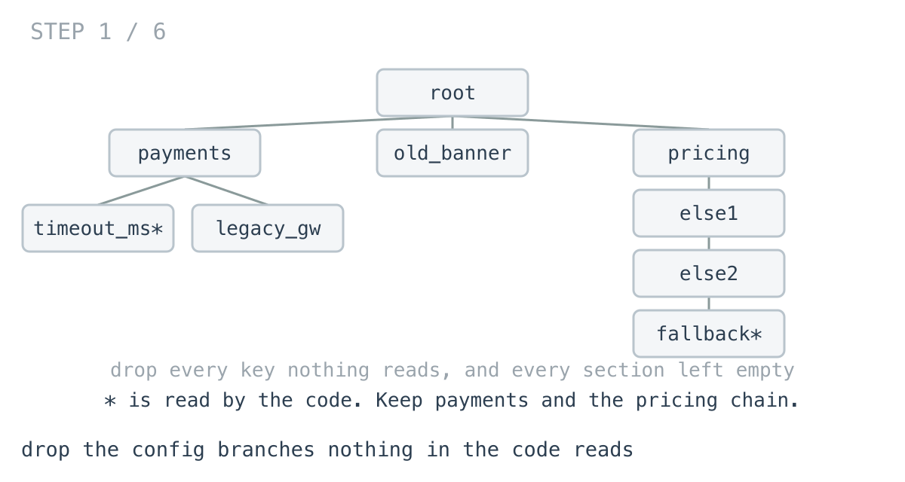
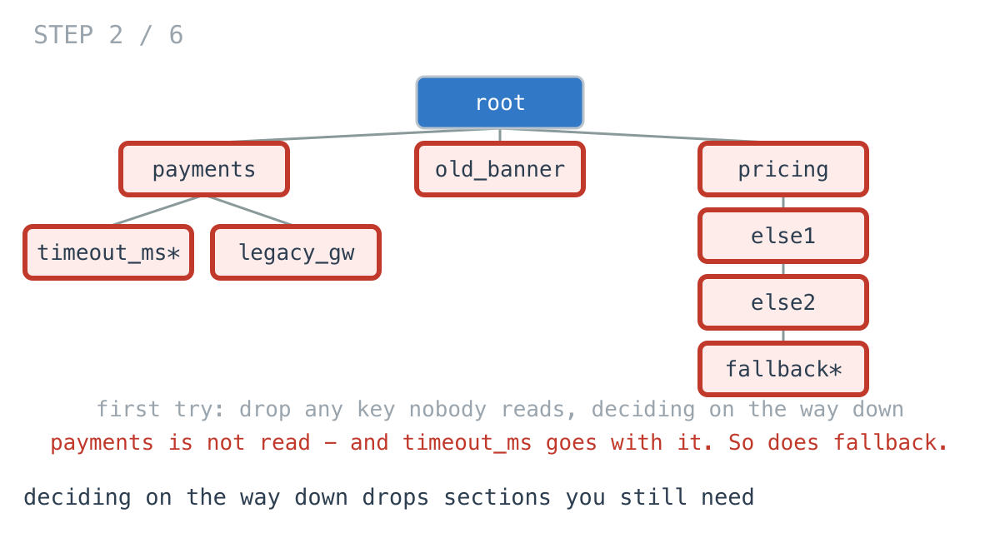
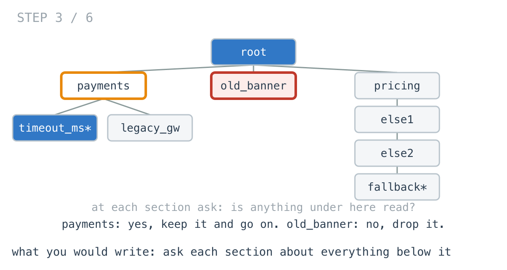
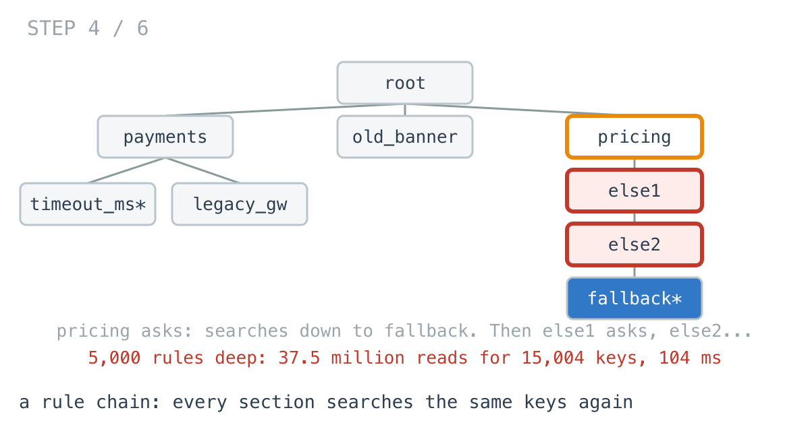
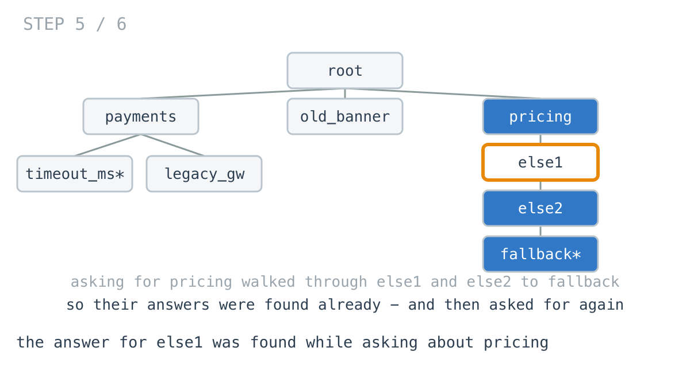
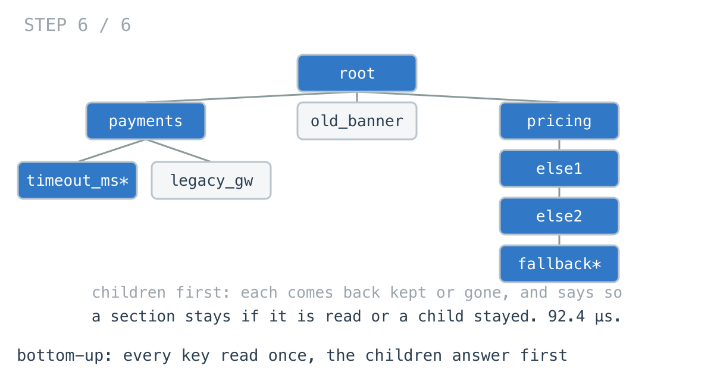

# Pruning 15,004 keys took 19x longer than 500,000

**It worked in dev · Episode 34 · technique: let the children answer first**

Before a service ships, the build drops every branch of its config that nothing
in the code reads: a key no code references, and a section left with nothing
under it. A section stays if anything below it is still read, whether or not its
own name is.

The whole platform's config, 500,000 entries, prunes in **5.35 ms**. The pricing
rules - a chain of 5,000 rules, 15,004 entries - take **104 ms**, **19.5x** as
long for a thirtieth of the size. Letting each child report before its section
decides does the rules in **92.4 µs**.

On every config shaped like a normal config, the two versions tie. The rules are
the only place it matters, and they are the reason this episode exists.

---

## The problem

```go
type Node struct {
	Key  string
	Used bool // something in the code reads this key
	Kids []*Node
}

// Drop every key nothing reads, and every section left with nothing
// under it. Returns nil if the whole tree goes.
func Prune(n *Node) *Node
```



---

## What you would write

The first version I wrote decided on the way down: walk the tree, drop any key
nothing reads. It dropped `payments`, because nothing reads `payments` itself -
and `payments.timeout_ms`, which the checkout service reads on every request,
went with it.



`TestOnTheWayDownDropsWhatIsRead` keeps that version around to fail. A section's
fate depends on what is under it, so the fix is to ask:

```go
func PruneByAsking(n *Node) *Node {
	if !anythingUsed(n) {
		return nil
	}
	kept := n.Kids[:0]
	for _, k := range n.Kids {
		if p := PruneByAsking(k); p != nil {
			kept = append(kept, p)
		}
	}
	n.Kids = kept
	return n
}

func anythingUsed(n *Node) bool {
	if n.Used {
		return true
	}
	for _, k := range n.Kids {
		if anythingUsed(k) {
			return true
		}
	}
	return false
}
```



It says exactly what the rule says. `anythingUsed` stops at the first read key
it finds, and a dead section is dropped without visiting anything under it
again. It allocates nothing. I would approve it.

---

## How bad, on its own

```
Apple M1 Pro · go1.26.4 · go test -bench=PruneByAsking -benchtime=50x
```

| shape | entries | ask each section |
|---|---:|---:|
| `service` | 5,000 | 46.7 µs |
| `platform` | 500,000 | 5.35 ms |
| `stale` | 500,000 | 3.59 ms |
| `rules` | 15,004 | 104 ms |

`service` is one service's config; `platform` is every service's in one tree;
`stale` is the same after years, with 0.2% of keys still read. All three are
linear, and fast. `rules` is the pricing rule chain: each rule a condition, a
price and an `else` holding the next rule, 5,000 deep, and only the fallback at
the bottom still read. 104 ms.

---

## From the symptom to the shape

### The issue, said plainly

On the rule chain, every section searches the same keys again - the ones every
section above it already searched.

### Quantify it on the concrete example

`TestSteps` counts the entries the questions read:

```
platform   500000 entries,  201512 kept  |  entries the questions read:     767765
rules       15004 entries,    5004 kept  |  entries the questions read:   37527506
```

On the platform config each entry is read about 1.5 times: the tree is eight
levels deep, and a question usually finds a read key a level or two down. On the
rules, `pricing` asks and searches 5,000 rules down to the fallback. Then the
first `else` asks and searches 4,999. Each entry is read 2,501 times.



### Why is it allowed to happen?

Because `anythingUsed` returns a yes or no and forgets everything it saw. The
search from `pricing` walked through every `else` on its way to the fallback,
and the only thing it handed back was "yes".

### The answer was already found: on the way through

When `pricing`'s search reached the fallback, it had just shown that every
`else` above the fallback has something read under it. That is the exact
question the recursion is about to ask each of them, one at a time, from the
top.



The answers existed. They were produced in the wrong order: the parent asked
before the children had answered, so the children got asked again.

### What shape is the question?

Do not assume it. A config is a **tree**: every key has one parent, nothing
loops back. And the question at every node is the same - does anything under
here survive?

### Write the thing you want as an equation

```
keep(n) = n.Used  or  keep(k) for any child k
```

Read the right-hand side out loud. Every term is about `n` itself or a child of
`n`. A section's answer is made only of its children's answers.

### Conclude the order

If `keep(n)` needs `keep(k)` for every child, the children answer first.
Postorder. And the answer the child gives can be the pruned child itself - nil
if nothing survived - so the parent keeps what came back non-nil and decides
from that. Nobody searches anything; each entry is visited once.



### Where it came from in the challenge

[Day 73](https://github.com/architagr/leetcode_solutions/blob/main/medium_problems/801_900/binary_tree_pruning/SOLUTION.md),
Binary Tree Pruning, is this episode with `1` for "read", and its intuition is
the whole derivation in two sentences: "A node cannot answer that question on
the way down - it doesn't yet know what's beneath it. So this is post-order: both
children report first, and the node combines their answers with its own value."
It also names the shape used here - "returns `*TreeNode` and has the caller
reassign" - and why it needs no wrapper for the root.

[Day 70](https://github.com/architagr/leetcode_solutions/blob/main/easy_problems/501_600/subtree_of_another_tree/SOLUTION.md),
Subtree of Another Tree, is the version that asks: a full question about the
subtree, "tried at every possible anchor point". It is the right shape when the
question needs the whole subtree compared against something outside the tree.
Here the answer is built from the children's answers, so asking each node
separately only repeats work.

### When this does not apply

Go back to the equation and break it.

It closes because `keep(n)` needs nothing but `n` and its children. Change the
rule to "keep a key if its section is listed in the deploy manifest", and a node
needs something from above - the answer now flows down, and bottom-up does not
help. Make it both - keep what is read, but only inside sections the manifest
lists - and it takes one pass down to carry the manifest and the same
bottom-up return to decide.

And on any config shaped like a config - wide, a handful of levels - the asking
version reads each entry about 1.5 times. That is not a problem worth an
episode.

### The rule

> **When a node's answer is made only from its children's answers, let the
> children answer first and hand the result up - asking each node about its
> whole subtree repeats every answer once per ancestor.**

---

## Try it before reading on

One recursive function, no helper. It returns the pruned child, or nil, and the
parent decides from what came back.

```bash
git clone https://github.com/architagr/leetcode_solutions
cd leetcode_solutions/series/it-worked-in-dev/episodes/34-prune-the-dead-config
go test ./...
```

Reading on costs you the rep.

---

## The version that scales

```go
func PruneBottomUp(n *Node) *Node {
	kept := n.Kids[:0]
	for _, k := range n.Kids {
		if p := PruneBottomUp(k); p != nil { // the child has already decided
			kept = append(kept, p)
		}
	}
	n.Kids = kept
	if !n.Used && len(kept) == 0 {
		return nil
	}
	return n
}
```

Two things carry it. The recursion happens before the decision, so by the time
`n` decides, every child has already pruned itself. And the parent clears the
pointer, by not keeping it: a child cannot remove itself from its parent's
slice, so it returns nil and the parent leaves it out. That is day 73's
"who does the deleting", in a slice instead of `Left` and `Right`.

---

## The measurement

| shape | entries | ask each section | bottom-up | ratio |
|---|---:|---:|---:|---:|
| `service` | 5,000 | 46.7 µs | 39.6 µs | 1.18x |
| `platform` | 500,000 | 5.35 ms | 5.42 ms | 0.99x |
| `stale` | 500,000 | 3.59 ms | 3.77 ms | 0.95x |
| `rules` | 15,004 | 104 ms | 92.4 µs | 1,130x |

Raw ns: 46,738 / 39,596 · 5,354,858 / 5,422,041 · 3,593,892 / 3,766,257 ·
104,376,445 / 92,358

On the real-shaped configs it is a tie, and on the stale one asking is **1.05x**
faster: almost nothing is read, so the root's question reads everything once and
every dead section is dropped unvisited. On the rule chain, bottom-up is
**1,130x** faster.

Neither allocates.

---

## What it costs

**Nothing, as far as I can find.** It is shorter than the asking version, has no
helper, and does the same work on configs that are not chains.

**It visits dead branches.** Bottom-up walks into a dead section to find out it
is dead; asking can decide from the top that a whole branch has nothing read and
skip it. That is why `stale` is 1.05x faster with asking - and why it is a tie,
not a loss.

**The bug it replaces is the dangerous part.** The slow version is slow on one
shape. The version I wrote first - decide on the way down - is wrong on every
config with a section whose own name is not read, which is most of them. That
one ships, because the config still parses.

---

## The one line to keep

If a node's answer is built only from its children's answers, let the children
answer first - a question asked from the top gets asked once per ancestor.

---

## Built on

Days from the [365-day LeetCode challenge](https://github.com/architagr/leetcode_solutions),
with the solution write-up and the problem itself:

- **Day 70 — [Subtree of Another Tree](https://github.com/architagr/leetcode_solutions/blob/main/easy_problems/501_600/subtree_of_another_tree/SOLUTION.md)** · LeetCode [#572](https://leetcode.com/problems/subtree-of-another-tree/) · easy
  <br>trying every node whose value matches as an anchor and comparing from there - correct, and as costly as the number of anchors
- **Day 73 — [Binary Tree Pruning](https://github.com/architagr/leetcode_solutions/blob/main/medium_problems/801_900/binary_tree_pruning/SOLUTION.md)** · LeetCode [#814](https://leetcode.com/problems/binary-tree-pruning/) · medium
  <br>a node that reports whether its subtree kept anything, with the parent cutting the pointer on the way back up

---

## Run it yourself

```bash
git clone https://github.com/architagr/leetcode_solutions
cd leetcode_solutions/series/it-worked-in-dev/episodes/34-prune-the-dead-config
go test ./...                         # both agree on 2,000 random configs
go test -run TestSteps -v             # how much the questions read
go test -bench=. -benchtime=50x       # the timings above
```

---

Part of [It worked in dev](../../), the long-form companion to the
[365-day LeetCode challenge](https://github.com/architagr/leetcode_solutions).

---

*Ideation, problem selection, benchmarks and conclusions: Archit Agarwal.
The prose was drafted with AI assistance and edited by me. Every number here
comes from a run you can reproduce with the commands above.*
