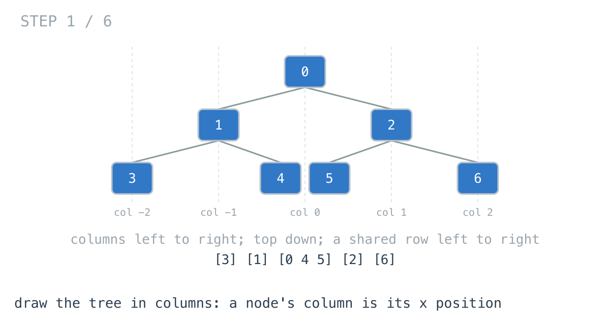
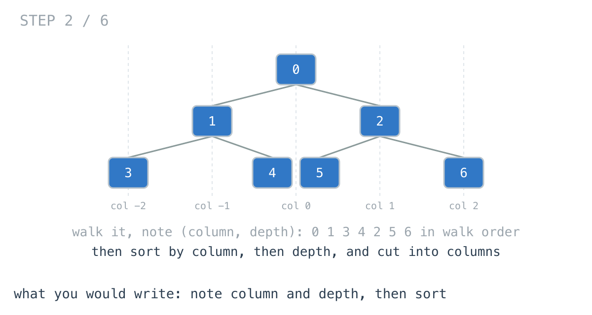
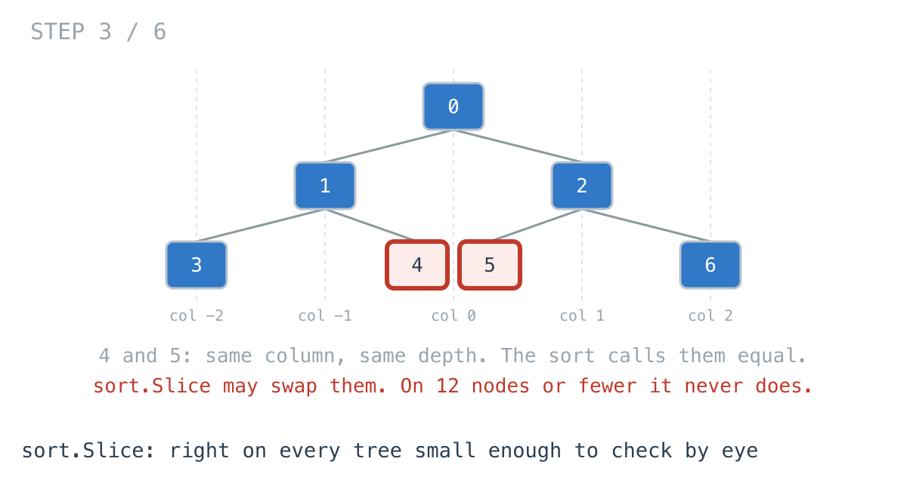
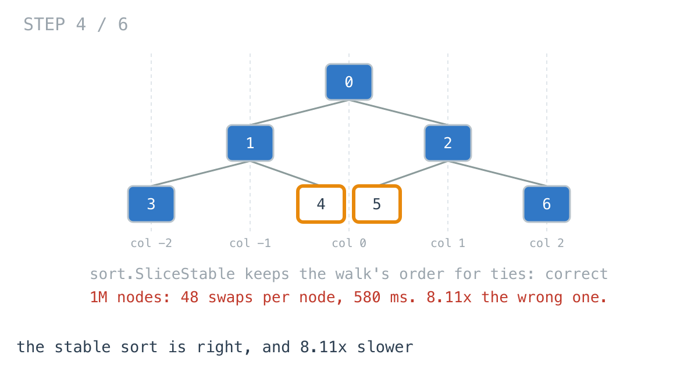
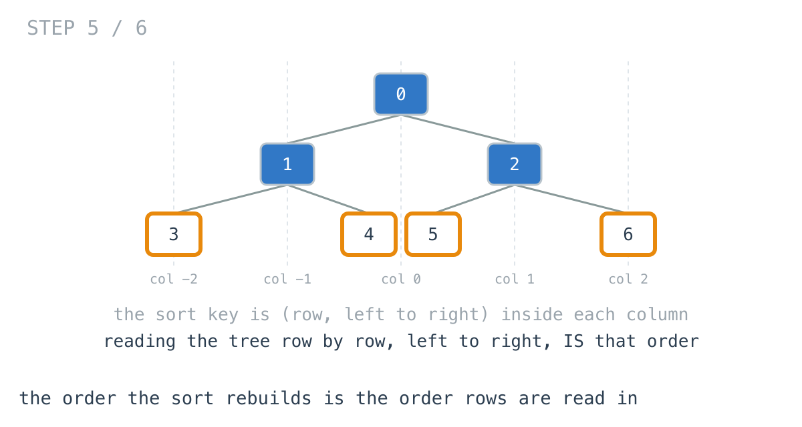
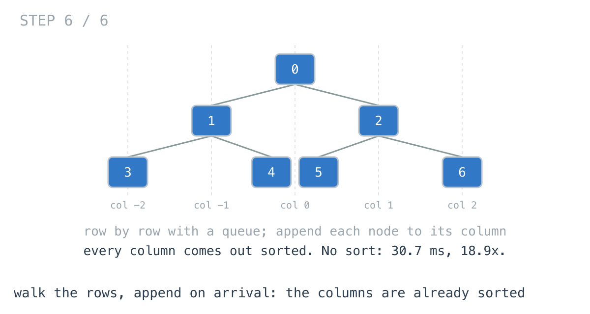

# Fixing one tie made the tree layout 8x slower

**It worked in dev · Episode 35 · technique: the order is the order rows are read in**

The model viewer draws a decision tree in columns. Every node goes in the column
of its x position - a left child one column left of its parent, a right child
one right - and inside a column from the top down, left to right where two nodes
share a row.

The first version I wrote passed every test and drew big trees wrong. The fix
was one word, `sort.Slice` to `sort.SliceStable`, and on a million-node tree it
made the layout **8.11x** slower: **71.5 ms** to **580 ms**. Reading the tree
row by row, which needs no sort at all, does it in **30.7 ms** - faster than the
wrong version.

---

## The problem

```go
type Node struct {
	ID          int
	Left, Right *Node
}

// Node ids by column, left to right; each column top to bottom,
// and left to right inside a row.
func Columns(root *Node) [][]int
```



---

## What you would write

Walk the tree once and note each node's column and depth. Then sort by column,
then depth, and cut the sorted list wherever the column changes:

```go
func ColumnsBySort(root *Node) [][]int {
	var all []placed
	var walk func(n *Node, col, depth int)
	walk = func(n *Node, col, depth int) {
		if n == nil {
			return
		}
		all = append(all, placed{n.ID, col, depth})
		walk(n.Left, col-1, depth+1)
		walk(n.Right, col+1, depth+1)
	}
	walk(root, 0, 0)
	// Stable, so two nodes in the same row and column keep the walk's
	// order, which is left to right.
	sort.SliceStable(all, func(i, j int) bool {
		if all[i].col != all[j].col {
			return all[i].col < all[j].col
		}
		return all[i].depth < all[j].depth
	})
	// ... cut into columns
}
```



The comment is there because the first version said `sort.Slice`. Nodes 4 and 5
are in the same row and the same column, so the comparison calls them equal, and
`sort.Slice` does not promise to keep equal elements in order. It kept them in
order in every test I wrote, because on 12 elements or fewer it runs an
insertion sort, which happens to be stable. On every complete tree from depth 4
to 12, it put some tie the wrong way round.



With `SliceStable` it is correct, it reads like the specification, and the sort
is from the standard library. I would approve it.

---

## How bad, on its own

```
Apple M1 Pro · go1.26.4 · go test -bench=. -benchtime=20x
```

| shape | nodes | unstable (wrong) | stable |
|---|---:|---:|---:|
| `stump` | 63 | 3.85 µs | 6.32 µs |
| `model` | 16,383 | 977 µs | 6.11 ms |
| `grown` | 200,000 | 23.8 ms | 126 ms |
| `deep` | 1,048,575 | 71.5 ms | 580 ms |

`stump` is what the viewer opens on: 63 nodes, and nobody will measure either
column. `model` is a complete depth-14 tree; `grown` is an unpruned tree,
lopsided; `deep` is complete to depth 20. The fix costs **1.64x** at 63 nodes
and **8.11x** at a million.



---

## From the symptom to the shape

### The issue, said plainly

The walk throws away the order the answer needs, and then the sort spends
almost all of the time putting it back.

### Quantify it on the concrete example

`TestSortWork` runs the same sort through `sort.Stable` with counting methods:

```
model     16383 nodes  |  stable sort:     158440 comparisons (10 per node),      451644 swaps ( 28 per node)
deep    1048575 nodes  |  stable sort:   10426684 comparisons (10 per node),    50338018 swaps ( 48 per node)
```

Ten comparisons per node is cheap. Forty-eight swaps per node is not, and the
documentation says why: a stable sort makes O(n log n) comparisons but
O(n log n log n) swaps. Every node is moved forty-eight times to reach the place
it should have been put in the first place.

### Why is it allowed to happen?

Because the walk visits nodes in an order unrelated to the answer. It goes down
the left side first, so it reaches node 4 at depth 2 before node 2 at depth 1.
The sort exists to undo that.

### The answer was already there: in how rows are read

Look at what the sort is sorting each column into: depth first, then left to
right among equal depths. That is not a new order. It is the order you read a
tree in if you go row by row, top to bottom, each row left to right.



The walk knew every node's depth and left-to-right position the moment it
reached it. It reached them in the wrong order, so a sort had to rebuild
an order that a different walk produces for free.

### What is the question actually asking?

Do not assume it. Each column is a subset of the nodes, in row order. And the
whole tree read row by row is all the nodes, in row order.

### Write the thing you want as an equation

```
column(c) = [n in level order where col(n) == c]
```

Read the right-hand side out loud. Filtering a list keeps the order of what
survives. So if the nodes arrive in level order and each one is dropped into its
column as it arrives, every column ends up in level order - which is exactly
what the sort was producing.

### Conclude the walk

Walk the tree a row at a time, with a queue, carrying each node's column. Append
each node to its column when it comes off the queue. No sort. And because every
child is one column from its parent, the columns are a contiguous range: a slice
for the right side and one for the left, no map and no sorting of column keys.



### Where it came from in the challenge

[Day 76](https://github.com/architagr/leetcode_solutions/blob/main/medium_problems/301_400/binary_tree_vertical_order_traversal/SOLUTION.md),
Binary Tree Vertical Order Traversal, is this viewer, and its solution says why
the walk has to be by rows: "A breadth-first walk reaches `3` at depth 0 and `15`
at depth 2, in that order, so appending as it goes produces `[3, 15]` correctly
with no sorting." It also names the shortcut it took for the column keys - a
fixed range from the problem's constraints - and that "collecting the map's keys
and sorting them would be the version that doesn't depend on the constraint
holding". The two slices here are a third option that needs neither.

[Day 29](https://github.com/architagr/leetcode_solutions/blob/main/medium_problems/101_200/binary_tree_level_order_traversal/SOLUTION.md),
Binary Tree Level Order Traversal, is the other way out, and day 76 contrasts
itself with it. Day 29 walks depth-first and still produces rows, because "the
grouping doesn't depend on arrival order": every node appends into the slot for
its own depth. The same trick works here with two keys - a slot per column and
depth - and then each column is its depths concatenated. Linear, no queue, and
one more level of slices.

### When this does not apply

Go back to the equation and break it.

It holds because the order inside a column is row order. LeetCode 987, the
harder version of this problem, breaks ties in the same row by node *value*
instead of left to right. Row order says nothing about values, so the sort comes
back - just within each tied group, not over the whole tree.

And if the x positions are real coordinates from a layout pass - nodes with
widths, Reingold-Tilford spacing - columns stop being one apart, and grouping by
x needs a map or a sort again.

### The rule

> **When you sort to recover an order, ask whether some walk visits things in
> that order already. If it does, take that walk and append as you go - the sort
> was undoing the first walk's choices.**

---

## Try it before reading on

A queue of nodes paired with their columns, and two slices of columns. No sort
anywhere.

```bash
git clone https://github.com/architagr/leetcode_solutions
cd leetcode_solutions/series/it-worked-in-dev/episodes/35-columns-not-rows
go test ./...
```

Reading on costs you the rep.

---

## The version that scales

```go
func ColumnsByLevel(root *Node) [][]int {
	if root == nil {
		return nil
	}
	type item struct {
		n   *Node
		col int
	}
	var left, right [][]int // columns -1, -2, ... and 0, 1, ...
	queue := []item{{root, 0}}
	for head := 0; head < len(queue); head++ {
		it := queue[head]
		if it.col >= 0 {
			for len(right) <= it.col {
				right = append(right, nil)
			}
			right[it.col] = append(right[it.col], it.n.ID) // arrives in order
		} else {
			c := -it.col - 1
			for len(left) <= c {
				left = append(left, nil)
			}
			left[c] = append(left[c], it.n.ID)
		}
		if it.n.Left != nil {
			queue = append(queue, item{it.n.Left, it.col - 1})
		}
		if it.n.Right != nil {
			queue = append(queue, item{it.n.Right, it.col + 1})
		}
	}
	out := make([][]int, 0, len(left)+len(right))
	for i := len(left) - 1; i >= 0; i-- {
		out = append(out, left[i])
	}
	return append(out, right...)
}
```

Three things carry it. Left is queued before right, which is what makes a row
read left to right. The queue is a slice with a moving `head` rather than
`queue[1:]`, so nothing is copied and the backing array is reused. And a new
column only ever appears at the edge - one past the widest so far - so the
`for len(right) <= it.col` loop runs at most once per node.

---

## The measurement

| shape | nodes | unstable | stable | three keys | by rows | stable ÷ rows |
|---|---:|---:|---:|---:|---:|---:|
| `stump` | 63 | 3.85 µs | 6.32 µs | 4.72 µs | 2.14 µs | 2.95x |
| `model` | 16,383 | 977 µs | 6.11 ms | 2.77 ms | 488 µs | 12.5x |
| `grown` | 200,000 | 23.8 ms | 126 ms | 46.1 ms | 9.19 ms | 13.7x |
| `deep` | 1,048,575 | 71.5 ms | 580 ms | 222 ms | 30.7 ms | 18.9x |

Raw ns, unstable / stable / three keys / rows: 3,845 / 6,315 / 4,717 / 2,140 ·
976,840 / 6,110,050 / 2,774,715 / 488,096 ·
23,761,856 / 125,785,225 / 46,098,581 / 9,190,023 ·
71,508,258 / 580,111,310 / 222,271,392 / 30,690,740

`unstable` is the `sort.Slice` version, which is wrong; `stable` is
`sort.SliceStable`.

`three keys` is the other way to fix the tie: keep `sort.Slice` and add the
walk's order as a third key, so nothing is ever equal. It is correct, and
**2.61x** faster than the stable sort on `deep` - but still **7.24x** slower than
reading by rows. By rows is **18.9x** faster than the stable sort on a million
nodes, and **2.33x** faster than the version that was wrong.

Allocated on `deep`: 179 MB for either sort, 242 MB with the third key, 129 MB
by rows.

---

## What it costs

**A queue as wide as the widest row.** The sorts hold a record per node; the
queue holds one per node too, here, because the slice only grows. Popping by
reslicing lets the front be dropped whenever `append` reallocates, which keeps
it nearer the width of a row, at the price of copying.

**The order is implicit.** The sorted version states its ordering in the
comparison function. The level-order version gets it from left being queued
before right, and a refactor that swaps those two lines breaks every tie with
no test failing unless a test has a tie. `TestExample` has one.

**At the size the viewer opens on, none of this matters.** 63 nodes: 2.14 µs
against 6.32. I would still write the row walk, for the bug it cannot have: there
is no sort, so there is no stability to forget.

---

## The one line to keep

If you sort to recover an order, look for the walk that visits things in that
order - then append as you go, and there is nothing left to sort.

---

## Built on

Days from the [365-day LeetCode challenge](https://github.com/architagr/leetcode_solutions),
with the solution write-up and the problem itself:

- **Day 29 — [Binary Tree Level Order Traversal](https://github.com/architagr/leetcode_solutions/blob/main/medium_problems/101_200/binary_tree_level_order_traversal/SOLUTION.md)** · LeetCode [#102](https://leetcode.com/problems/binary-tree-level-order-traversal/) · medium
  <br>every node writes into the slot for its own depth, and the first node to reach a depth opens it - the accumulator, with depth as an index
- **Day 76 — [Binary Tree Vertical Order Traversal](https://github.com/architagr/leetcode_solutions/blob/main/medium_problems/301_400/binary_tree_vertical_order_traversal/SOLUTION.md)** · LeetCode [#314](https://leetcode.com/problems/binary-tree-vertical-order-traversal/) · medium
  <br>carrying a column index down a breadth-first walk, so each column fills top to bottom in the order nodes are discovered

---

## Run it yourself

```bash
git clone https://github.com/architagr/leetcode_solutions
cd leetcode_solutions/series/it-worked-in-dev/episodes/35-columns-not-rows
go test ./...                         # sort and rows agree; sort.Slice gets ties wrong
go test -run TestSortWork -v          # what the stable sort does per node
go test -bench=. -benchtime=20x       # the timings above
```

---

Part of [It worked in dev](../../), the long-form companion to the
[365-day LeetCode challenge](https://github.com/architagr/leetcode_solutions).

---

*Ideation, problem selection, benchmarks and conclusions: Archit Agarwal.
The prose was drafted with AI assistance and edited by me. Every number here
comes from a run you can reproduce with the commands above.*
