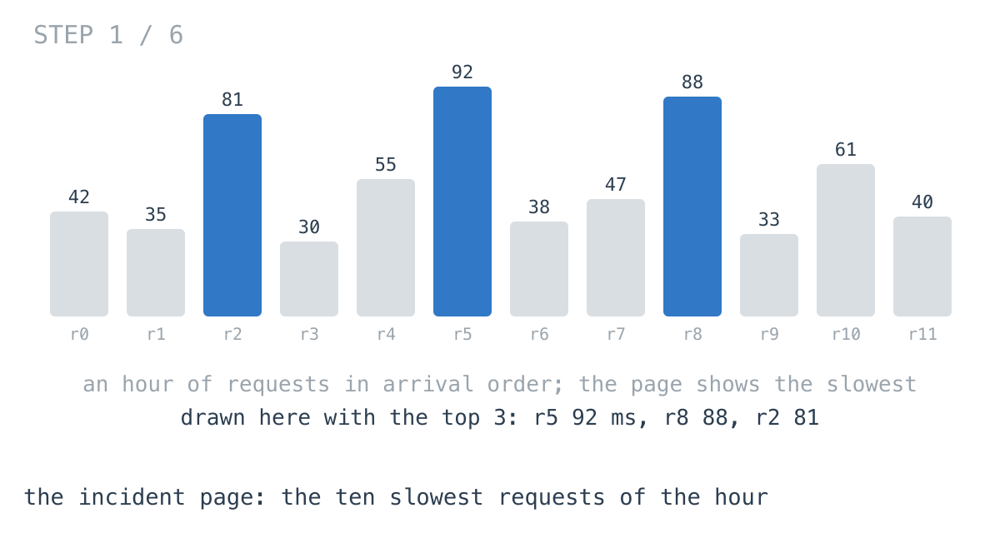
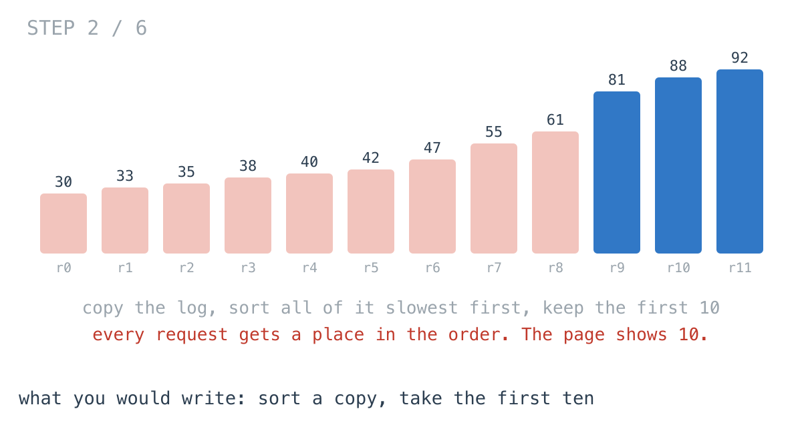
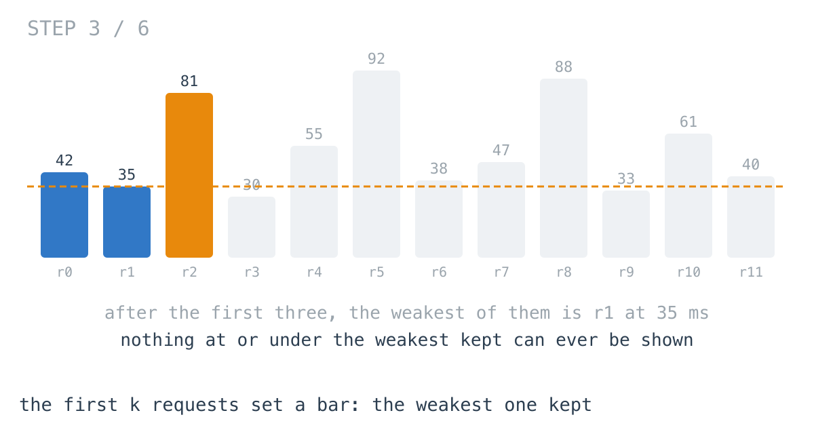
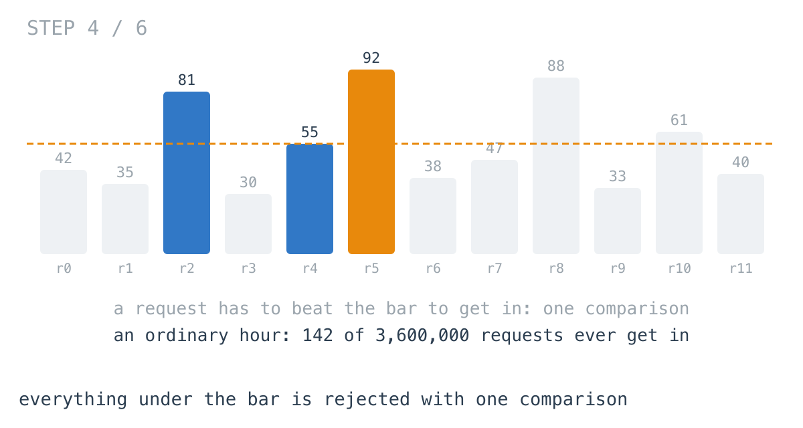
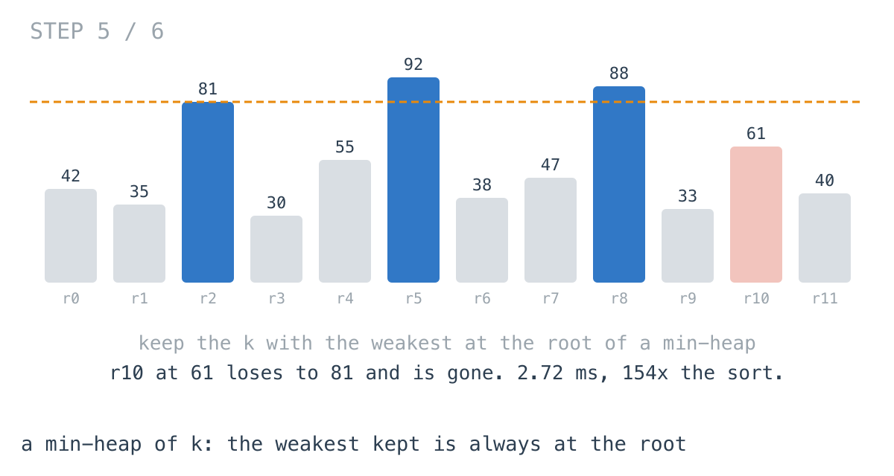
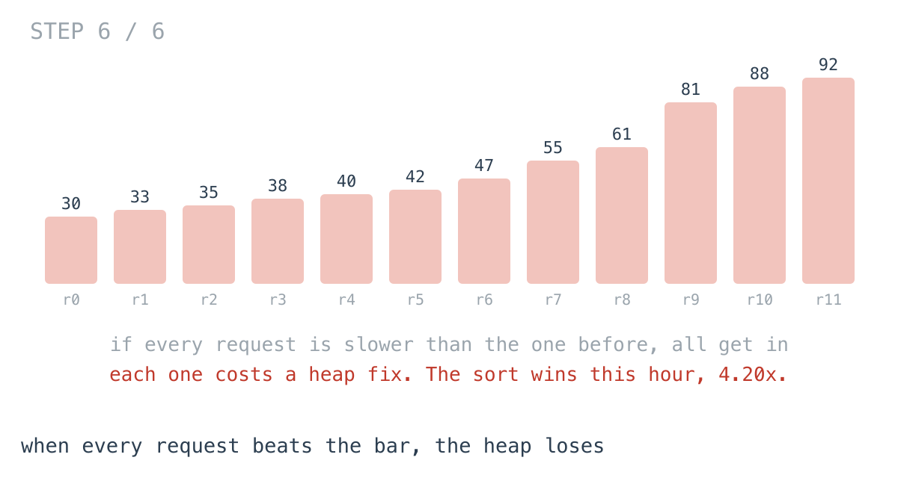

# To show ten slow requests, we sorted 3.6 million

**It worked in dev · Episode 36 · technique: a size-k heap with the weakest at the root**

The incident page opens on the ten slowest requests of the last hour: which
endpoint, how long. At 1,000 requests a second, that is ten rows picked out of
3,600,000.

The code that picks them sorted all 3,600,000 to do it: **417 ms** and an
**86.4 MB** copy every time the page loaded. Keeping only the ten slowest seen
so far, with the weakest of them at the root of a heap, takes **2.72 ms** and
504 bytes - **154x** faster.

It is not free. On one shape of hour the heap is **4.20x** slower than the sort,
and that shape is a real one.

---

## The problem

```go
type Req struct {
	Path   string
	Micros int64
}

// The k slowest requests in the log, slowest first.
// The log is shared with every other panel: do not reorder it.
func Slowest(log []Req, k int) []Req
```



---

## What you would write

Copy the log, sort the copy slowest first, keep the first ten:

```go
func SlowestBySort(log []Req, k int) []Req {
	all := slices.Clone(log) // the log is shared; sort a copy
	slices.SortFunc(all, slowestFirst)
	return all[:min(k, len(all))]
}
```



Three lines, all standard library, and the copy is there because sorting the
shared log in place would reorder it under every other panel that reads it. I
would approve this in review without a second thought.

---

## How bad, on its own

```
Apple M1 Pro · go1.26.4 · go test -bench=SlowestBySort -benchtime=10x
```

| shape | requests | sort a copy |
|---|---:|---:|
| `page` | 1,000 | 52.5 µs |
| `minute` | 60,000 | 6.13 ms |
| `hour` | 3,600,000 | 417 ms |
| `backlog` | 3,600,000 | 387 ms |
| `ascending` | 3,600,000 | 52.0 ms |
| `climbing` | 3,600,000 | 20.8 ms |

A page of the last thousand requests: 52.5 µs, nothing to see. A minute: 6.13
ms. An hour: 417 ms, plus an 86.4 MB copy, on the page people open when
something is already wrong.

The last three rows are the same number of requests in a different order.
`backlog` is an hour in which a queue backs up, every request waiting a little
longer than the one before. `ascending` is an hour exported already ordered by
duration. `climbing` is every request strictly slower than the last. The sort
gets faster the more ordered the log already is - 20.1x faster on `climbing`
than on `hour`. Remember that row.

---

## From the symptom to the shape

### The issue, said plainly

The page shows ten requests, and the sort works out the exact position of all
3,600,000 of them.

### Quantify it on the concrete example

Of 3,600,000 requests in an ordinary hour, how many could ever be in the top ten
at the moment they arrive? `TestEntries` counts them: **142**. Everything else
gets a place in a sorted order that is thrown away three lines later, 3,599,990
positions nobody reads.

### Why is it allowed to happen?

Because a sort answers a bigger question than the one asked. Day 78's write-up
says it about stones: "sorting answers a bigger question than the one asked.
This problem never needs the third-heaviest stone or the ordering of the rest."
The page never needs the 11th-slowest request, or the order of the rest.

### The answer was already known: there is a bar

Read the log in order and keep the slowest ten so far. After the first ten
requests, the weakest of them sets a bar: a request at or under it can never be
shown, because there are already ten slower. Deciding that takes one comparison.



The sort compares that request against about twenty others to place it. We knew
after one comparison that its place did not matter.



### What is the question actually asking?

Do not assume it. It is not "order the log". It is: keep a set of ten, and
every time a request arrives, compare it with the weakest member and, if it
wins, replace that member. So the set needs one thing quickly, over and over, as
it changes: its weakest member.

### Write the thing you want as an equation

```
kept(after r) = kept                              if r <= min(kept)
              = kept - min(kept) + r              otherwise
```

Read the right-hand side out loud. The only thing ever asked of the set is
`min(kept)`, and the only change is removing the minimum and adding one. A
repeated minimum of a changing collection is what a heap is for.

### Conclude the structure

A min-heap of size ten on latency. Fill it with the first ten. After that,
compare each request with the root; if it is slower, overwrite the root and let
the heap re-settle - a handful of swaps, because ten is small. At the end, sort
the ten for display.



The min-heap reads backwards for "the slowest", every time. Day 80 explains
why: "The incumbent displaced is always **the least frequent of those currently
kept** - the weakest member, the one on the boundary. That is the entry you need
instant access to." Swap "least frequent" for "fastest".

### Where it came from in the challenge

[Day 80](https://github.com/architagr/leetcode_solutions/blob/main/medium_problems/301_400/top_k_frequent_elements/SOLUTION.md),
Top K Frequent Elements, is this panel with counts for latencies, and the warning
that matters: get the heap direction backwards and "It silently returns the k
**least** frequent elements". `TestBothAgree` exists for that.

[Day 78](https://github.com/architagr/leetcode_solutions/blob/main/easy_problems/1001_1100/last_stone_weight/SOLUTION.md),
Last Stone Weight, is where the heap came in, as the structure that maintains
"the maximum, repeatedly, from a changing collection - and nothing else". It is
also where `container/heap` gets explained: it always builds a min-heap, and the
`Less` you write decides what "min" means. Day 78 inverted it to get the
heaviest at the root. Here the honest `<` is the right one, because the root
should be the request about to be replaced.

### When this does not apply

Go back to the equation and break it.

The heap is fast because the first branch - `r <= min(kept)` - is almost always
taken. On an ordinary hour, 142 requests of 3,600,000 take the second. On
`climbing`, where every request is slower than the last, every one does, and
every one costs a `heap.Fix`. Meanwhile the sort is at its best: input already
in order is the easy case for Go's pattern-defeating quicksort.



That hour is not invented. It is an overload where a queue keeps growing and
every request waits longer than the one before. The `backlog` row is the
realistic version, with service time noise on top, and only 0.22% of requests
get in. `climbing` is the limit, with no noise at all.

And if you need a large fraction of the log - the slowest half - a heap of
1,800,000 is not small any more. Sort, or select.

### The rule

> **When you need the top k of something large, keep k and compare each newcomer
> with the weakest of them - a min-heap for the largest, so the one about to be
> replaced is always at the root.**

---

## Try it before reading on

A heap that never holds more than ten, and one comparison per request against
its root. `container/heap` builds a min-heap; decide what that should mean here.

```bash
git clone https://github.com/architagr/leetcode_solutions
cd leetcode_solutions/series/it-worked-in-dev/episodes/36-slowest-endpoints
go test ./...
```

Reading on costs you the rep.

---

## The version that scales

```go
// kept is a min-heap on latency: the fastest of the requests kept so far is
// at the root, because it is the one the next slow request replaces.
type kept []Req

func (h kept) Less(i, j int) bool { return h[i].Micros < h[j].Micros }
// ... Len, Swap, Push, Pop as container/heap needs them

func SlowestByHeap(log []Req, k int) []Req {
	h := make(kept, 0, k)
	for _, r := range log {
		if len(h) < k {
			heap.Push(&h, r)
			continue
		}
		if r.Micros > h[0].Micros { // beats the weakest of the k
			h[0] = r
			heap.Fix(&h, 0)
		}
	}
	slices.SortFunc(h, slowestFirst) // k of them, for display
	return h
}
```

Three things carry it. `Less` is `<`, so the fastest kept request is the root.
`h[0] = r; heap.Fix(&h, 0)` replaces the root in place rather than a `Pop` and a
`Push`, which is one sift instead of two. And `>`, not `>=`: a request that only
ties the weakest does not get in, so a run of equal latencies costs nothing.

The log is only read, never copied.

---

## The measurement

| shape | requests | sort a copy | heap of 10 | ratio |
|---|---:|---:|---:|---:|
| `page` | 1,000 | 52.5 µs | 1.93 µs | 27.2x |
| `minute` | 60,000 | 6.13 ms | 47.5 µs | 129x |
| `hour` | 3,600,000 | 417 ms | 2.72 ms | 154x |
| `backlog` | 3,600,000 | 387 ms | 2.86 ms | 135x |
| `ascending` | 3,600,000 | 52.0 ms | 22.7 ms | 2.30x |
| `climbing` | 3,600,000 | 20.8 ms | 87.5 ms | 0.24x |

Raw ns: 52,496 / 1,933 · 6,131,530 / 47,540 · 417,361,488 / 2,715,767 ·
386,748,750 / 2,857,508 · 52,020,071 / 22,663,079 · 20,812,492 / 87,467,108

On an ordinary hour, **154x**. While a queue backs up, **135x**. On a log
already ordered fastest first, the sort gets cheap and the heap gets busy, and
the gap closes to **2.30x**. On `climbing` the heap is **4.20x** slower.

Allocated: the sort copies the log every time, **86.4 MB** for an hour. The heap
holds ten requests, 504 bytes, whatever the hour.

---

## What it costs

**A worst case that is somebody's real hour.** The heap's cost depends on how
many requests beat the bar, and an overload that only gets worse is exactly the
hour the incident page is for. If your incidents look like `climbing`, the sort
is the faster version on the day it matters. Mine look like `backlog`.

**The direction is easy to get wrong.** A max-heap of ten compiles, runs, and
returns ten requests. Day 80 says what happens: the k **least**. Only a test that
compares against a sort catches it.

**At page scale it does not matter.** 52.5 µs to sort the last thousand
requests. I would write the heap for the 86.4 MB, not the milliseconds: the page
is opened during incidents, on the same machines that are having one.

---

## The one line to keep

To find the top k, keep k and guard the door with the weakest of them - most
things never get past one comparison.

---

## Built on

Days from the [365-day LeetCode challenge](https://github.com/architagr/leetcode_solutions),
with the solution write-up and the problem itself:

- **Day 78 — [Last Stone Weight](https://github.com/architagr/leetcode_solutions/blob/main/easy_problems/1001_1100/last_stone_weight/SOLUTION.md)** · LeetCode [#1046](https://leetcode.com/problems/last-stone-weight/) · easy
  <br>a heap promises only the extreme at the root, and inverting Less is how container/heap gives you a max-heap
- **Day 80 — [Top K Frequent Elements](https://github.com/architagr/leetcode_solutions/blob/main/medium_problems/301_400/top_k_frequent_elements/SOLUTION.md)** · LeetCode [#347](https://leetcode.com/problems/top-k-frequent-elements/) · medium
  <br>keeping only k entries with the weakest at the root, which is why the top k wants a min-heap

---

## Run it yourself

```bash
git clone https://github.com/architagr/leetcode_solutions
cd leetcode_solutions/series/it-worked-in-dev/episodes/36-slowest-endpoints
go test ./...                         # sort and heap agree, and the log is untouched
go test -run TestEntries -v           # how many requests ever get past the root
go test -bench=. -benchtime=10x       # the timings above
```

---

Part of [It worked in dev](../../), the long-form companion to the
[365-day LeetCode challenge](https://github.com/architagr/leetcode_solutions).

---

*Ideation, problem selection, benchmarks and conclusions: Archit Agarwal.
The prose was drafted with AI assistance and edited by me. Every number here
comes from a run you can reproduce with the commands above.*
