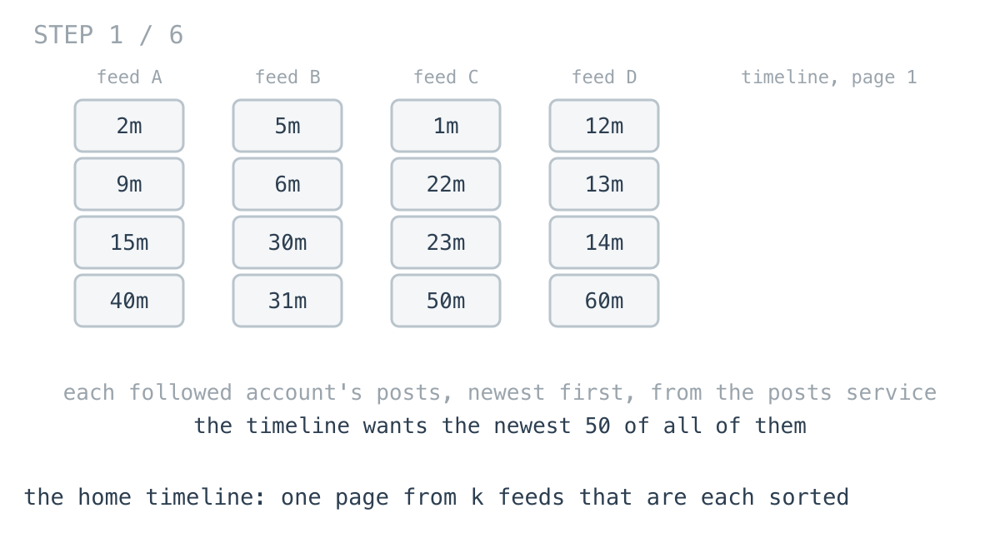
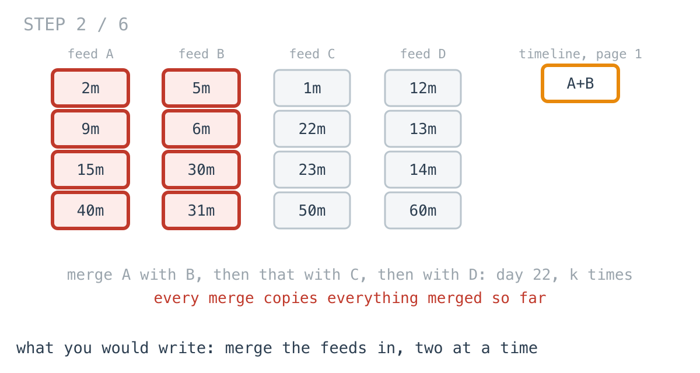
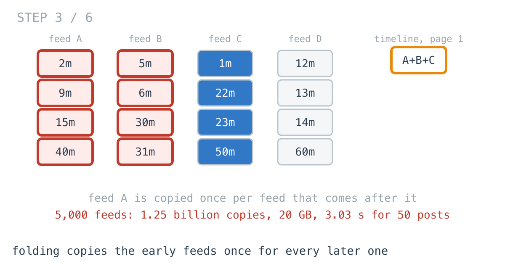
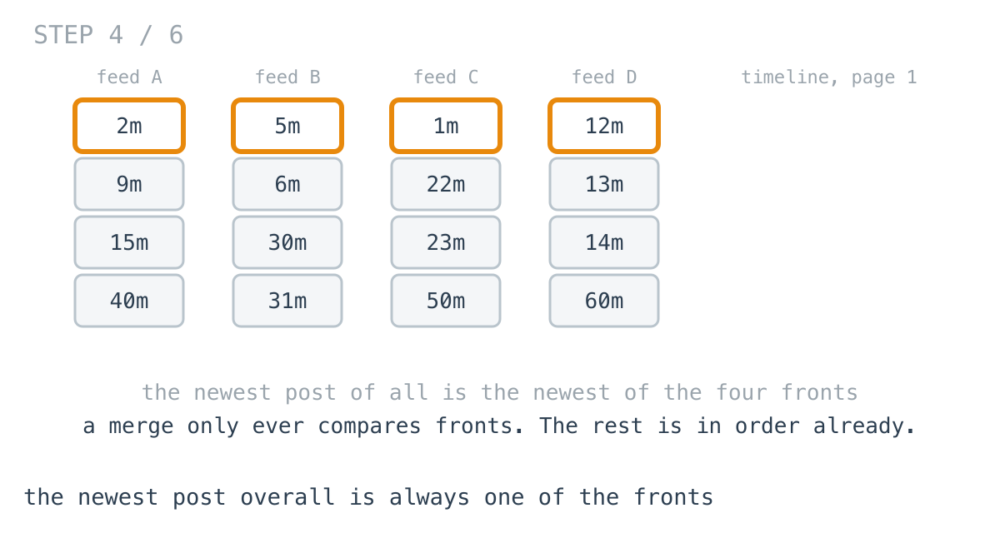
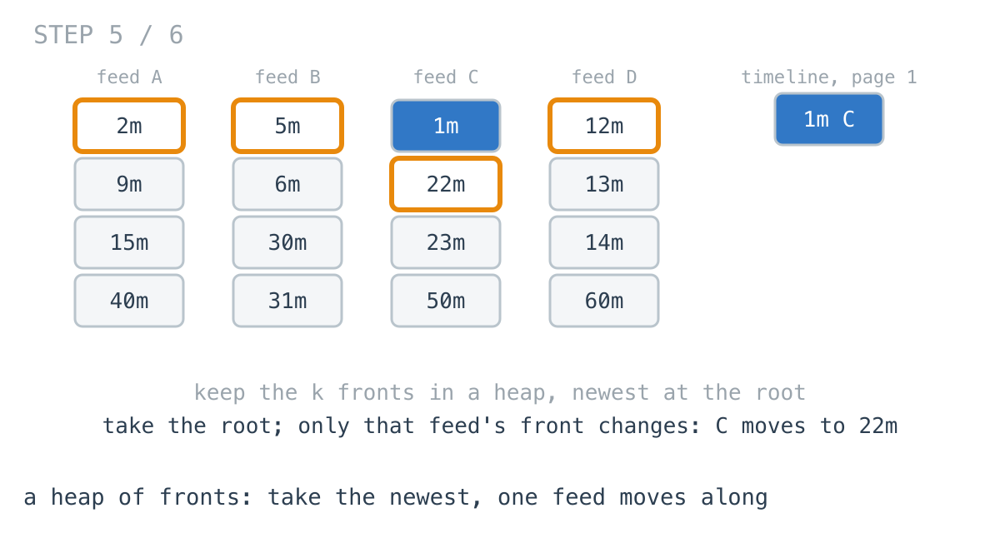
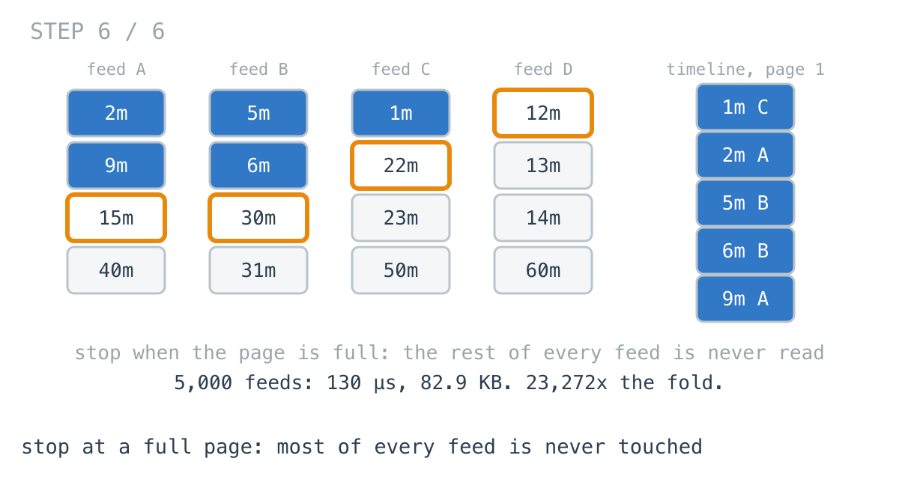

# The timeline merge allocated 20 GB to show 50 posts

**It worked in dev · Episode 37 · technique: a heap of the fronts, stopped at a full page**

The home timeline asks the posts service for the latest posts of every account
you follow. Each feed comes back newest first. The timeline shows one page of
them all together, newest first: 50 posts.

For an account following ten people, merging the feeds in two at a time takes
**19.2 µs**, faster than sorting them. For one following 5,000, it takes
**3.03 s** and allocates **20.0 GB** - for 50 posts. A heap holding the front
of each feed, stopped as soon as the page is full, does the same page in
**130 µs** and 82.9 KB.

---

## The problem

```go
type Post struct {
	ID int64
	At int64 // unix ms
}

// The newest n posts across all feeds, newest first.
// Every feed is already sorted newest first.
func Page(feeds [][]Post, n int) []Post
```



---

## What you would write

Every feed is sorted, and there is a function in the codebase - there always is
- that merges two sorted lists in linear time. So merge them in, one at a time:

```go
func PageByFolding(feeds [][]Post, n int) []Post {
	var out []Post
	for _, f := range feeds {
		out = merge(out, f)
	}
	return out[:min(n, len(out))]
}

// merge is the two-list merge: take the newer front, advance that side.
func merge(a, b []Post) []Post {
	out := make([]Post, 0, len(a)+len(b))
	i, j := 0, 0
	for i < len(a) && j < len(b) {
		if newer(a[i], b[j]) <= 0 {
			out = append(out, a[i])
			i++
		} else {
			out = append(out, b[j])
			j++
		}
	}
	out = append(out, a[i:]...)
	return append(out, b[j:]...)
}
```



It uses the fact that the feeds are sorted, which a sort would ignore. Each
merge is linear. It never modifies a feed. On a new account it is the fastest
of the obvious versions - 2.21x faster than appending everything and sorting.
I would approve it.

---

## How bad, on its own

```
Apple M1 Pro · go1.26.4 · go test -bench=PageByFolding -benchtime=5x
```

| shape | feeds | page | fold |
|---|---:|---:|---:|
| `new` | 10 | 50 | 19.2 µs |
| `typical` | 300 | 50 | 11.5 ms |
| `heavy` | 5,000 | 50 | 3.03 s |
| `export` | 300 | 30,000 | 11.8 ms |

Thirty times the feeds from `new` to `typical`, and 600 times the time. Then
`heavy`, about seventeen times the feeds again: 263 times the time, and 20.0 GB
allocated along the way. `export` is the same 300 feeds asking for every post,
not one page - and costs about what one page does.

---

## From the symptom to the shape

### The issue, said plainly

Every merge copies everything merged so far. The first feed is copied once for
every feed after it.

### Quantify it on the concrete example

`TestWork` adds up the copies:

```
typical    300 feeds,   30000 posts, page   50  |  fold copies     4515000 posts
heavy     5000 feeds,  500000 posts, page   50  |  fold copies  1250250000 posts
```

500,000 posts, copied 1.25 billion times, to read the first 50 of them. Each
merge is linear in the length of what it merges, and what it merges keeps
growing: 100 posts, then 200, then 300, out to 500,000.



### Why is it allowed to happen?

Because `merge` was written for two lists and is right for two lists. Folding
it over k turns "linear" into the sum of k growing lists, and nothing in either
function knows the page only needs 50.

### The answer was already there: in the fronts

Look at what `merge` actually compares: the front of one list against the front
of the other. Never anything behind them, because each list is sorted - the
front is the newest thing in it.

The same holds for any number of lists. The newest post across all k feeds is
the newest of the k fronts. That was known before any merging started, and the
fold copied half a million posts to find it out again.



### What is the question actually asking?

Do not assume it. It is not "build the merged list". It is: 50 times, find the
newest of the k fronts, and take it. Taking it changes exactly one front - that
feed moves along by one. The other k - 1 fronts are where they were.

### Write the thing you want as an equation

```
next  = newest(front(f) for every feed f that is not used up)
after taking from feed g:  front(g) = the post after it;  every other front unchanged
```

Read it out loud. A repeated "newest of" over a collection where one member
changes between asks. That is a heap: the newest at the root, one sift to
absorb the change.

### Conclude the structure

Put the front of every feed in a heap, all at once. Take the root into the page.
Replace it with the next post from the same feed, or drop it if that feed is used
up, and let the heap re-settle. Stop when the page has 50.



The rest of every feed is never read. Not copied, not compared - not looked at.



### Where it came from in the challenge

[Day 82](https://github.com/architagr/leetcode_solutions/blob/main/hard_problems/1_100/merge_k_sorted_lists/SOLUTION.md),
Merge k Sorted Lists, is this, and states the rule the heap rests on: "A list's
second element cannot be the next smallest overall while its first is still
unplaced - the list is sorted, so its own head is smaller. It is not a
candidate yet." It also names the waste the heap removes from the other obvious
version, scanning all k heads each time: "Between two rounds only **one** head
changed."

[Day 22](https://github.com/architagr/leetcode_solutions/blob/main/easy_problems/1_100/merge_two_sorted_lists/SOLUTION.md),
Merge Two Sorted Lists, is the `merge` above - and day 82 describes itself as
"day 22's merge with the `if` replaced by a heap". The fold is the other way to
get from 22 to k lists, and the one this episode measures.

### When this does not apply

Go back to the equation and break it.

It wants the page, not the whole merge. On `export`, asking for all 30,000
posts, every post goes through the heap, and the sort - one tight call into the
standard library - is 1.20x faster. Day 82's complexity line, O(N log k)
against O(N log N), is true and is not the whole story when N is all of it and
k is 300.

And it needs every feed sorted by the thing the timeline sorts by. Rank the
timeline by a score computed after fetching, and the fronts stop being the
candidates. Score first, then sort.

### The rule

> **When k sorted sources feed one sorted result, the next item is always one of
> the k fronts. Keep the fronts in a heap, and stop when you have enough - the
> rest of every source is never read.**

---

## Try it before reading on

A heap of positions - one per feed - with the newest post at the root. Take, move
that feed along, repeat 50 times. Nothing else is read.

```bash
git clone https://github.com/architagr/leetcode_solutions
cd leetcode_solutions/series/it-worked-in-dev/episodes/37-merge-paginated-feeds
go test ./...
```

Reading on costs you the rep.

---

## The version that scales

```go
func PageByHeap(feeds [][]Post, n int) []Post {
	h := &fronts{feeds: feeds, at: make([]cursor, 0, len(feeds))}
	for f, posts := range feeds {
		if len(posts) > 0 {
			h.at = append(h.at, cursor{f, 0})
		}
	}
	heap.Init(h) // all fronts at once: linear, not k pushes
	out := make([]Post, 0, n)
	for len(out) < n && h.Len() > 0 {
		c := h.at[0]
		out = append(out, h.post(c))
		if c.i+1 < len(feeds[c.feed]) {
			h.at[0] = cursor{c.feed, c.i + 1} // that feed's next post takes its place
			heap.Fix(h, 0)
		} else {
			heap.Pop(h)
		}
	}
	return out
}
```

Four things carry it. The heap holds cursors - a feed and a position - not posts,
so nothing is copied out of the feeds until it goes on the page. Empty feeds are
never pushed; there is no front to compare. `heap.Init` builds the heap from all
k fronts at once, which day 82 points out is linear where k pushes are not.
And replacing the root and calling `Fix` is one sift where `Pop` then `Push` is
two.

The loop condition does the rest: `len(out) < n`.

---

## The measurement

| shape | feeds | page | fold | sort | heap | fold ÷ heap |
|---|---:|---:|---:|---:|---:|---:|
| `new` | 10 | 50 | 19.2 µs | 42.5 µs | 1.44 µs | 13.3x |
| `typical` | 300 | 50 | 11.5 ms | 2.50 ms | 6.94 µs | 1,658x |
| `heavy` | 5,000 | 50 | 3.03 s | 55.1 ms | 130 µs | 23,272x |
| `export` | 300 | 30,000 | 11.8 ms | 2.55 ms | 3.05 ms | 3.87x |

Raw ns, fold / sort / heap: 19,223 / 42,491 / 1,444 ·
11,513,077 / 2,504,159 / 6,944 · 3,034,069,558 / 55,116,533 / 130,375 ·
11,797,625 / 2,546,700 / 3,045,533

`sort` is the other version people write: append every feed to one slice, sort,
take 50. It ignores that the feeds are sorted, and it beats the fold from 300
feeds up - **4.60x** on `typical`, **55.0x** on `heavy` - because a sort of N is
cheaper than k merges of growing lists. The heap beats both on a page: **361x**
the sort on `typical`, **423x** on `heavy`. On `export` the sort is **1.20x**
faster than the heap.

Allocated: the fold, 73.4 MB on `typical` and **20.0 GB** on `heavy`. The sort,
44.7 MB on `heavy`. The heap, 82.9 KB.

---

## What it costs

**It is slower for the whole merge.** If a caller wants everything - an export, a
backfill - use the sort. The heap's advantage is that it can stop.

**It trusts every feed to be sorted.** So does the fold. If the posts service
ever returns a feed slightly out of order - an edited post bumped to the top,
say - both quietly put it in the wrong place on the page, and only the sort
would still be right. The heap is a promise about the input as much as an
algorithm.

**The page boundary needs a cursor.** Page 2 should not re-merge page 1. The
heap's state - one position per feed - is exactly the cursor, and handing it back
to the client is the honest way to paginate this. That is the next change I
would make, and it is not in this episode.

---

## The one line to keep

The next item from k sorted sources is always one of the k fronts. Keep only the
fronts, in a heap, and stop when the page is full.

---

## Built on

Days from the [365-day LeetCode challenge](https://github.com/architagr/leetcode_solutions),
with the solution write-up and the problem itself:

- **Day 22 — [Merge Two Sorted Lists](https://github.com/architagr/leetcode_solutions/blob/main/easy_problems/1_100/merge_two_sorted_lists/SOLUTION.md)** · LeetCode [#21](https://leetcode.com/problems/merge-two-sorted-lists/) · easy
  <br>taking the smaller of the two fronts, and attaching the rest of the surviving list whole rather than walking it
- **Day 82 — [Merge k Sorted Lists](https://github.com/architagr/leetcode_solutions/blob/main/hard_problems/1_100/merge_k_sorted_lists/SOLUTION.md)** · LeetCode [#23](https://leetcode.com/problems/merge-k-sorted-lists/) · hard
  <br>a heap holding one head per list, so each pop and its successor's push cost log k however long the lists are

---

## Run it yourself

```bash
git clone https://github.com/architagr/leetcode_solutions
cd leetcode_solutions/series/it-worked-in-dev/episodes/37-merge-paginated-feeds
go test ./...                         # fold, sort and heap agree; no feed is modified
go test -run TestWork -v              # how much the fold copies
go test -bench=. -benchtime=5x        # the timings above (the fold on heavy takes a while)
```

---

Part of [It worked in dev](../../), the long-form companion to the
[365-day LeetCode challenge](https://github.com/architagr/leetcode_solutions).

---

*Ideation, problem selection, benchmarks and conclusions: Archit Agarwal.
The prose was drafted with AI assistance and edited by me. Every number here
comes from a run you can reproduce with the commands above.*
